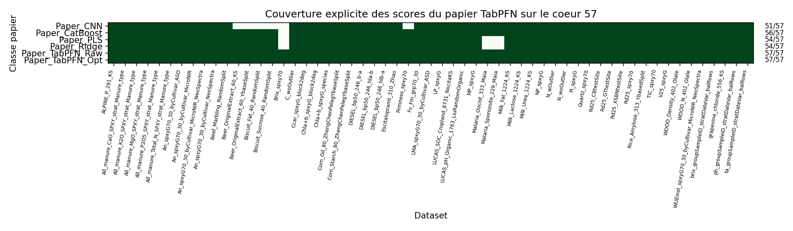
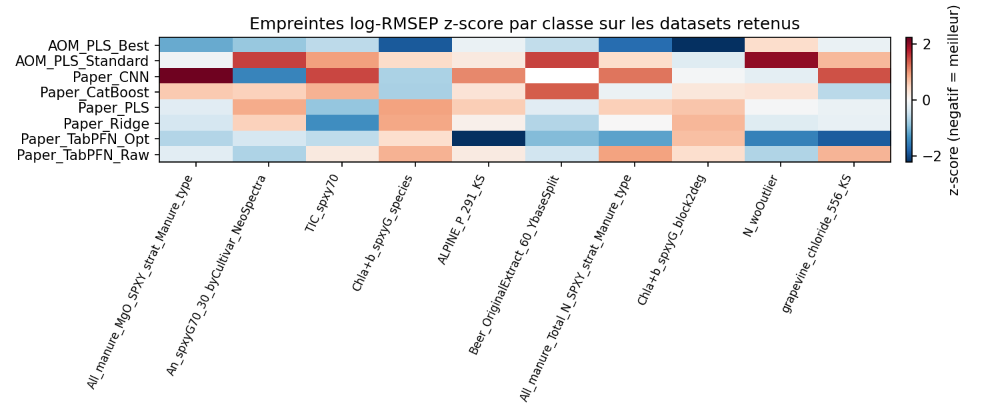
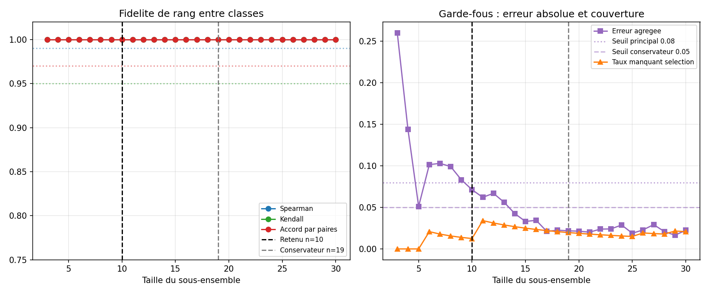
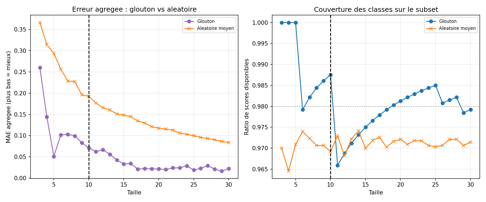
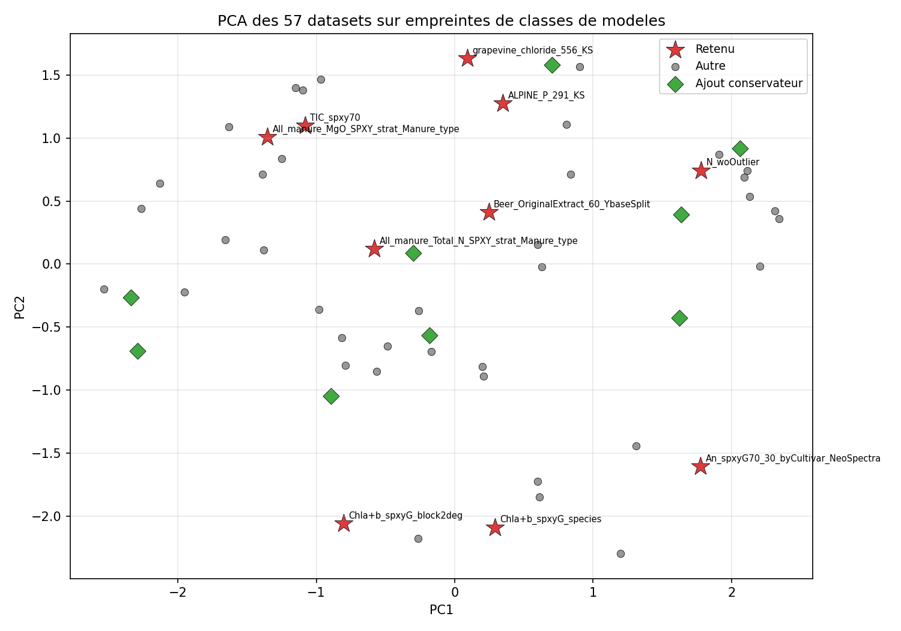

# Synthese technique - protocole class-balanced paper-aware

## Pourquoi revoir le protocole ?

L'analyse initiale contenait beaucoup de variantes AOM. Meme si elle etait statistiquement stable, elle ponderait trop fortement une seule famille. La version revisee donne une voix a chaque **classe de modeles** : CNN papier, CatBoost papier, PLS papier, Ridge papier, TabPFN raw/opt, et deux classes AOM maximum.

## Scores papier visibles

Les scores du papier TabPFN sont dans `tabpfn_paper_scores_core_pivot.csv` et visualises par la figure de couverture.

## Selection class-balanced

La matrice principale est `main_class_score_matrix.csv`. Elle contient des NaN assumes pour les scores papier manquants. Les scores sont transformes en `log(RMSEP)`, puis z-score par dataset entre classes disponibles dans `class_dataset_zscores.csv`. `class_score_matrix.csv` reste un fichier d'audit avec les classes candidates exclues.

Les deux lignes AOM conservees sont `AOM_PLS_Standard` et `AOM_PLS_Best`; aucune variante AOM individuelle ne vote dans la selection.

La recherche gloutonne maximise un composite qui combine fidelite de rang, erreur agregee et couverture. Les rangs saturant vite avec 8 classes, la decision se lit surtout via `agg_mae` et la couverture.

Les baselines aleatoires montrent ce qui est gagne par la selection active plutot que par la seule taille du sous-ensemble.

La PCA illustre la repartition des datasets retenus dans l'espace des empreintes de performance par classe.

## Recommandation

Le sous-ensemble principal contient **10 datasets** : `All_manure_MgO_SPXY_strat_Manure_type`, `An_spxyG70_30_byCultivar_NeoSpectra`, `TIC_spxy70`, `Chla+b_spxyG_species`, `ALPINE_P_291_KS`, `Beer_OriginalExtract_60_YbaseSplit`, `All_manure_Total_N_SPXY_strat_Manure_type`, `Chla+b_spxyG_block2deg`, `N_woOutlier`, `grapevine_chloride_556_KS`.

Pour une decision finale ou une comparaison serree, utiliser l'alternative conservatrice indiquee dans `selected_subset.json`.
