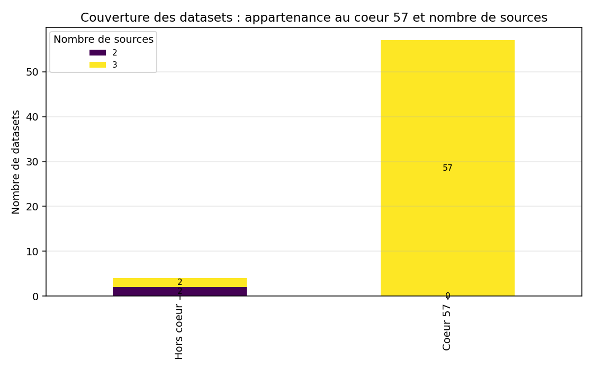
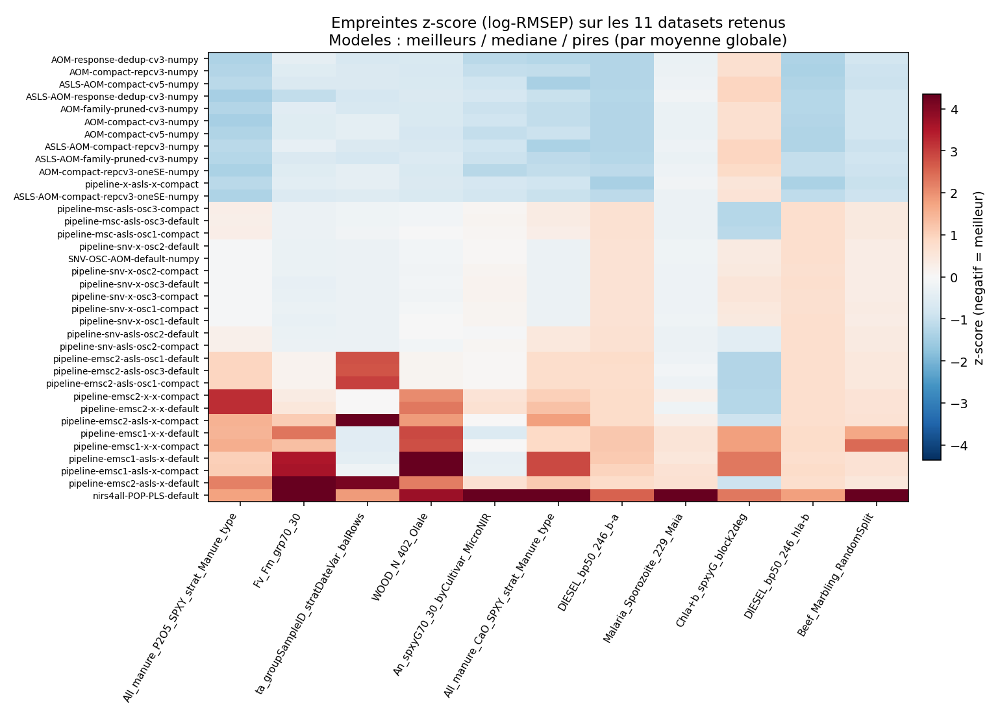
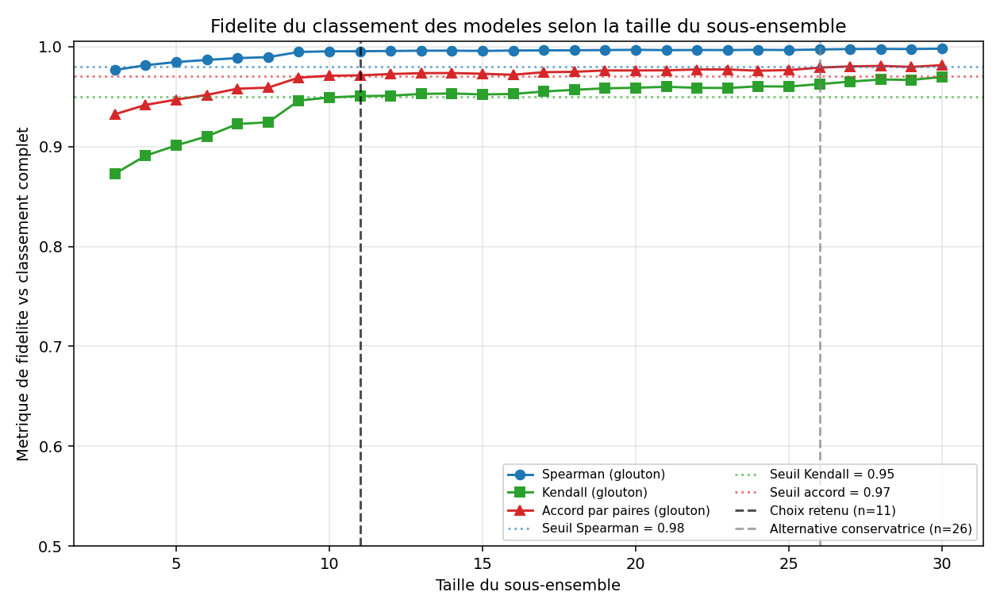
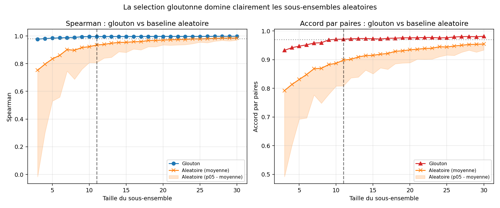
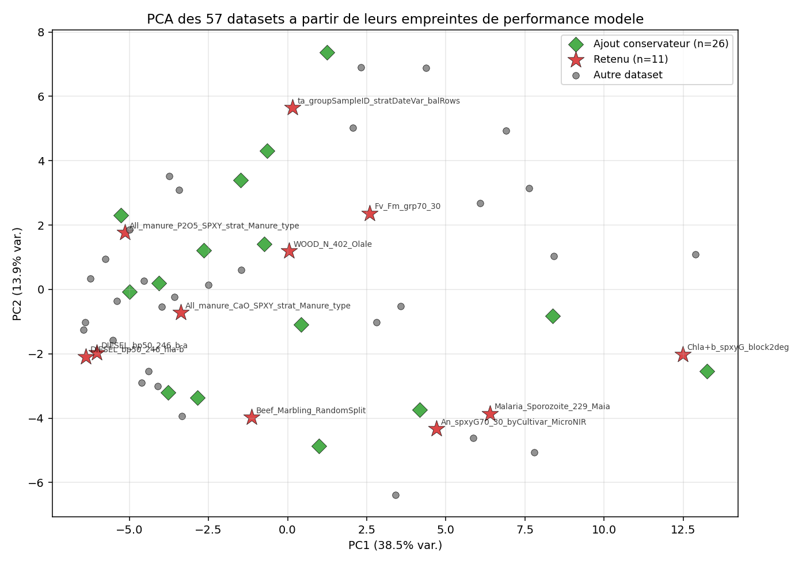

# Synthese technique — Selection d'un sous-ensemble representatif de datasets NIR

Ce document explique, pas a pas, les techniques statistiques utilisees pour
extraire un petit sous-ensemble de datasets a partir des 57 datasets de
regression du benchmark, en preservant le classement des modeles. Il accompagne
les sorties produites par `analyze_subset.py` et `make_visualizations.py`.

L'objectif pratique : pouvoir iterer rapidement sur les modeles (entrainement,
ablations, debug) sur un petit sous-ensemble representatif, sans avoir a
relancer l'ensemble du benchmark a chaque essai, tout en gardant une bonne
correlation avec le classement obtenu sur les 57 datasets.

---

## 1. Donnees source et perimetre

Les scores proviennent des sorties du benchmark AOM (`all_scores_long.csv`),
agreges en table longue normalisee `(source, model, dataset_group, dataset,
task, metric_name, metric_value, lower_is_better)`.

- **Restriction au coeur 57** : on ne retient que les datasets de regression
  presents dans tous les fichiers de comparaison principaux, evalues avec la
  meme metrique RMSEP (`lower_is_better = True`). Cela garantit la
  comparabilite des scores entre datasets et entre modeles.
- **Modeles** : 128 modeles couvrent integralement le coeur 57 (matrice
  modele x dataset complete, pas de NaN), ce qui evite tout biais
  d'imputation.
- **Classification ecartee** : les sources de classification disponibles
  ailleurs dans `bench/` ont des metriques et une couverture differentes ;
  les melanger biaiserait les comparaisons. Voir `dataset_coverage.csv` :
  `in_core_57` indique l'appartenance au coeur.

---

## 2. Normalisation des scores

Le RMSEP varie de plusieurs ordres de grandeur entre datasets, ce qui rend la
comparaison brute trompeuse (un dataset domine alors numeriquement la
moyenne). On applique donc :

1. **Transformation log** : `s = log(RMSEP)` pour stabiliser la variance et
   rendre les ecarts relatifs additifs.
2. **z-score par dataset** : pour chaque dataset, on centre et reduit `s`
   sur l'ensemble des modeles. La matrice `model_dataset_zscores.csv`
   represente l'**empreinte de performance** de chaque modele : un z-score
   negatif signifie « meilleur que la moyenne sur ce dataset ».

Cette double transformation (log + z par colonne) rend les datasets
comparables et permet de raisonner uniformement en termes de classement et
d'ecarts standardises.

---

## 3. Score agrege et classement de reference

Le **classement de reference** des modeles est obtenu en moyennant les
z-scores de chaque modele sur l'ensemble des 57 datasets, puis en triant
(plus negatif = meilleur). C'est ce classement « verite terrain » que tout
sous-ensemble candidat doit reproduire.

---

## 4. Metriques de fidelite vs sous-ensemble

Pour un sous-ensemble candidat `S` de datasets, on recalcule le score agrege
des modeles **uniquement sur `S`**, on en deduit un classement, et on le
compare au classement de reference via :

- **Spearman** ρ : correlation des rangs (mesure globale).
- **Kendall** τ : correlation par paires concordantes/discordantes (plus
  exigeante, sensible aux inversions).
- **Accord par paires** : proportion de paires de modeles dont l'ordre est
  preserve.
- **Rank MAE** : ecart absolu moyen entre rangs.
- **MAE agregee** : ecart absolu moyen des scores agreges.
- **Composite** : moyenne des metriques principales, sert d'objectif
  d'optimisation pour la recherche gloutonne.

---

## 5. Selection gloutonne (forward greedy)

A partir d'un sous-ensemble vide, on ajoute iterativement le dataset qui
**maximise le composite** (Spearman / Kendall / accord). Cette heuristique
est :

- peu couteuse (O(n_datasets x taille)),
- deterministe (seed 1234),
- monotone par construction sur le composite,
- competitive en pratique vis-a-vis d'une recherche exhaustive devenue
  intraitable au-dela de ~5 elements.

La progression est consignee dans `greedy_progression.csv` et
`subset_search_results.csv`.

On observe :

- une montee tres rapide jusqu'a 6-8 datasets,
- un plateau au-dela de 11-15 ou les seuils Spearman 0.98 et accord 0.97
  sont nettement depasses,
- le franchissement du seuil Kendall 0.95 a partir de la taille **11**.

---

## 6. Baselines aleatoires

Pour quantifier le gain reel du glouton, on compare a des sous-ensembles
**tires aleatoirement** (200 tirages par taille, meme seed) : on calcule la
moyenne et le 5e percentile des memes metriques. Le glouton domine
systematiquement la moyenne aleatoire et bat largement le p05 — confirmant
que le choix des datasets compte, pas seulement leur nombre.

---

## 7. Bootstrap sur les modeles

La fidelite mesuree depend du panel de modeles. Pour ne pas surestimer la
robustesse, on **bootstrap les modeles** : 300 re-echantillonnages avec
remise sur les 128 modeles, et on recalcule a chaque tirage les metriques
modele-classement vs reference. On extrait :

- la moyenne bootstrap,
- les bornes p05 et p95 (intervalle de confiance empirique).

Ces bornes apparaissent dans `bootstrap_ci.csv` et dans les colonnes
`boot_*` de `subset_search_results.csv`. Un sous-ensemble n'est juge fiable
que si **meme la borne p05** reste au-dessus du seuil pertinent — cela
mesure la stabilite de la selection face a la composition du panel de
modeles.

---

## 8. Seuils et choix retenu

Seuils pratiques retenus :

| Metrique | Seuil direct | Seuil bootstrap p05 |
|----------|-------------:|---------------------:|
| Spearman | 0.98 | 0.95 |
| Kendall  | 0.95 | (0.95 pour la version stricte) |
| Accord par paires | 0.97 | 0.95 |

- **Sous-ensemble retenu : 11 datasets.** Tous les seuils directs sont
  satisfaits, ainsi que les bornes p05 sur Spearman et accord par paires.
  Spearman ≈ 0.995, Kendall ≈ 0.950, accord ≈ 0.971.
- **Alternative conservatrice : 26 datasets.** Plus petite taille qui
  satisfait *en plus* la borne stricte `boot_kendall_p05 >= 0.95`. A
  privilegier quand on souhaite une garantie supplementaire sur la
  stabilite Kendall (selections fines, comparaisons serrees).

Le contenu exact des deux ensembles est dans `selected_subset.json`.

La projection PCA des datasets dans l'espace de leurs empreintes de
performance modele montre que les 11 retenus se repartissent dans les
principales regions du nuage (pas concentres sur une zone), et que les
ajouts conservateurs comblent les zones intermediaires.

---

## 9. Limitations et garde-fous

- **Domaine restreint au coeur 57** : la conclusion ne s'etend pas
  formellement aux datasets hors coeur (couverture incomplete, sources
  heterogenes).
- **Dependance au panel de modeles** : la borne bootstrap mesure la
  stabilite *vis-a-vis du panel actuel*. Un panel tres different (par
  exemple modeles de generation suivante avec dynamiques differentes) peut
  necessiter une re-evaluation.
- **Metrique unique (RMSEP)** : choix justifie par la comparabilite, mais
  une metrique alternative (R^2, MAE) pourrait reordonner certains modeles
  en limite.
- **Selection gloutonne, pas exhaustive** : le sous-ensemble est
  quasi-optimal au sens du composite, pas garanti optimal.
- **Pas de validation hors-distribution** : la selection optimise la
  reproduction du classement *complet*, pas la transferabilite vers des
  datasets nouveaux.

En pratique : utiliser les **11 datasets** pour le cycle d'iteration rapide,
basculer sur les **26** quand un choix de modele se joue a la marge, et
revalider ponctuellement sur les **57** avant publication ou decision
importante.

---

## 10. Fichiers utiles

- `analyze_subset.py` : pipeline complet (matrice, glouton, bootstrap,
  baselines, selection).
- `make_visualizations.py` : ce script, produit toutes les figures
  ci-dessus dans `figures/`.
- `selected_subset.json` : sous-ensembles retenus et metriques associees.
- `subset_search_results.csv` : tableau lisible par taille (greedy +
  bootstrap + aleatoire).
- `REPORT.md` : rapport detaille auto-genere.
