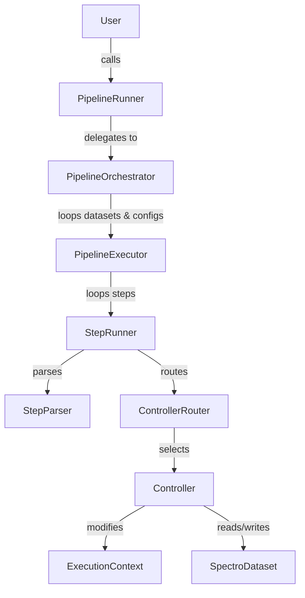

# Pipeline Architecture Overview

This document provides a high-level overview of the `nirs4all` pipeline architecture for developers. It explains the flow of execution, key components, and how to extend the system.

## Architecture Philosophy

The pipeline module is designed around a **layered architecture** with **separation of concerns**:

1.  **Orchestration:** Managing multiple datasets and pipeline configurations.
2.  **Execution:** Running a specific sequence of steps on a specific dataset.
3.  **Step Logic:** The actual implementation of a pipeline step (model training, preprocessing, etc.).

## Key Components

### 1. PipelineRunner (`nirs4all/pipeline/runner.py`)
**Role:** The public entry point (Facade).
**Responsibility:**
-   Provides a simple API for users (`run()`, `predict()`, `explain()`).
-   Initializes the environment (workspace, logging).
-   Delegates work to the `Orchestrator`.

### 2. PipelineOrchestrator (`nirs4all/pipeline/execution/orchestrator.py`)
**Role:** The high-level manager.
**Responsibility:**
-   Iterates over all provided **Datasets**.
-   Iterates over all provided **Pipeline Configurations**.
-   Manages global results (aggregating predictions across runs).
-   Instantiates a `PipelineExecutor` for each (Dataset, Pipeline) pair.

### 3. PipelineExecutor (`nirs4all/pipeline/execution/executor.py`)
**Role:** The sequence runner.
**Responsibility:**
-   Executes a list of steps sequentially.
-   Manages the **ExecutionContext** (state propagation).
-   Handles artifact management (saving models, logs) for a single run.
-   Catches errors and handles the "continue on error" logic.

### 4. StepRunner (`nirs4all/pipeline/steps/step_runner.py`)
**Role:** The unit executor.
**Responsibility:**
-   **Parses** the raw step definition (dict, string, object) using `StepParser`.
-   **Routes** the step to the appropriate Controller using `ControllerRouter`.
-   Executes the Controller.

### 5. Controllers (`nirs4all/controllers/`)
**Role:** The business logic.
**Responsibility:**
-   Implements the actual logic for a step (e.g., `ModelController`, `PreprocessingController`).
-   Interacts with the `SpectroDataset`.
-   Updates the `ExecutionContext`.
-   Returns artifacts (files, objects) to be saved.

## Data Flow

The data flow relies on two main objects passed through the layers:

1.  **SpectroDataset:** The data itself. It is mutable but typically modified via "views" or internal state updates managed by controllers.
2.  **ExecutionContext:** A composite object containing:
    -   `DataSelector`: Immutable configuration for how to read data (e.g., "train" partition, "raw" source).
    -   `PipelineState`: Mutable state tracking (e.g., current Y-transformation).
    -   `StepMetadata`: Ephemeral flags for communication between steps.

## Execution Flow Diagram

## How to Add a New Feature

### Adding a New Step Type
1.  **Create a Controller:** Inherit from `BaseController` in `nirs4all/controllers/`.
2.  **Implement `matches`:** Define when your controller should be used (e.g., specific keyword or operator type).
3.  **Implement `execute`:** Write the logic.
4.  **Register:** The `CONTROLLER_REGISTRY` automatically discovers subclasses of `BaseController` (ensure your module is imported).

### Adding a New Execution Mode
1.  Update `PipelineRunner` to expose the mode.
2.  Update `PipelineExecutor` / `StepRunner` if the mode requires special handling (like `predict` or `explain`).

## Common Patterns

-   **Registry Pattern:** Controllers are discovered automatically.
-   **Builder Pattern:** `ExecutorBuilder` constructs the executor.
-   **Facade Pattern:** `PipelineRunner` hides complexity.
-   **Context Object:** `ExecutionContext` encapsulates state.
