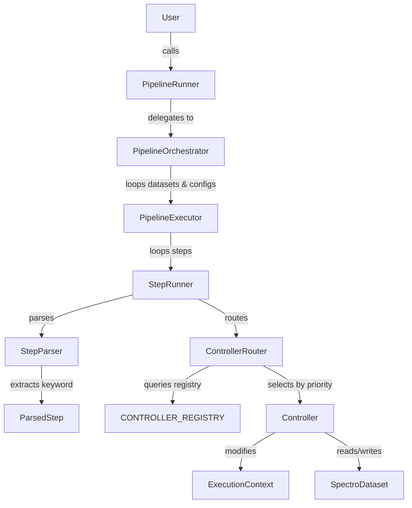

# Pipeline Architecture Overview
This document provides a high-level overview of the `nirs4all` pipeline architecture for developers. It explains the flow of execution, key components, and how to extend the system with custom controllers and keywords.

## Architecture Philosophy

The pipeline module is designed around a **layered architecture** with **separation of concerns**:

1.  **Orchestration:** Managing multiple datasets and pipeline configurations.
2.  **Execution:** Running a specific sequence of steps on a specific dataset.
3.  **Step Logic:** The actual implementation of a pipeline step (model training, preprocessing, etc.).

## Key Components

### 1. PipelineRunner (`nirs4all/pipeline/runner.py`)
**Role:** The public entry point (Facade).
**Responsibility:**
-   Provides a simple API for users (`run()`, `predict()`, `explain()`).
-   Initializes the environment (workspace, logging).
-   Delegates work to the `Orchestrator`.

### 2. PipelineOrchestrator (`nirs4all/pipeline/execution/orchestrator.py`)
**Role:** The high-level manager.
**Responsibility:**
-   Iterates over all provided **Datasets**.
-   Iterates over all provided **Pipeline Configurations**.
-   Manages global results (aggregating predictions across runs).
-   Instantiates a `PipelineExecutor` for each (Dataset, Pipeline) pair.

### 3. PipelineExecutor (`nirs4all/pipeline/execution/executor.py`)
**Role:** The sequence runner.
**Responsibility:**
-   Executes a list of steps sequentially.
-   Manages the **ExecutionContext** (state propagation).
-   Handles artifact management (saving models, logs) for a single run.
-   Catches errors and handles the "continue on error" logic.

### 4. StepRunner (`nirs4all/pipeline/steps/step_runner.py`)
**Role:** The unit executor.
**Responsibility:**
-   **Parses** the raw step definition (dict, string, object) using `StepParser`.
-   **Routes** the step to the appropriate Controller using `ControllerRouter`.
-   Executes the Controller.

### 5. StepParser (`nirs4all/pipeline/steps/parser.py`)
**Role:** Step configuration parser.
**Responsibility:**
-   Normalizes different step syntaxes (dict, string, instance, list) into a canonical `ParsedStep` format.
-   Extracts keywords from step configurations (both standard and custom).
-   Identifies step types (workflow, serialized, subpipeline, direct).
-   Deserializes operators when needed.

### 6. ControllerRouter (`nirs4all/pipeline/steps/router.py`)
**Role:** Controller selection.
**Responsibility:**
-   Matches parsed steps to appropriate controllers using priority-based selection.
-   Queries each controller's `matches()` method.
-   Returns the highest-priority matching controller.

### 7. Controllers (`nirs4all/controllers/`)
**Role:** The business logic.
**Responsibility:**
-   Implements the actual logic for a step (e.g., `ModelController`, `PreprocessingController`).
-   Interacts with the `SpectroDataset`.
-   Updates the `ExecutionContext`.
-   Returns artifacts (files, objects) to be saved.

### 8. Controller Registry (`nirs4all/controllers/registry.py`)
**Role:** Controller discovery and registration.
**Responsibility:**
-   Maintains the global `CONTROLLER_REGISTRY` list.
-   Provides the `@register_controller` decorator for automatic registration.
-   Ensures controllers are sorted by priority.

## Data Flow

The data flow relies on two main objects passed through the layers:

1.  **SpectroDataset:** The data itself. It is mutable but typically modified via "views" or internal state updates managed by controllers.
2.  **ExecutionContext:** A composite object containing:
    -   `DataSelector`: Immutable configuration for how to read data (e.g., "train" partition, "raw" source).
    -   `PipelineState`: Mutable state tracking (e.g., current Y-transformation).
    -   `StepMetadata`: Ephemeral flags for communication between steps.

## Execution Flow Diagram



## Keyword and Controller System

### Step Configuration Parsing

The `StepParser` handles multiple step syntaxes and normalizes them into a canonical `ParsedStep` format:

1. **Dictionary steps**: Extracts keyword and operator
   ```python
   {"model": SVC(), "params": {"C": 1.0}}
   {"preprocessing": StandardScaler}
   {"my_custom_op": custom_function, "params": {...}}
   ```

2. **String steps**: Interpreted as class paths or keywords
   ```python
   "sklearn.preprocessing.StandardScaler"  # Class path
   "chart_2d"                               # Keyword
   ```

3. **Direct instances**: Object passed directly
   ```python
   StandardScaler()
   ```

4. **Nested lists**: Subpipelines
   ```python
   [[step1, step2], step3]
   ```

### Keyword Types

The parser recognizes three categories of keywords:

1. **Reserved Keywords** (not treated as operators):
   - `params`, `metadata`, `steps`, `name`, `finetune_params`, `train_params`

2. **Serialization Operators** (checked first):
   - `class`, `function`, `module`, `object`, `pipeline`, `instance`

3. **Workflow Keywords**:
   - **Priority keywords** (standard operations, checked in order):
     1. `model`
     2. `preprocessing`
     3. `feature_augmentation`
     4. `y_processing`
     5. `sample_augmentation`
   - **Custom keywords**: Any other non-reserved key

### Keyword Prioritization

When multiple potential keywords exist in a step:

1. **Serialization operators take precedence** over everything
2. **Priority workflow keywords** take precedence over custom keywords
3. **First custom keyword** is chosen when multiple custom keywords exist

Example:
```python
# "model" wins (priority keyword)
{"model": SVC(), "my_custom": lambda x: x}

# "my_custom" is used (no priority keyword present)
{"my_custom": lambda x: x, "params": {...}}

# "class" wins (serialization operator)
{"class": "sklearn.svm.SVC", "model": SVC()}
```

### Controller Matching

The `ControllerRouter` selects controllers based on:

1. **Priority**: Lower numbers = higher priority (default=100)
2. **Matching**: Controller's `matches()` method returns True
3. **Selection**: Highest-priority matching controller is chosen

Example controller priorities in the system:
- DummyController: 1000 (catch-all, lowest priority)
- Model controllers: varies (20-50)
- Transform controllers: varies (30-60)
- Chart controllers: 10 (high priority for specific matching)

## How to Add a New Feature

### Adding a Custom Controller with Custom Keywords

The system is designed to be fully extensible. You can add custom controllers with custom keywords without modifying core nirs4all code.

#### Step-by-Step Guide

1. **Create a Controller Class**

   Inherit from `OperatorController` and implement required methods:

   ```python
   from nirs4all.controllers.controller import OperatorController
   from nirs4all.controllers.registry import register_controller
   from typing import Any, Tuple, List

   @register_controller
   class SmoothingController(OperatorController):
       """Custom controller for spectral smoothing operations."""

       priority = 45  # Lower = higher priority (default is 100)

       @classmethod
       def matches(cls, step: Any, operator: Any, keyword: str) -> bool:
           """Define when this controller should be used."""
           # Match on custom keywords
           if isinstance(step, dict):
               return 'smoothing' in step or 'smooth' in step
           return keyword in ['smoothing', 'smooth']

       @classmethod
       def use_multi_source(cls) -> bool:
           """Return True if controller supports multi-source datasets."""
           return True

       @classmethod
       def supports_prediction_mode(cls) -> bool:
           """Return True if controller should run during prediction."""
           return True

       def execute(
           self,
           step_info: 'ParsedStep',
           dataset: 'SpectroDataset',
           context: 'ExecutionContext',
           runtime_context: 'RuntimeContext',
           source: int = -1,
           mode: str = "train",
           loaded_binaries: Any = None,
           prediction_store: Any = None
       ) -> Tuple['ExecutionContext', List[Tuple[str, bytes]]]:
           """Execute the smoothing operation."""
           smoother = step_info.operator
           params = step_info.metadata.get('params', {})

           # Your custom logic here
           # - Modify dataset
           # - Update context
           # - Generate artifacts

           return context, []  # Return updated context and artifacts
   ```

2. **Import Your Controller Module**

   The controller is automatically registered when the module is imported:

   ```python
   # At the top of your script or in __init__.py
   import my_custom_controllers  # Registers all controllers in this module
   ```

3. **Use Your Custom Keyword in Pipelines**

   ```python
   from scipy.signal import savgol_filter

   pipeline = [
       # Your custom keyword!
       {"smoothing": savgol_filter, "params": {"window": 5, "polyorder": 2}},

       # Or with lambda
       {"smooth": lambda x: savgol_filter(x, 5, 2)},

       # Standard steps still work
       {"preprocessing": StandardScaler()},
       {"model": SVC()},
   ]
   ```

#### Important Considerations

- **Reserved Keywords**: Avoid using these as your custom keywords:
  - `params`, `metadata`, `steps`, `name`, `finetune_params`, `train_params`

- **Serialization Keywords**: These have special meaning:
  - `class`, `function`, `module`, `object`, `pipeline`, `instance`

- **Priority Keywords**: These take precedence if multiple keywords in one step:
  - `model`, `preprocessing`, `feature_augmentation`, `y_processing`, `sample_augmentation`

- **Priority System**: Set your controller's priority appropriately:
  - Lower number = higher priority
  - Default is 100
  - Specific controllers should have priority 10-50
  - Generic fallbacks should have priority 80-100
  - Catch-all controllers use 1000+

- **Multiple Matching Controllers**: If multiple controllers match, the one with lowest priority number wins

#### Real-World Examples

**Example 1: Baseline Correction Controller**

```python
@register_controller
class BaselineCorrectionController(OperatorController):
    priority = 40

    @classmethod
    def matches(cls, step, operator, keyword):
        return keyword in ["baseline_correction", "baseline"]

    @classmethod
    def use_multi_source(cls):
        return True

    @classmethod
    def supports_prediction_mode(cls):
        return True

    def execute(self, step_info, dataset, context, runtime_context,
               source=-1, mode="train", loaded_binaries=None, prediction_store=None):
        # Apply baseline correction to spectra
        method = step_info.metadata.get('params', {}).get('method', 'als')
        # ... implementation ...
        return context, []

# Usage:
pipeline = [
    {"baseline_correction": my_baseline_fn, "params": {"method": "als"}}
]
```

**Example 2: Outlier Detection Controller**

```python
@register_controller
class OutlierDetectionController(OperatorController):
    priority = 35

    @classmethod
    def matches(cls, step, operator, keyword):
        return keyword in ["outlier_detection", "outliers"]

    @classmethod
    def use_multi_source(cls):
        return True

    @classmethod
    def supports_prediction_mode(cls):
        return False  # Only runs during training

    def execute(self, step_info, dataset, context, runtime_context,
               source=-1, mode="train", loaded_binaries=None, prediction_store=None):
        # Detect and mark outliers
        detector = step_info.operator
        # ... implementation ...
        return context, []

# Usage:
pipeline = [
    {"outlier_detection": IsolationForest(), "params": {"contamination": 0.1}}
]
```

### Adding a New Step Type (Without Custom Controller)

If you want to use an existing controller with a new operator type, you don't need a custom controller. Just ensure your operator matches an existing controller's pattern:

```python
# Uses TransformerMixinController (has fit() and transform())
from sklearn.preprocessing import StandardScaler, RobustScaler

pipeline = [
    StandardScaler(),  # Direct instance
    {"preprocessing": RobustScaler()},  # Dict with keyword
    {"class": "sklearn.preprocessing.StandardScaler"},  # Serialized
]
```

### Adding a New Execution Mode
1.  Update `PipelineRunner` to expose the mode.
2.  Update `PipelineExecutor` / `StepRunner` if the mode requires special handling (like `predict` or `explain`).

## Common Patterns

-   **Registry Pattern:** Controllers are discovered automatically via `@register_controller` decorator.
-   **Priority Pattern:** Controllers compete for steps based on priority; highest priority (lowest number) wins.
-   **Parser Pattern:** Multiple step syntaxes are normalized to canonical `ParsedStep` format.
-   **Builder Pattern:** `ExecutorBuilder` constructs the executor with dependencies.
-   **Facade Pattern:** `PipelineRunner` hides complexity from users.
-   **Context Object:** `ExecutionContext` encapsulates state and is immutably updated through steps.
-   **Strategy Pattern:** Controllers implement different strategies for handling different operator types.

## Extension Points

The system provides multiple extension points:

1. **Custom Controllers**: Add new controllers with `@register_controller`
2. **Custom Keywords**: Use any non-reserved keyword in step dictionaries
3. **Custom Operators**: Any Python callable or class can be an operator
4. **Custom Context Data**: Use `context.custom` dict for controller-specific data
5. **Custom Artifacts**: Controllers can return any serializable artifacts

## Testing Custom Extensions

When adding custom controllers, consider testing:

1. **Keyword extraction**: Verify your keyword is extracted from step dicts
2. **Controller registration**: Verify `@register_controller` adds to registry
3. **Priority ordering**: Verify your controller's priority relative to others
4. **Routing**: Verify `ControllerRouter` selects your controller for your keywords
5. **Execution**: Verify your controller executes correctly and modifies context/dataset
6. **Prediction mode**: Verify `supports_prediction_mode()` behavior is correct

See `tests/unit/pipeline/steps/test_custom_extensibility.py` for comprehensive examples.
