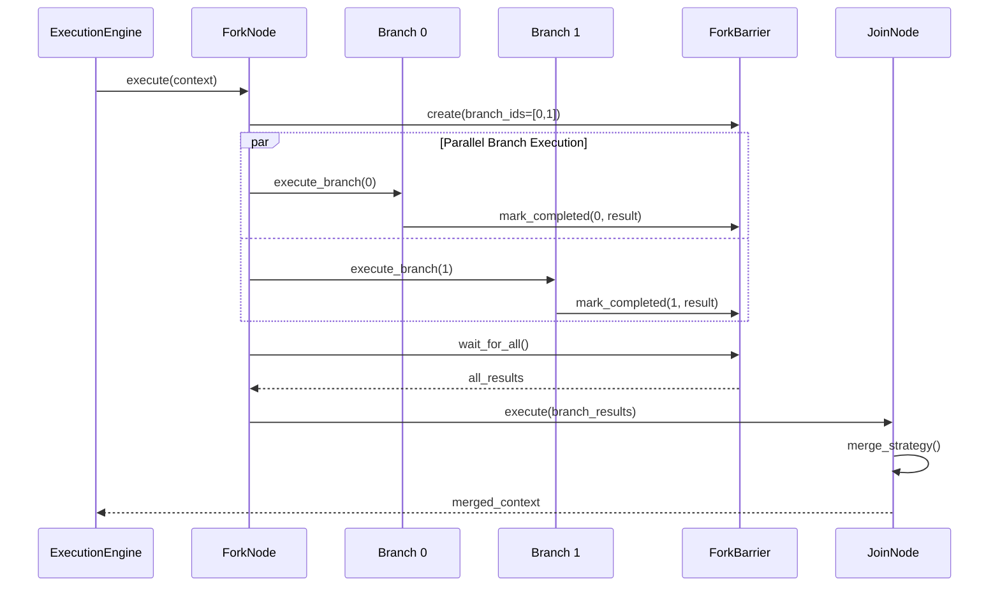

# NIRS4ALL v2.0: Architecture Overview

**Author**: GitHub Copilot (Claude Opus 4.5)
**Date**: December 25, 2025
**Status**: Design Proposal (Revised per Critical Review)
**Document**: 1 of 5

---

## Table of Contents

1. [Executive Summary](#executive-summary)
2. [Design Philosophy](#design-philosophy)
3. [Three-Layer Architecture](#three-layer-architecture)
4. [Layer Interactions](#layer-interactions)
5. [Key Design Decisions](#key-design-decisions)
6. [NIRS4ALL-Specific Features Preservation](#nirs4all-specific-features-preservation)
7. [Error Handling Philosophy](#error-handling-philosophy)
8. [Reproducibility Guarantees](#reproducibility-guarantees)
9. [Feature Preservation Matrix](#feature-preservation-matrix)
10. [Technology Stack](#technology-stack)

---

## Executive Summary

NIRS4ALL v2.0 is a ground-up redesign that separates concerns into three distinct layers:

```
┌─────────────────────────────────────────────────────────────────┐
│                        API LAYER                                 │
│  ┌─────────────┐  ┌─────────────────┐  ┌─────────────────────┐  │
│  │ Static API  │  │ sklearn Compat  │  │   CLI / Config      │  │
│  │ run/predict │  │ NIRSEstimator   │  │   YAML pipelines    │  │
│  └─────────────┘  └─────────────────┘  └─────────────────────┘  │
└──────────────────────────────┬──────────────────────────────────┘
                               │
┌──────────────────────────────▼──────────────────────────────────┐
│                     DAG EXECUTION ENGINE                         │
│  ┌──────────────┐  ┌───────────────┐  ┌──────────────────────┐  │
│  │ DAG Builder  │  │ Node Executor │  │  Artifact Manager    │  │
│  │ from syntax  │  │  parallel/seq │  │  cache & lineage     │  │
│  └──────────────┘  └───────────────┘  └──────────────────────┘  │
│  ┌──────────────┐  ┌───────────────┐  ┌──────────────────────┐  │
│  │ Branch/Merge │  │ Generator     │  │  Predictions Store   │  │
│  │ fork/join    │  │ expansion     │  │  ranking & query     │  │
│  └──────────────┘  └───────────────┘  └──────────────────────┘  │
└──────────────────────────────┬──────────────────────────────────┘
                               │
┌──────────────────────────────▼──────────────────────────────────┐
│                       DATA LAYER                                 │
│  ┌──────────────────────────────────────────────────────────┐   │
│  │                  FeatureBlockStore                        │   │
│  │  ┌─────────────┐  ┌─────────────┐  ┌─────────────────┐   │   │
│  │  │ FeatureBlock│  │ FeatureBlock│  │ FeatureBlock    │   │   │
│  │  │ (NIR specs) │  │ (markers)   │  │ (predictions)   │   │   │
│  │  └─────────────┘  └─────────────┘  └─────────────────┘   │   │
│  └──────────────────────────────────────────────────────────┘   │
│  ┌───────────────┐  ┌───────────────┐  ┌─────────────────────┐  │
│  │ SampleRegistry│  │ ViewResolver  │  │  TargetStore        │  │
│  │ Polars-backed │  │ lazy slicing  │  │  transform chain    │  │
│  └───────────────┘  └───────────────┘  └─────────────────────┘  │
└─────────────────────────────────────────────────────────────────┘
```

### Core Principles

1. **Separation of Concerns**: Each layer has a single responsibility
2. **Copy-on-Write Data Flow**: Blocks use CoW semantics for memory efficiency; views are lightweight references
3. **DAG-Native Execution**: All pipelines compile to a directed acyclic graph
4. **Reproducibility by Design**: Hash-based lineage for every transformation with full random state tracking
5. **Layered Array Backend**: NumPy for feature arrays (primary), Polars for metadata/registry (performance), xarray optional for labeled 3D data
6. **Preserve v1 UX**: All flexible syntax options (class/instance/dict/YAML) remain supported
7. **Domain-Aware**: First-class support for NIRS-specific concepts (sample repetitions, aggregation keys, spectral preprocessing)

---

## Design Philosophy

### From Current Pain Points to Solutions

| Current Issue | Root Cause | v2.0 Solution |
|---------------|------------|---------------|
| Dataset mutations are hard to track | In-place updates to `SpectroDataset` | Immutable blocks + append-only store |
| Branching/merging is complex | Context copying, snapshot management | DAG with explicit fork/join nodes |
| Cross-validation leaks are possible | Manual partition management | Views enforce partition boundaries |
| Caching is ad-hoc | No lineage tracking | Hash-based block identification |
| sklearn integration is awkward | Different execution model | `NIRSEstimator` wraps DAG execution |
| Multi-source handling is fragile | Coupled source management | Independent blocks + alignment views |

### Guiding Constraints

1. **No Backward Compatibility Required**: This is a clean rewrite
2. **Preserve All Features**: Every current capability must exist in v2.0
3. **Preserve UX Flexibility**: Multiple syntax options (class, instance, dict, YAML, JSON) continue to work
4. **Simplify User Experience**: Fewer concepts, clearer mental model
5. **Enable Parallelism**: Design must support future parallel execution
6. **Support Experimentation**: REPL-friendly, incremental builds
7. **Fail-Fast with Clear Errors**: Explicit error messages with actionable guidance

### Abstraction Justifications

Some components may appear over-engineered for simple use cases. This section justifies why each abstraction exists and when simpler alternatives could be used.

#### VirtualModel: Why Not Just Return One Model?

**The Problem**: After cross-validation, should we return:
- The best single fold model?
- A retrained model on all data?
- All fold models combined?

**Why VirtualModel is Necessary**:

| Use Case | Simple Model | VirtualModel |
|----------|-------------|--------------|
| Single prediction | ✅ Works | ✅ Works |
| Uncertainty estimation | ❌ No variance info | ✅ Fold disagreement = uncertainty |
| Stacking/Ensembles | ❌ Single model only | ✅ Aggregates multiple models |
| Model interpretation | ❌ Which fold's model? | ✅ Aggregate or per-fold SHAP |
| Production deployment | ⚠️ Which model? | ✅ Clear serialization with weights |

**Simplification for Basic Users**:
```python
# Users who don't need VirtualModel complexity:
result = run(pipeline, data)
prediction = result.predict(X_new)  # VirtualModel is hidden

# Users who need it:
virtual_model = result.load_model()
predictions_with_uncertainty = virtual_model.predict_with_std(X_new)
```

#### TargetStore: Why Bidirectional Transform Chains?

**The Problem**: When we scale targets (e.g., MinMaxScaler on y), predictions come out in scaled space. We need to inverse-transform to original units.

**Why TargetStore is Necessary**:

| Scenario | Without TargetStore | With TargetStore |
|----------|---------------------|------------------|
| Scaled y, unscaled predictions | Manual inverse transform | ✅ Automatic |
| Multiple y transforms | Track all manually | ✅ Chain inversion |
| Classification with encoding | Decode labels manually | ✅ Automatic decoding |
| Multi-target with different scales | Very complex | ✅ Per-target chains |

**Real Example**:
```python
# Pipeline with y scaling
pipeline = [
    {"y_processing": MinMaxScaler()},  # Scale y to [0, 1]
    KFold(n_splits=5),
    {"model": PLSRegression(n_components=10)}
]

result = run(pipeline, data)

# Without TargetStore: User must track scaler and manually inverse
# With TargetStore: Predictions automatically returned in original scale
print(result.y_pred)  # Already in original units!
```

**Simplification**: For 80% of users who don't transform y, TargetStore is transparent - it simply passes through unchanged.

#### When to Skip These Abstractions

For truly simple cases, direct sklearn usage remains valid:

```python
# If you don't need branching, stacking, or multi-source:
from sklearn.pipeline import Pipeline
from sklearn.preprocessing import MinMaxScaler
from sklearn.cross_decomposition import PLSRegression

simple_pipe = Pipeline([
    ('scaler', MinMaxScaler()),
    ('pls', PLSRegression(n_components=10))
])
simple_pipe.fit(X, y)  # Just use sklearn directly
```

The v2.0 architecture is designed for the 20% of use cases that require:
- Parallel preprocessing comparisons
- Stacking/ensemble methods
- Multi-source data fusion
- Complex branching with merging
- Reproducibility tracking
- Explainability across ensemble components

For simple linear pipelines, the overhead is minimal (VirtualModel wraps a single model, TargetStore has an empty chain).

---

## Three-Layer Architecture

### Layer 1: Data Layer (Document 2)

**Purpose**: Unified data storage and retrieval with lazy evaluation

```
┌─────────────────────────────────────────────────────────────────┐
│                     FeatureBlockStore                            │
│  ┌──────────────────────────────────────────────────────────┐   │
│  │ Block Registry                                            │   │
│  │   block_id → (array, metadata, lineage_hash)              │   │
│  └──────────────────────────────────────────────────────────┘   │
│                              │                                   │
│  ┌──────────────────────────▼───────────────────────────────┐   │
│  │ ViewResolver                                              │   │
│  │   view_spec → lazy slice (block_ids, row_ids, col_slice)  │   │
│  └──────────────────────────────────────────────────────────┘   │
│                              │                                   │
│  ┌──────────────────────────▼───────────────────────────────┐   │
│  │ DatasetContext                                            │   │
│  │   sample_registry + targets + metadata + fold_indices     │   │
│  └──────────────────────────────────────────────────────────┘   │
└─────────────────────────────────────────────────────────────────┘
```

**Key Components**:
- `FeatureBlock`: Copy-on-Write 3D array (samples × processings × features) + metadata
- `FeatureBlockStore`: Registry of all blocks with lineage tracking and garbage collection
- `SampleRegistry`: Polars DataFrame tracking sample identity, partition, groups, aggregation keys, repetitions
- `ViewSpec`: Declarative specification of data subset (partition, fold, branch, aggregation)
- `DatasetContext`: Complete training/prediction context bundle

### Layer 2: DAG Execution Engine (Document 3)

**Purpose**: Compile pipeline syntax to DAG, execute with parallelism

```
┌─────────────────────────────────────────────────────────────────┐
│                      DAG Engine                                  │
│                                                                  │
│  [Pipeline Syntax] ──► [DAG Builder] ──► [Executable DAG]       │
│                                                                  │
│  ┌──────────────────────────────────────────────────────────┐   │
│  │ Node Types                                                │   │
│  │   • TransformNode     (fit/transform operators)           │   │
│  │   • ModelNode         (fit/predict with folds)            │   │
│  │   • ForkNode          (branch/source_branch)              │   │
│  │   • JoinNode          (merge/merge_sources)               │   │
│  │   • GeneratorNode     (_or_/_range_ expansion)            │   │
│  │   • SplitterNode      (CV fold assignment)                │   │
│  └──────────────────────────────────────────────────────────┘   │
│                                                                  │
│  ┌──────────────────────────────────────────────────────────┐   │
│  │ Execution                                                 │   │
│  │   • Topological sort → execution order                    │   │
│  │   • Parallel execution within same level                  │   │
│  │   • Artifact caching via block lineage                    │   │
│  └──────────────────────────────────────────────────────────┘   │
└─────────────────────────────────────────────────────────────────┘
```

**Key Concepts**:
- Pipelines are **always** compiled to DAG before execution
- Generators (`_or_`, `_range_`) expand to parallel branches at compile time with **configurable limits**
- Folds are modeled as implicit fork/join (N parallel training paths) with explicit synchronization
- All nodes produce output blocks using CoW semantics; edges carry `ViewSpec`
- Generator expansion is **limited** (default max 1000 variants) with warnings at >100

### Layer 3: API Layer (Document 4)

**Purpose**: User-friendly interfaces for training, prediction, explanation

```
┌─────────────────────────────────────────────────────────────────┐
│                        API Layer                                 │
│                                                                  │
│  ┌────────────────────┐                                         │
│  │ Static Functions   │  nirs4all.run(pipeline, data)           │
│  │                    │  nirs4all.predict(model, data)          │
│  │                    │  nirs4all.explain(model, data)          │
│  └────────────────────┘                                         │
│                                                                  │
│  ┌────────────────────┐                                         │
│  │ sklearn Estimators │  NIRSRegressor(pipeline).fit(X, y)      │
│  │                    │  NIRSClassifier(pipeline).predict(X)    │
│  │                    │  NIRSSearchCV(pipelines).fit(X, y)      │
│  └────────────────────┘                                         │
│                                                                  │
│  ┌────────────────────┐                                         │
│  │ Result Objects     │  RunResult.best, .top(n), .export()     │
│  │                    │  PredictionResult with partition data   │
│  │                    │  ExplanationResult with SHAP values     │
│  └────────────────────┘                                         │
└─────────────────────────────────────────────────────────────────┘
```

**Key Interfaces**:
- `run()`: Train pipeline, return ranked results
- `predict()`: Apply trained model to new data
- `explain()`: Generate SHAP explanations
- `NIRSEstimator`: sklearn-compatible wrapper for nirs4all pipelines
- `NIRSSearchCV`: Grid search over pipeline configurations

---

## Layer Interactions

### Training Flow

```
User Code                 API Layer              DAG Engine            Data Layer
    │                         │                      │                     │
    │ run(pipeline, data)     │                      │                     │
    ├────────────────────────►│                      │                     │
    │                         │ create DatasetContext│                     │
    │                         ├─────────────────────────────────────────────►
    │                         │                      │ register source blocks
    │                         │                      │◄────────────────────┤
    │                         │ build_dag(pipeline)  │                     │
    │                         ├─────────────────────►│                     │
    │                         │ expanded DAG         │                     │
    │                         │◄─────────────────────┤                     │
    │                         │ execute(dag, context)│                     │
    │                         ├─────────────────────►│                     │
    │                         │                      │ for each node:      │
    │                         │                      │   resolve_view()    │
    │                         │                      ├────────────────────►│
    │                         │                      │   X, y data         │
    │                         │                      │◄────────────────────┤
    │                         │                      │   execute node      │
    │                         │                      │   register output   │
    │                         │                      ├────────────────────►│
    │                         │ RunResult            │                     │
    │◄────────────────────────┤                      │                     │
```

### Prediction Flow

```
User Code                 API Layer              DAG Engine            Data Layer
    │                         │                      │                     │
    │ predict(model, data)    │                      │                     │
    ├────────────────────────►│                      │                     │
    │                         │ load_artifacts(model)│                     │
    │                         ├─────────────────────────────────────────────►
    │                         │ create DatasetContext(new_data, artifacts) │
    │                         │                      │                     │
    │                         │ build_minimal_dag()  │                     │
    │                         ├─────────────────────►│                     │
    │                         │ execute(dag, mode="predict")              │
    │                         ├─────────────────────►│                     │
    │                         │                      │ apply transforms    │
    │                         │                      │ aggregate fold preds│
    │                         │ PredictionResult     │                     │
    │◄────────────────────────┤                      │                     │
```

---

## Key Design Decisions

### Decision 1: Immutable Blocks with Append-Only Store

**Rationale**: Current `SpectroDataset` mutates in-place, making it hard to:
- Track what transformations have been applied
- Roll back to previous states
- Cache intermediate results
- Enable parallel execution

**v2.0 Approach**:
```python
# Each transformation creates a NEW block
raw_block = store.register(X_raw, metadata={"source": "NIR"})
scaled_block = store.register(X_scaled, parent=raw_block,
                              transform="MinMaxScaler")

# Blocks are never modified; lineage is explicit
assert scaled_block.lineage_hash != raw_block.lineage_hash
```

### Decision 2: Views as Lazy References

**Rationale**: Copying data for each partition/fold is wasteful

**v2.0 Approach**:
```python
# ViewSpec is a lightweight object describing a slice
view = ViewSpec(
    block_ids=["block_001"],
    partition="train",
    fold_id=0,
    exclude_samples=[45, 67]  # outliers
)

# Data is only materialized when needed
X, y = context.materialize(view)
```

### Decision 3: DAG Compilation Before Execution

**Rationale**: Sequential execution misses parallelization opportunities and makes branching complex

**v2.0 Approach**:
```python
# Pipeline syntax compiles to DAG
dag = DAGBuilder().build([
    MinMaxScaler(),
    {"_or_": [SNV(), MSC()]},  # Creates fork node
    PLSRegression()
])

# DAG structure:
#   scale → fork → [snv_path, msc_path] → join → pls
```

### Decision 4: Folds as Implicit Fork/Join

**Rationale**: Cross-validation is just a special case of branching

**v2.0 Approach**:
```python
# SplitterNode creates N implicit branches (one per fold)
# ModelNode executes on each fold independently
# Final output is a "virtual model" (aggregated predictions)

class VirtualModel:
    fold_models: List[FittedModel]
    aggregation: str = "weighted_mean"

    def predict(self, X):
        preds = [m.predict(X) for m in self.fold_models]
        return aggregate(preds, self.aggregation)
```

### Decision 5: sklearn Estimator as DAG Wrapper

**Rationale**: Users want sklearn compatibility for `GridSearchCV`, SHAP, etc.

**v2.0 Approach**:
```python
class NIRSEstimator(BaseEstimator, RegressorMixin):
    def __init__(self, pipeline, cv=5):
        self.pipeline = pipeline
        self.cv = cv

    def fit(self, X, y):
        # Build DAG and execute in training mode
        self.dag_ = DAGBuilder().build(self.pipeline)
        self.result_ = execute_dag(self.dag_, X, y, cv=self.cv)
        self.best_model_ = self.result_.best
        return self

    def predict(self, X):
        return self.best_model_.predict(X)
```

---

## NIRS4ALL-Specific Features Preservation

### Sample Repetitions and Aggregation Keys

NIRS data often contains multiple measurements per biological sample (repetitions). The v2.0 design preserves this domain-specific handling:

```python
# SampleRegistry tracks aggregation relationships
SAMPLE_REGISTRY_SCHEMA = {
    "_sample_id": pl.Int64,       # Unique measurement ID (obs_id)
    "_bio_id": pl.Int64,          # Biological sample ID (for aggregation)
    "repetition_idx": pl.Int32,   # Repetition number within bio_id
    "partition": pl.Utf8,
    "group": pl.Utf8,
    # ... other fields
}

# Aggregation support at prediction time
class AggregationSpec:
    """Specification for sample-level aggregation."""
    by: str                  # Column to group by (e.g., "_bio_id")
    method: str = "mean"     # "mean", "median", "vote" (classification)
    exclude_outliers: bool = False
    outlier_threshold: float = 0.95
```

### Repetition Transformation

Convert repetitions to sources or processings:

```python
# Current v1 syntax preserved
pipeline = [
    {"rep_to_sources": "Sample_ID"},      # Reps → separate sources
    {"rep_to_processings": {"column": "Sample_ID", "expected_reps": 3}},
]

# Becomes RepetitionTransformNode in DAG
class RepetitionTransformNode(DAGNode):
    column: str
    mode: Literal["sources", "processings"]
    expected_reps: Optional[int]
    unequal_strategy: Literal["error", "drop", "pad", "mask"]
```

### Flexible Pipeline Syntax

All v1 syntax options remain supported and normalize to canonical form:

```python
# All of these are equivalent and valid:
MinMaxScaler                                    # Class reference
MinMaxScaler()                                  # Instance
{"preprocessing": MinMaxScaler()}               # Dict with keyword
{"class": "sklearn.preprocessing.MinMaxScaler"} # Explicit class path
"sklearn.preprocessing.MinMaxScaler"            # String path

# Step parsing normalizes all to ParsedStep
@dataclass
class ParsedStep:
    operator: Any                    # Instantiated operator
    keyword: str                     # Resolved keyword
    operator_class: str              # Fully qualified class name
    params: Dict[str, Any]           # Constructor parameters
    original_syntax: Any             # Preserved for serialization
```

### Operator Registry Pattern

**Users write operators directly - controllers are auto-identified at runtime.**

This is a core UX principle: users never need to specify which controller handles an operator.
The ControllerRegistry uses interface introspection to dispatch automatically:

```python
# === User writes this (v1 and v2 identical) ===
from sklearn.preprocessing import StandardScaler
from sklearn.cross_decomposition import PLSRegression
import torch.nn as nn

# Mix sklearn, TensorFlow, PyTorch - all auto-detected
pipeline = [
    StandardScaler(),           # → TransformController (TransformerMixin detected)
    PLSRegression(),            # → SklearnModelController (predict method detected)
    MyCustomTransform(),        # → TransformController (TransformerMixin detected)
    # MyTorchModel(),           # → TorchModelController (nn.Module detected)
]

# No explicit controller specification needed!
result = nirs4all.run(pipeline, data)
```

#### How Controller Matching Works

```python
class ControllerRegistry:
    """Priority-based controller dispatch via interface introspection."""

    controllers: List[Type[OperatorController]]  # Sorted by priority (lower = higher)

    def get_controller(self, operator: Any, keyword: str = "") -> OperatorController:
        """Find appropriate controller for operator.

        The registry iterates through controllers in priority order.
        Each controller's matches() method uses introspection:
        - TransformController: checks isinstance(op, TransformerMixin)
        - SklearnModelController: checks hasattr(op, 'predict') and is_regressor/is_classifier
        - TorchModelController: checks isinstance(op, nn.Module)
        - TFModelController: checks isinstance(op, tf.keras.Model)
        """
        for controller_cls in self.controllers:
            if controller_cls.matches(step=None, operator=operator, keyword=keyword):
                return controller_cls()

        raise ControllerNotFoundError(
            f"No controller found for: {type(operator).__name__}. "
            f"Ensure it has fit/transform methods (TransformerMixin) "
            f"or fit/predict methods (model)."
        )

# Built-in priority order (lower number = higher priority)
CONTROLLER_REGISTRY = [
    (TFModelController, priority=4),        # TensorFlow models
    (TorchModelController, priority=5),     # PyTorch models
    (JaxModelController, priority=5),       # JAX/Flax models
    (SklearnModelController, priority=6),   # sklearn predictors
    (TransformController, priority=10),     # sklearn transformers (catch-all)
]

# Custom controllers can use priority 1-3 to override defaults
@register_controller
class MySpecialController(OperatorController):
    priority = 2  # Will be checked before all built-in controllers

    @classmethod
    def matches(cls, step, operator, keyword):
        return isinstance(operator, MySpecialOperator)
```

#### Why This Matters

1. **Zero configuration**: Drop in any sklearn/TF/Torch/JAX operator
2. **v1 compatibility**: Existing pipelines work unchanged
3. **Extensible**: Custom controllers can override defaults
4. **Framework-agnostic**: Mix frameworks in one pipeline

---

## Error Handling Philosophy

### Error Strategy: Fail-Fast with Rich Context

```python
class NIRSError(Exception):
    """Base exception for all nirs4all errors."""
    pass

class PipelineValidationError(NIRSError):
    """Invalid pipeline configuration."""
    def __init__(self, message: str, step_idx: int, step: Any, suggestions: List[str] = None):
        self.step_idx = step_idx
        self.step = step
        self.suggestions = suggestions or []
        super().__init__(self._format_message(message))

    def _format_message(self, message: str) -> str:
        msg = f"Step {self.step_idx}: {message}\n"
        msg += f"  Step definition: {self.step!r}\n"
        if self.suggestions:
            msg += "  Suggestions:\n"
            for s in self.suggestions:
                msg += f"    - {s}\n"
        return msg

class DAGExecutionError(NIRSError):
    """Error during DAG execution."""
    def __init__(self, message: str, node_id: str, branch_id: Optional[int] = None, cause: Optional[Exception] = None):
        self.node_id = node_id
        self.branch_id = branch_id
        self.cause = cause
        super().__init__(message)

class DataValidationError(NIRSError):
    """Invalid data provided."""
    def __init__(self, message: str, field: str, expected: str, got: str):
        self.field = field
        self.expected = expected
        self.got = got
        super().__init__(f"{field}: {message} (expected {expected}, got {got})")

class GeneratorExplosionWarning(UserWarning):
    """Warning when generator expansion exceeds threshold."""
    pass
```

### Error Handling in DAG Execution

```python
class ExecutionEngine:
    def execute(self, dag, context, mode="train", fail_fast=True):
        errors = []

        for node_id in dag.topological_order():
            try:
                result = self._execute_node(node_id, ...)
            except Exception as e:
                error = DAGExecutionError(
                    message=str(e),
                    node_id=node_id,
                    branch_id=context.metadata.get("branch_id"),
                    cause=e
                )
                if fail_fast:
                    raise error from e
                errors.append(error)

        if errors:
            raise DAGExecutionError(
                f"Pipeline failed with {len(errors)} errors",
                node_id=errors[0].node_id,
                cause=errors[0]
            )
```

### Parallel Branch Error Handling

```python
class BranchExecutionError(DAGExecutionError):
    """One or more branches failed."""
    def __init__(self, branch_errors: Dict[int, Exception]):
        self.branch_errors = branch_errors
        failed = list(branch_errors.keys())
        super().__init__(
            f"Branches {failed} failed",
            node_id="fork",
            branch_id=failed[0]
        )

# Fork/Join with partial failure handling
class ForkNode:
    def execute(self, ..., continue_on_error: bool = False):
        results = {}
        errors = {}

        for branch_id, branch_def in enumerate(self.branches):
            try:
                results[branch_id] = self._execute_branch(branch_id, ...)
            except Exception as e:
                if not continue_on_error:
                    raise
                errors[branch_id] = e

        if errors:
            raise BranchExecutionError(errors)
        return results
```

---

## Logging Strategy

### Structured Logging with DAG Context

nirs4all uses structured logging that correlates log entries with DAG execution context. This enables efficient debugging and monitoring of complex pipelines.

```python
import logging
from contextlib import contextmanager
from typing import List, Optional, Dict, Any
from dataclasses import dataclass, field
from datetime import datetime


@dataclass
class LogContext:
    """Structured logging context for pipeline execution."""
    run_id: str
    node_stack: List[str] = field(default_factory=list)
    branch_id: Optional[int] = None
    fold_id: Optional[int] = None
    start_time: datetime = field(default_factory=datetime.now)

    def to_dict(self) -> Dict[str, Any]:
        """Convert to dict for structured logging."""
        return {
            "run_id": self.run_id,
            "node_path": "/".join(self.node_stack),
            "branch_id": self.branch_id,
            "fold_id": self.fold_id,
            "elapsed_ms": (datetime.now() - self.start_time).total_seconds() * 1000
        }


class PipelineLogger:
    """Structured logger with DAG context tracking.

    Integrates with Python's logging module while adding:
    - Node execution context (which node is running)
    - Branch and fold tracking
    - Timing information
    - Structured output for log aggregation tools

    Attributes:
        run_id: Unique identifier for this pipeline run
        verbose: Verbosity level (0=silent, 1=progress, 2=debug, 3=trace)
    """

    def __init__(self, run_id: str, verbose: int = 1):
        self.run_id = run_id
        self.verbose = verbose
        self._context = LogContext(run_id=run_id)
        self._logger = logging.getLogger(f"nirs4all.run.{run_id}")

        # Configure based on verbosity
        level = {0: logging.WARNING, 1: logging.INFO, 2: logging.DEBUG, 3: 5}.get(verbose, logging.INFO)
        self._logger.setLevel(level)

    @contextmanager
    def node_context(self, node_id: str, node_type: str = ""):
        """Context manager for node execution logging.

        All log entries within this context include the node information.

        Args:
            node_id: Unique node identifier
            node_type: Type of node (transform, model, fork, etc.)

        Example:
            with logger.node_context("snv_01", "transform"):
                logger.info("Applying SNV normalization")
                # Log entry includes: {"node_path": "snv_01", ...}
        """
        self._context.node_stack.append(node_id)
        start = datetime.now()

        if self.verbose >= 2:
            self._logger.debug(f"Entering {node_type} node: {node_id}")

        try:
            yield
        finally:
            elapsed = (datetime.now() - start).total_seconds()
            if self.verbose >= 2:
                self._logger.debug(f"Exiting {node_id} (took {elapsed:.3f}s)")
            self._context.node_stack.pop()

    @contextmanager
    def branch_context(self, branch_id: int):
        """Context manager for branch execution."""
        old_branch = self._context.branch_id
        self._context.branch_id = branch_id
        try:
            yield
        finally:
            self._context.branch_id = old_branch

    @contextmanager
    def fold_context(self, fold_id: int):
        """Context manager for fold execution."""
        old_fold = self._context.fold_id
        self._context.fold_id = fold_id
        try:
            yield
        finally:
            self._context.fold_id = old_fold

    def log(self, level: int, message: str, **extra):
        """Log with structured context.

        Args:
            level: Logging level (DEBUG, INFO, WARNING, ERROR)
            message: Log message
            **extra: Additional structured fields
        """
        record = {
            **self._context.to_dict(),
            **extra
        }
        self._logger.log(level, message, extra={"structured": record})

    def info(self, message: str, **extra):
        """Log info message."""
        if self.verbose >= 1:
            self.log(logging.INFO, message, **extra)

    def debug(self, message: str, **extra):
        """Log debug message."""
        if self.verbose >= 2:
            self.log(logging.DEBUG, message, **extra)

    def warning(self, message: str, **extra):
        """Log warning message."""
        self.log(logging.WARNING, message, **extra)

    def error(self, message: str, **extra):
        """Log error message."""
        self.log(logging.ERROR, message, **extra)

    def progress(self, current: int, total: int, message: str = ""):
        """Log progress update.

        Args:
            current: Current step number
            total: Total steps
            message: Optional progress message
        """
        if self.verbose >= 1:
            pct = current / total * 100 if total > 0 else 0
            self.info(f"[{current}/{total}] {pct:.0f}% {message}",
                     progress_current=current, progress_total=total)
```

### Verbosity Levels

| Level | Description | Use Case |
|-------|-------------|----------|
| 0 | Silent | Production, batch processing |
| 1 | Progress | Normal usage, shows step progress |
| 2 | Debug | Development, shows node entry/exit + shapes |
| 3 | Trace | Deep debugging, shows all internal operations |

### Integration with Monitoring Tools

The structured logging output can be captured by log aggregation tools:

```python
import json
import logging

class JSONFormatter(logging.Formatter):
    """JSON formatter for structured log output."""

    def format(self, record):
        log_entry = {
            "timestamp": self.formatTime(record),
            "level": record.levelname,
            "message": record.getMessage(),
        }
        if hasattr(record, "structured"):
            log_entry.update(record.structured)
        return json.dumps(log_entry)

# Configure JSON logging for production
handler = logging.StreamHandler()
handler.setFormatter(JSONFormatter())
logging.getLogger("nirs4all").addHandler(handler)
```

---

## Reproducibility Guarantees

### Random State Propagation

```python
@dataclass
class ReproducibilityContext:
    """Tracks all sources of randomness for reproducibility.

    This context ensures deterministic execution by:
    1. Deriving per-node seeds from global seed + node_id
    2. Setting RNG state for ALL relevant libraries before each node executes
    3. Recording library versions for reproducibility reports
    """
    global_seed: int
    node_seeds: Dict[str, int]  # Deterministic per-node seeds
    library_versions: Dict[str, str]  # numpy, sklearn, torch, tensorflow, etc.
    platform_info: Dict[str, str]  # OS, Python version

    @classmethod
    def create(cls, seed: int) -> "ReproducibilityContext":
        import numpy as np
        import sklearn
        import platform

        versions = {
            "numpy": np.__version__,
            "sklearn": sklearn.__version__,
            "nirs4all": nirs4all.__version__,
        }

        # Optionally capture deep learning framework versions
        try:
            import torch
            versions["torch"] = torch.__version__
        except ImportError:
            pass

        try:
            import tensorflow as tf
            versions["tensorflow"] = tf.__version__
        except ImportError:
            pass

        try:
            import jax
            versions["jax"] = jax.__version__
        except ImportError:
            pass

        return cls(
            global_seed=seed,
            node_seeds={},  # Populated during DAG build
            library_versions=versions,
            platform_info={
                "python": platform.python_version(),
                "platform": platform.platform(),
            }
        )

    def get_node_seed(self, node_id: str) -> int:
        """Deterministic seed for a specific node."""
        if node_id not in self.node_seeds:
            # Hash-based deterministic seed derivation
            import hashlib
            h = hashlib.sha256(f"{self.global_seed}:{node_id}".encode())
            self.node_seeds[node_id] = int(h.hexdigest()[:8], 16)
        return self.node_seeds[node_id]

    def apply_node_seed(self, node_id: str) -> None:
        """Apply deterministic seed to ALL relevant RNG sources before node execution.

        This method is called by the ExecutionEngine before each node executes.
        It sets the random state for:
        - Python's random module
        - NumPy's random generator
        - PyTorch (if available)
        - TensorFlow (if available)
        - JAX (note: JAX uses explicit key passing, so we provide the key)

        Args:
            node_id: The node about to execute
        """
        import random
        import numpy as np

        seed = self.get_node_seed(node_id)

        # Python random
        random.seed(seed)

        # NumPy
        np.random.seed(seed)

        # PyTorch (if available)
        try:
            import torch
            torch.manual_seed(seed)
            if torch.cuda.is_available():
                torch.cuda.manual_seed_all(seed)
        except ImportError:
            pass

        # TensorFlow (if available)
        try:
            import tensorflow as tf
            tf.random.set_seed(seed)
        except ImportError:
            pass

        # JAX note: JAX doesn't use global state; nodes using JAX should
        # call context.get_jax_key(node_id) to get a deterministic PRNGKey

    def get_jax_key(self, node_id: str) -> "jax.random.PRNGKey":
        """Get a deterministic JAX PRNGKey for a node.

        JAX uses explicit random key passing rather than global state.
        Nodes that use JAX should call this method to get their key.

        Args:
            node_id: The node requesting a key

        Returns:
            JAX PRNGKey derived from node seed
        """
        import jax
        seed = self.get_node_seed(node_id)
        return jax.random.PRNGKey(seed)
```

### Execution Order Guarantees

```python
class ExecutableDAG:
    def topological_order(self, deterministic: bool = True) -> List[str]:
        """Return nodes in reproducible execution order.

        Args:
            deterministic: If True, nodes at same level are sorted by ID
                          to ensure consistent ordering across runs.
        """
        from collections import deque

        in_degree = {nid: 0 for nid in self.nodes}
        for edge in self.edges:
            in_degree[edge.target_id] += 1

        # Sort initial queue for determinism
        ready = sorted([nid for nid, deg in in_degree.items() if deg == 0])
        queue = deque(ready)
        order = []

        while queue:
            node_id = queue.popleft()
            order.append(node_id)

            # Collect and sort successors for determinism
            successors = sorted(self.get_successors(node_id))
            for succ in successors:
                in_degree[succ] -= 1
                if in_degree[succ] == 0:
                    # Insert in sorted position
                    for i, q_id in enumerate(queue):
                        if succ < q_id:
                            queue.insert(i, succ)
                            break
                    else:
                        queue.append(succ)

        return order
```

### Result Reproducibility Report

```python
@dataclass
class RunResult:
    # ... existing fields ...
    reproducibility: ReproducibilityContext

    def reproducibility_report(self) -> Dict[str, Any]:
        """Generate report on reproducibility factors."""
        return {
            "seed": self.reproducibility.global_seed,
            "node_seeds": self.reproducibility.node_seeds,
            "versions": self.reproducibility.library_versions,
            "platform": self.reproducibility.platform_info,
            "dag_hash": self.dag.content_hash(),
            "execution_order": self.dag.topological_order(),
        }
```

### Cross-Platform Numerical Variance

**Important**: Even with identical seeds and versions, floating-point results may differ across:
- Different CPU architectures (x86 vs ARM)
- Different OS (Linux vs Windows vs macOS)
- Different BLAS/LAPACK implementations (OpenBLAS vs MKL vs Apple Accelerate)
- Different compiler optimizations

**Mitigation Strategies**:

1. **Tolerance-Based Comparisons**: Use relative tolerance (e.g., r² ± 0.001) for reproducibility checks
2. **Platform Recording**: The `platform_info` field captures OS and architecture
3. **Deterministic BLAS**: For strict reproducibility, use `OPENBLAS_NUM_THREADS=1` or similar
4. **Validation Mode**: `run(..., validate_reproducibility=True)` compares results against reference

```python
# Example: Validating cross-platform reproducibility
result = nirs4all.run(pipeline, data, random_state=42)

# Compare against reference (from different machine)
ref = nirs4all.load_reference("reference_results.npz")
if not np.allclose(result.y_pred, ref.y_pred, rtol=1e-3):
    warnings.warn(
        f"Results differ from reference. "
        f"Max diff: {np.max(np.abs(result.y_pred - ref.y_pred))}. "
        f"This may be due to platform differences: "
        f"{result.reproducibility.platform_info} vs {ref.platform_info}"
    )
```

---

## Feature Preservation Matrix

Every feature from v1.x must exist in v2.0:

| v1.x Feature | v2.0 Location | Notes |
|--------------|---------------|-------|
| Multi-source datasets | `FeatureBlockStore` with multiple blocks | Block alignment via `SampleRegistry` |
| Processing chain tracking | Block `lineage_hash` + `processing_ids` | Automatic, not manual |
| Cross-validation | `SplitterNode` → implicit fork/join | `VirtualModel` for aggregation with sync protocol |
| Branching (`branch:`) | `ForkNode` + `JoinNode` | Explicit DAG edges with barrier sync |
| Source branching | `SourceForkNode` | Per-source parallel paths |
| Merging (`merge:`) | `JoinNode` with strategy | `features` or `predictions` mode |
| Generators (`_or_`, `_range_`) | `GeneratorExpansion` at compile | Pre-execution with limits (max_variants=1000) |
| Feature augmentation | `AugmentNode` | Creates new blocks with CoW |
| Sample augmentation | `SampleAugmentNode` | Adds rows, tracks `origin` |
| Y processing | `TargetTransformNode` | Transform chain with inverse support |
| Predictions storage | `PredictionStore` (Polars-backed) | Same as v1.x, minor API changes |
| Prediction ranking | `PredictionRanker` | Unchanged API |
| Artifact persistence | `ArtifactManager` | Block-based, hash-indexed, GC-enabled |
| Bundle export | `BundleExporter` | Exports DAG + blocks + reproducibility |
| SHAP explanations | `explain()` + `ExplainerBridge` | Pluggable explainer backends |
| **Aggregation** | `AggregationView` + `SampleRegistry._bio_id` | Sample-level prediction aggregation |
| **Repetition handling** | `RepetitionTransformNode` | Reps → sources or processings with policy |
| Outlier exclusion | `OutlierExcluderNode` | Marks samples in registry |
| Metadata filtering | `ViewSpec.filter` | Declarative sample selection |
| **Flexible syntax** | `StepParser` with normalization | Class/instance/dict/YAML/JSON all supported |
| **Operator registry** | `ControllerRegistry` priority dispatch | Seamless sklearn/TF/Torch/JAX integration |

---

## Extensibility and Plugin System

nirs4all is designed for extensibility without forking. New operators can be added via the `ControllerRegistry`.

### Adding Custom Operators

```python
from nirs4all.controllers import register_controller, OperatorController
from sklearn.base import BaseEstimator, TransformerMixin

# 1. Define your custom transformer (sklearn-compatible)
class WavelengthCalibrator(TransformerMixin, BaseEstimator):
    """Calibrate wavelength axis using reference peaks."""

    def __init__(self, reference_peaks: List[float], tolerance: float = 1.0):
        self.reference_peaks = reference_peaks
        self.tolerance = tolerance

    def fit(self, X, y=None):
        # Detect peaks and compute calibration
        self.shift_ = self._compute_shift(X)
        return self

    def transform(self, X):
        return self._apply_shift(X, self.shift_)


# 2. (Optional) Register custom controller if special handling needed
@register_controller
class WavelengthCalibratorController(OperatorController):
    """Controller for wavelength calibration."""
    priority = 45  # Higher priority than generic transform

    @classmethod
    def matches(cls, step, operator, keyword) -> bool:
        return isinstance(operator, WavelengthCalibrator)

    def execute(self, step_info, dataset, context, runtime_context, **kwargs):
        # Custom execution logic
        return self._default_transform_execute(...)
```

### Plugin Discovery

Plugins are discovered via entry points:

```toml
# In your package's pyproject.toml
[project.entry-points."nirs4all.controllers"]
my_controller = "my_package.controllers:MyController"

[project.entry-points."nirs4all.transforms"]
my_transform = "my_package.transforms:MyTransform"
```

```python
# nirs4all loads plugins at startup
def _load_plugins():
    from importlib.metadata import entry_points

    eps = entry_points(group="nirs4all.controllers")
    for ep in eps:
        controller_class = ep.load()
        register_controller(controller_class)

    eps = entry_points(group="nirs4all.transforms")
    for ep in eps:
        # Make transform available in syntax
        transform_class = ep.load()
        TRANSFORM_REGISTRY[ep.name] = transform_class
```

### Extension Points

| Extension Point | Entry Point Group | Description |
|-----------------|-------------------|-------------|
| Controllers | `nirs4all.controllers` | Custom step execution logic |
| Transforms | `nirs4all.transforms` | Custom preprocessing operators |
| Models | `nirs4all.models` | Custom model architectures |
| Splitters | `nirs4all.splitters` | Custom CV strategies |
| Explainers | `nirs4all.explainers` | Custom explanation methods |
| Aggregators | `nirs4all.aggregators` | Custom prediction aggregation |

---

## Technology Stack

### Core Dependencies

| Component | Library | Rationale |
|-----------|---------|-----------|
| DataFrames | **Polars** | Fast, lazy evaluation, no pandas overhead |
| Arrays | **NumPy** | Standard, universal compatibility |
| Optional 3D | **xarray** | Named dimensions for multi-source |
| ML Base | **scikit-learn** | Transformer/Estimator patterns |
| Deep Learning | **PyTorch** (primary), TF, JAX | Flexible, good SHAP support |
| Optimization | **Optuna** | Hyperparameter search |
| Explanations | **SHAP** | Model-agnostic + deep explainers |
| Serialization | **joblib** + **Parquet** | Efficient binary + columnar |
| Hashing | **hashlib** (MD5/SHA256) | Deterministic lineage |
| Parallelism | **concurrent.futures** | Thread/process pools |

### Optional Dependencies

| Feature | Library | Install Extra |
|---------|---------|---------------|
| xarray backend | xarray | `nirs4all[xarray]` |
| TensorFlow models | tensorflow | `nirs4all[tf]` |
| JAX models | jax, flax | `nirs4all[jax]` |
| Ray parallelism | ray | `nirs4all[ray]` |
| MLflow tracking | mlflow | `nirs4all[mlflow]` |

---

## Next Documents

1. **Document 2: Data Layer** - `FeatureBlockStore`, views, aggregations
2. **Document 3: DAG Engine** - Node types, execution, branching
3. **Document 4: API Layer** - Static API, sklearn estimators
4. **Document 5: Implementation Plan** - Phases, testing, migration

---

## Execution Flow Diagrams

### Training Flow Sequence

```mermaid
sequenceDiagram
    participant User
    participant run() as nirs4all.run()
    participant DAGBuilder
    participant ExecutionEngine
    participant DatasetContext
    participant FeatureBlockStore
    participant VirtualModel

    User->>run(): run(pipeline, data, cv=5)

    Note over run(): 1. Data Initialization
    run()->>DatasetContext: from_data(data)
    DatasetContext->>FeatureBlockStore: register_source(X)
    FeatureBlockStore-->>DatasetContext: block_id

    Note over run(): 2. DAG Compilation
    run()->>DAGBuilder: build(pipeline)
    DAGBuilder->>DAGBuilder: expand_generators()
    DAGBuilder->>DAGBuilder: validate_dag()
    DAGBuilder-->>run(): ExecutableDAG

    Note over run(): 3. Execution
    run()->>ExecutionEngine: execute(dag, context, mode="train")

    loop For each node in topological order
        ExecutionEngine->>DatasetContext: materialize(view)
        DatasetContext->>FeatureBlockStore: get(block_ids)
        FeatureBlockStore-->>DatasetContext: arrays
        DatasetContext-->>ExecutionEngine: X, y

        ExecutionEngine->>ExecutionEngine: node.execute(X, y)
        ExecutionEngine->>FeatureBlockStore: register_transform(new_data)
        FeatureBlockStore-->>ExecutionEngine: new_block_id
    end

    Note over run(): 4. Model Aggregation
    ExecutionEngine->>VirtualModel: aggregate(fold_models)
    VirtualModel-->>ExecutionEngine: aggregated_model

    ExecutionEngine-->>run(): ExecutionResult
    run()-->>User: RunResult
```

### Prediction Flow Sequence

```mermaid
sequenceDiagram
    participant User
    participant predict() as nirs4all.predict()
    participant BundleLoader
    participant ExecutionEngine
    participant DatasetContext
    participant VirtualModel

    User->>predict(): predict(model, new_data)

    Note over predict(): 1. Load Model
    predict()->>BundleLoader: load(model_path)
    BundleLoader-->>predict(): VirtualModel, artifacts, DAG

    Note over predict(): 2. Prepare Data
    predict()->>DatasetContext: from_data(new_data, artifacts)

    Note over predict(): 3. Build Minimal DAG
    predict()->>predict(): build_minimal_dag()
    Note right of predict(): Only transform nodes,<br/>no splitter/training

    Note over predict(): 4. Execute Transforms
    predict()->>ExecutionEngine: execute(dag, mode="predict")

    loop For each transform node
        ExecutionEngine->>ExecutionEngine: apply_fitted_transform()
    end

    ExecutionEngine-->>predict(): transformed_context

    Note over predict(): 5. Aggregate Predictions
    predict()->>VirtualModel: predict(X_transformed)
    VirtualModel->>VirtualModel: aggregate_fold_predictions()
    VirtualModel-->>predict(): y_pred

    predict()-->>User: PredictResult
```

### Fork/Join Execution



---

## Appendix: Glossary

| Term | Definition |
|------|------------|
| **Block** | Copy-on-Write 3D array + metadata + lineage hash |
| **View** | Lazy reference to a subset of data |
| **ViewSpec** | Declarative specification of a view |
| **DAG** | Directed Acyclic Graph of pipeline operations |
| **Node** | Single operation in the DAG |
| **Edge** | Data flow between nodes (carries ViewSpec) |
| **Fork** | Node that creates multiple parallel paths with barrier sync |
| **Join** | Node that merges parallel paths |
| **Lineage** | Hash-based tracking of block transformations |
| **VirtualModel** | Aggregated prediction from fold models with weighted aggregation |
| **DatasetContext** | Complete bundle of data + artifacts for execution |
| **bio_id** | Biological sample ID (for aggregation across repetitions) |
| **obs_id** | Observation/measurement ID (unique per measurement) |
| **Aggregation Key** | Column used to group repetitions for prediction aggregation |
| **CoW** | Copy-on-Write semantics for memory-efficient block operations |
| **ParsedStep** | Normalized step representation from any syntax |
| **ReproducibilityContext** | Complete snapshot of random state and versions |
