# NIRS4ALL Library Overview

Version date: 2026-02-07
Audience: New contributors, advanced users, maintainers, integration engineers
Document type: High-level architecture and workflow guide
Scope: End-to-end understanding of the current nirs4all library

---

## About This Document

This document provides a conceptual overview of the nirs4all codebase. It favors clarity over implementation detail, explains how major parts fit together, and maps concepts to module boundaries. It includes diagrams and mental models but avoids deep code walkthroughs.

You can read it in one pass or section by section.

### Suggested Reading Paths

| Reader profile | Start with |
| --- | --- |
| Researcher | Sections 1, 2, 3, 10, 14 |
| Pipeline developer | Sections 1, 3, 5, 6, 7, 9, 11 |
| Maintainer | Sections 3, 4, 5, 8, 9, 12, 13 |
| Integration engineer | Sections 4, 7, 8, 12, 13 |
| Operator author | Sections 5, 6, 9, 11, and the glossary |

---

## Table of Contents

1. [Main Concept (High Level)](#section-1-main-concept-high-level)
2. [Data Concept and Logic](#section-2-data-concept-and-logic)
3. [Pipeline Workflow](#section-3-pipeline-workflow)
4. [Project, Workspace, and File Management](#section-4-project-workspace-and-file-management)
5. [Controllers](#section-5-controllers)
6. [Operators Diversity (Short)](#section-6-operators-diversity-short)
7. [Public API and Usage Surfaces](#section-7-public-api-and-usage-surfaces)
8. [CLI and Operational Flows](#section-8-cli-and-operational-flows)
9. [Reproducibility, Caching, and Performance](#section-9-reproducibility-caching-and-performance)
10. [Modeling Patterns in Real Work](#section-10-modeling-patterns-in-real-work)
11. [Extension Model and Customization](#section-11-extension-model-and-customization)
12. [Observability and Artifacts Lifecycle](#section-12-observability-and-artifacts-lifecycle)
13. [Risks, Tradeoffs, and Current Technical Debt Themes](#section-13-risks-tradeoffs-and-current-technical-debt-themes)
14. [Onboarding Paths by Persona](#section-14-onboarding-paths-by-persona)
15. [Practical Glossary](#section-15-practical-glossary)
16. [Appendix A: Concept Maps](#section-16-appendix-a---concept-maps)

---

## Library Positioning

nirs4all is a spectroscopy-first ML/DL orchestration library. It is not simply a model zoo, a data loader, or a pipeline syntax wrapper. It combines:

- a rich dataset abstraction (`SpectroDataset`)
- a controller-based pipeline engine
- operator families across preprocessing, filtering, and modeling
- a DuckDB-backed workspace persistence layer
- export and replay capabilities
- both Python API and CLI usage surfaces

nirs4all is optimized for iterative experimentation, supports broad backend compatibility (sklearn, TensorFlow, PyTorch, JAX, AutoGluon), and keeps spectroscopy-specific needs first class while remaining usable outside strict NIRS-only scenarios.

---

## Architecture at a Glance

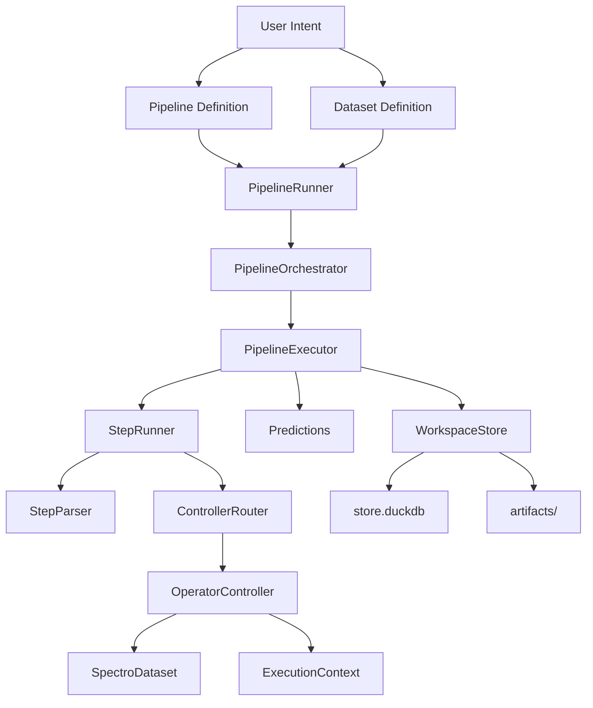

The execution core is controller-driven. The data core is dataset and index-driven. The persistence core is DuckDB plus content-addressed artifact files.

---

## Section 1: Main Concept (High Level)

### 1.1 What Problem the Library Solves

NIRS workflows are rarely linear. Real projects combine many preprocessing choices, compare multiple model families, require repeatable evaluation, and need traceable outputs.

The library addresses this by combining declarative workflow composition, controlled execution semantics, standardized result capture, and reusable artifacts with replay paths. It reduces glue code burden, prevents one-off script drift, and increases reproducibility discipline.

### 1.2 Core Mental Model

Think in three layers:

- **Layer 1: Data** — samples, targets, metadata, and index semantics (`SpectroDataset`)
- **Layer 2: Workflow** — ordered steps, branching, and merging behaviors (`PipelineConfigs`)
- **Layer 3: Runtime** — execution context, persistence, and reporting (`WorkspaceStore`)

In short: Data is the state. Pipeline is the plan. Controllers are the behavior. Workspace is the memory.

### 1.3 Conceptual Objects

The most important objects are:

| Object | Role |
| --- | --- |
| `SpectroDataset` | Core data container (features, targets, metadata, folds, index) |
| `PipelineConfigs` | Normalized pipeline definitions with generator expansion |
| `ExecutionContext` | Composite of DataSelector, PipelineState, and StepMetadata |
| `RuntimeContext` | Infrastructure wiring (store, artifact registry, trace, cache) |
| `OperatorController` | Behavior adapter between abstract steps and execution |
| `Predictions` | Accumulated prediction records with arrays and metrics |
| `WorkspaceStore` | DuckDB-backed persistence facade |

Each owns a distinct concern. Execution frequently crosses object boundaries.

### 1.4 Data-First and Operator-Driven

The pipeline engine is operator-driven, but the runtime is data-state aware. A controller does not blindly run an operator — it interprets operator intent in context, which includes partition, fold, processing chain, and execution mode.

This allows train vs predict behavior differences, fold-aware behaviors, branch-aware behaviors, and artifact-aware behaviors.

### 1.5 Why Controllers Matter

Many libraries directly execute step objects. This library routes steps through controllers, which provides:

- framework-specific handling (sklearn vs TensorFlow vs PyTorch vs JAX)
- keyword-specific handling (`model`, `y_processing`, `branch`, `merge`, etc.)
- branching and merge orchestration
- consistent prediction-mode behavior

Controller routing is priority-based: lower numeric priority wins. Multiple controllers may match one step; the highest-priority match is selected.

### 1.6 Why the Dataset Abstraction Matters

Most ML libraries assume simple tabular arrays. This library supports multi-source spectral data. A dataset stores not only `X` and `y` but also processing chains, index semantics, fold assignments, tags, and repetition/aggregation configuration.

This supports spectroscopy workflows where one sample can have multiple spectral measurements, one project can combine heterogeneous sources, and preprocessing branches need consistent sample alignment.

### 1.7 Why the Workspace Matters

A pipeline result is not only a final score — it is also traceability and deployability. The workspace stores run metadata, chains, predictions, and artifacts as content-addressed binaries. It supports replay and export, giving a durable experiment memory that outlives one Python process.

### 1.8 High-Level Execution Story

1. A user defines a pipeline and a dataset.
2. The runner normalizes both.
3. The orchestrator expands generator combinations.
4. The executor runs each pipeline variant per dataset.
5. The step runner parses and routes each step to a controller.
6. Controllers mutate dataset/context and emit artifacts.
7. Predictions are accumulated and persisted.
8. Chains are built from execution traces.
9. The workspace stores the full run record.

### 1.9 Relationship Between API and Internals

The module-level API (`run`, `predict`, `explain`, `retrain`) is simple by design. Internally, these entry points call the same execution infrastructure, keeping behavior coherent across workflows. Public simplicity is achieved by internal modularity.

### 1.10 Main Concept Diagram

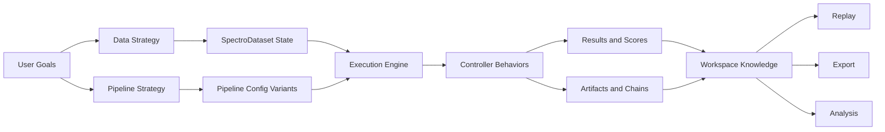

### 1.11 Strengths and Complexities

**Strong areas:**
- Spectroscopy-aware preprocessing and data handling
- Flexible controller dispatch across ML frameworks
- Workspace-backed experiment persistence
- Chain export and replay workflows

**Complex areas:**
- Branching and merge semantics
- Fold and prediction lifecycle alignment
- Cache and memory management under large sweeps

---

## Section 2: Data Concept and Logic

### 2.1 Data Layer Mission

The data layer exists to make modeling safe and flexible.

**Safe** means no silent sample misalignment, no silent leakage across folds, traceable transformations, and predictable selection semantics.

**Flexible** means multi-source support, multiple processing branches, dynamic metadata filtering, and augmentation-aware retrieval.

### 2.2 The Central Data Object

The central object is `SpectroDataset`. It acts as a facade over several internal blocks:

- **Feature storage** — one or more `FeatureSource` objects, each holding a 3D array (samples x processings x features)
- **Target storage** — y values with named processing states
- **Metadata storage** — index-aligned, queryable metadata columns
- **Index storage** — sample identity, partition, group, tags, exclusion flags

The facade also owns dataset-level state: task type, signal type, repetition configuration, aggregation settings, and fold assignments.

### 2.3 Internal Composition of SpectroDataset

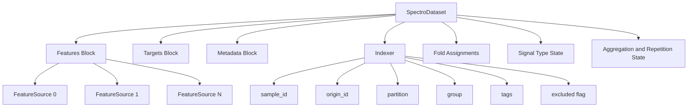

This decomposition separates value arrays from index semantics, keeping retrieval logic explicit and mutation logic controlled.

### 2.4 Sample Identity Model

The index tracks two critical identifiers: **sample_id** and **origin_id**.

- Base samples have `sample_id == origin_id`.
- Augmented samples have `sample_id != origin_id`.

This enables a key behavior: `X` for augmented samples can differ from the original, while `y` can map back to the origin. This preserves label consistency and is why index semantics are central to the library.

### 2.5 Multi-Source Data Model

A dataset can carry one or many sources. Each source can have distinct feature dimensionality, headers, and processing chains.

At retrieval time, the caller can keep sources separate or concatenate them. This enables patterns like spectra plus metadata markers, spectra from multiple instruments, and source-specific preprocessing followed by merge.

### 2.6 Processing Dimension Model

Features are not simply 2D arrays. Internally, each `FeatureSource` stores a 3D array with axes: **samples x processings x features**.

This allows multiple preprocessing variants to coexist without overwriting earlier processings, supporting branch and feature augmentation patterns. When a merge operation needs a flattened representation, it can collapse the processing/source structure.

### 2.7 Retrieval Semantics

Key retrieval controls include:

| Control | Purpose |
| --- | --- |
| `partition` | Select train, val, or test subsets |
| `processing` | Select specific processing chains |
| `layout` | Control output tensor shape (2d, 3d, etc.) |
| `include_augmented` | Include/exclude augmented samples |
| `include_excluded` | Include/exclude flagged-out samples |
| `source_index` | Select a specific source |

These switches exist because a wrong default can leak information or break alignment. Controllers use them intentionally for each execution mode.

### 2.8 Layout Semantics

Layout is a contract between data retrieval and operator expectations. It changes tensor organization without changing scientific meaning. The library supports four layout families, defined in the `FeatureLayout` enum:

| Layout | Enum value | Conceptual shape | Typical consumer |
| --- | --- | --- | --- |
| `2d` | `FLAT_2D` | samples x (processings * features) | Classical ML, sklearn estimators |
| `2d_interleaved` | `FLAT_2D_INTERLEAVED` | samples x (features * processings) | Models expecting ordered channel alternation |
| `3d` | `VOLUME_3D` | samples x processings x features | Deep learning, custom tensor operators |
| `3d_transpose` | `VOLUME_3D_TRANSPOSE` | samples x features x processings | DL variants needing feature-major memory order |

**Why layout exists:** NIRS workflows mix classical regression models, deep models, multi-source inputs, and feature-augmented channels. One fixed layout would force repeated ad hoc reshaping. Explicit layout keeps train/predict symmetry easier to maintain.

**Practical rules:**
1. Choose layout based on consumer contract, not one-step convenience.
2. Keep layout stable across train and predict for a given chain.
3. Treat layout as part of the reproducibility fingerprint — different layout can produce different fitted artifacts.

**Failure modes to avoid:** Training with `3d` and predicting with `2d`, silent transpose mismatches, merging branches with incompatible tensor orientation.

### 2.9 Augmented Sample Handling

Augmented samples are inclusion-optional at selection time. For split operations, only base samples should drive fold assignment. For training, augmented samples are typically included. For targets, augmented samples map to origin `y` values. This keeps augmentation powerful without breaking target consistency.

### 2.10 Excluded Sample Handling

Samples can be marked as excluded. Exclusion is an index flag, not immediate deletion, meaning:

- Arrays remain structurally stable
- Selection can omit excluded samples by default
- Diagnostics can re-include excluded samples when needed

This is important because some stages need full-shape updates while others need filtered training subsets.

### 2.11 Tags as Data-State Annotations

Tags are first-class computed columns in index space. They are useful for analysis, diagnostics, branch routing, and conditional filtering. A tag annotates samples without removing them — exclusion and tagging are distinct behaviors.

### 2.12 Repetition Semantics

Repetition means multiple spectra for one physical sample — a frequent NIRS reality. The dataset can define a repetition column that drives group-aware split behavior and aggregation in scoring. Without grouping by repetition, train/test can share the same biological entity, causing data leakage.

### 2.13 Aggregation Semantics

Aggregation groups predictions by metadata column, repetition semantics, or task-specific policies. Available methods include mean, median, and vote. Outlier-aware aggregation can be enabled to handle noisy replicates.

### 2.14 Fold Storage in Dataset

Split controllers write fold assignments into the dataset. Model controllers then consume these fold definitions without recomputing split logic, creating a clear separation: **split controller decides folds, model controller trains on folds**.

### 2.15 DataSelector and Context Coupling

Selection logic is carried through `DataSelector`, a dataclass inside `ExecutionContext`. Its key fields include:

- `partition` — train, val, test
- `processing` — active processing chains
- `layout` — requested array shape
- `include_augmented` — augmented sample inclusion flag
- `include_excluded` — excluded sample inclusion flag
- `fold_id` — current fold identifier
- `branch_id` / `branch_name` — branch context
- `source_index` — specific feature source

This keeps step behavior deterministic and reduces hidden global assumptions.

### 2.16 Targets and Y-Processing

Targets are handled separately from features. `y_processing` can transform targets, and these transformations are tracked as named processing states in context. This enables scaled target training, inverse-consistent prediction logic, and chain persistence of target transforms.

### 2.17 Metadata Handling

Metadata is index-aligned and queryable. It participates in grouping, splitting, branching rules, sample selection, and reporting. The data layer treats metadata as operational context, not just display context.

### 2.18 Signal Type and Header Semantics

Spectral data comes in different physical representations. The `SignalType` enum tracks:

| Category | Values |
| --- | --- |
| Core types | `absorbance`, `reflectance`, `reflectance%`, `transmittance`, `transmittance%` |
| Special types | `kubelka_munk`, `log_1_r`, `log_1_t` |
| Detection states | `auto`, `unknown`, `preprocessed` |

Header units (`HeaderUnit` enum) include `cm-1` (wavenumber), `nm` (wavelength), `none`, `text`, and `index`. These semantics matter for wavelength-aware transforms and signal conversion operators.

### 2.19 Auto-Detection and Loader Stack

Dataset loading supports auto-detection of delimiters, headers, and signal types. The loader ecosystem covers CSV, Excel, Parquet, NumPy, and MATLAB formats. NA policy choices include abort, drop, and replace — critical in spectral pipelines where missing values can silently destabilize models.

### 2.20 DatasetConfigs as Input Orchestrator

`DatasetConfigs` normalizes many dataset specifications. It accepts paths, dict configs, and lists, and applies global overrides for task type, signal type, repetition, and aggregation settings.

### 2.21 Task Type Semantics

The `TaskType` enum defines three task types:

- `REGRESSION` — continuous target prediction
- `BINARY_CLASSIFICATION` — two-class classification
- `MULTICLASS_CLASSIFICATION` — multi-class classification

Task type influences scorer behavior, aggregation method defaults, model interpretation logic, and probability handling.

### 2.22 Data Mutation and Hashing

Every transform can change feature state. Content hashing exists for reproducibility, and hash caches are invalidated on feature mutation. A stable dataset hash supports provenance, compatibility checks, and cache keying strategies.

### 2.23 Leakage Prevention Patterns

Leakage prevention is layered, not a single control:

- Split-first logic before model fitting
- Explicit base-sample selection for split operations
- Repetition-aware grouping
- Separate train vs test partition selectors
- Exclusion and tag-based filtering

### 2.24 Predictions Coupling with Data

`Predictions` is tightly coupled with dataset context. Each prediction record carries dataset name, fold id, partition, model identity, preprocessing signature, and branch context. Array payloads include y_true, y_pred, probabilities, and sample indices.

### 2.25 Data Retrieval Modes Matrix

| Retrieval intent | Include augmented | Include excluded | Typical user |
| --- | --- | --- | --- |
| Split calculation | No | No | Splitter controller |
| Transform all data | Usually Yes | Often Yes | Transform controller |
| Train model | Often Yes | No | Model controller |
| Diagnostics | Optional | Yes | Analysis/reporting |
| Predict new data | Context-dependent | Usually No | Prediction flow |

### 2.26 Data Logic Concept Map

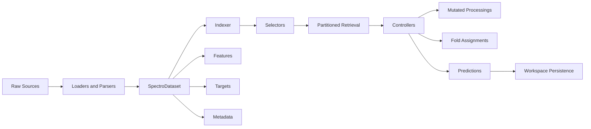

---

## Section 3: Pipeline Workflow

### 3.1 Workflow Mission

The workflow layer turns intent into controlled execution. It takes a pipeline definition and one or more datasets, expands variants from generators, executes steps with context-aware controller logic, and records outputs in a reproducible store.

### 3.2 Primary Execution Stack

| Component | Role |
| --- | --- |
| `PipelineRunner` | Top-level facade for run/predict/explain/retrain |
| `PipelineOrchestrator` | Coordinates Cartesian product of datasets x pipeline configs |
| `PipelineExecutor` | Executes a single pipeline on a single dataset |
| `StepRunner` | Parses, routes, and executes individual steps |
| `StepParser` | Normalizes raw step syntax into `ParsedStep` |
| `ControllerRouter` | Selects the matching controller by priority |
| `OperatorController` | Behavior adapter that executes the step |

### 3.3 End-to-End Training Flow

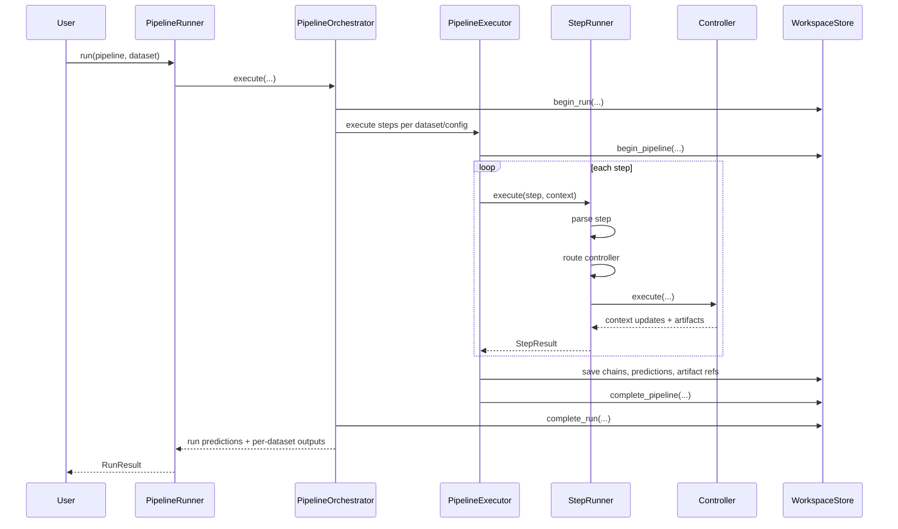

### 3.4 Pipeline Normalization Phase

Before execution, `PipelineConfigs` normalizes the pipeline definition. It accepts various input forms: lists of step objects, dicts with pipeline keys, or JSON/YAML paths.

Generator expansion happens at this phase. The system expands `_or_` (variant alternatives) and `_range_` (parameter sweeps) constructs. Each expanded variant receives a generated identity.

### 3.5 Dataset Normalization Phase

Dataset inputs are normalized via `DatasetConfigs`, which handles path-based loading, config parsing, and direct `SpectroDataset` instances. Once normalized, the orchestrator operates on consistent dataset objects.

### 3.6 Orchestration Topology

The orchestrator executes a Cartesian product of each dataset with each expanded pipeline config. This allows sweep-style experiments naturally. During this phase, the orchestrator also starts run-level persistence, initializes shared runtime components, and manages post-run summaries.

### 3.7 Context Initialization

The executor initializes an `ExecutionContext` containing:

- **DataSelector** — immutable data selection parameters
- **PipelineState** — mutable state (current step number, y_processing name, execution mode)
- **StepMetadata** — controller coordination data (keyword, operator type)
- **Custom dict** — for controller-specific state (e.g., branch paths)
- **Aggregate column** — for prediction aggregation policy

### 3.8 RuntimeContext Role

`RuntimeContext` is the infrastructure context. It carries runtime services rather than data state:

- `store` — WorkspaceStore for DuckDB-backed persistence
- `artifact_registry` — for artifact management during training
- `artifact_loader` / `artifact_provider` — for predict/explain modes
- `step_runner` — for executing sub-steps (e.g., inside branches)
- `run_id`, `pipeline_id`, `pipeline_uid`, `pipeline_name` — identifiers
- `trace_recorder` — for recording execution traces
- `cache_config` / `step_cache` — for step-level caching
- `retrain_config` — for retrain mode control
- `phase` — current execution phase (`CV` or `REFIT`)

This separates data semantics from infrastructure wiring.

### 3.9 Step Processing Pipeline

Each step goes through three mini-phases: **parse** (convert syntax into `ParsedStep`), **route** (select the best matching controller by priority), and **execute** (apply controller logic with context and dataset).

### 3.10 Keyword Semantics

Pipeline keywords influence controller matching. The key pipeline syntax keywords are:

| Keyword | Purpose |
| --- | --- |
| `model` | Define model step |
| `y_processing` | Target scaling |
| `tag` | Mark samples (non-removal) |
| `exclude` | Exclude samples from training |
| `branch` | Parallel/separation branches |
| `merge` | Combine branch outputs |
| `_or_` | Generator for variant alternatives |
| `_range_` | Parameter sweep generator |

Additional internal keywords include `feature_augmentation`, `sample_augmentation`, `auto_transfer_preprocessing`, and `concat_transform`.

### 3.11 Controller Routing Logic

Routing is simple and deterministic:

1. Evaluate all registered controllers
2. Keep those whose `matches()` returns `True`
3. Sort by numeric `priority` (lower wins)
4. Instantiate the first match

### 3.12 Execution Modes

**Train mode** is the richest lifecycle: split controllers define folds, transform controllers fit and transform, model controllers train and score, predictions are stored with fold/partition context, and traces capture step-level artifact references.

**Predict mode** replays persisted artifacts: training-only steps are skipped, controllers load stored artifacts, transformations replay in pipeline order, and model artifacts generate final predictions.

**Explain mode** resembles predict mode but collects explanation artifacts and SHAP charts instead of raw predictions.

**Refit mode** retrains the winning configuration on the full training partition after CV evaluation, producing a deployment-ready final model.

### 3.13 Out-of-Fold (OOF) Training and Prediction Lifecycle

OOF is the core mechanism behind honest validation and stacking-safe features. Each prediction is produced by a model that did not train on that row.

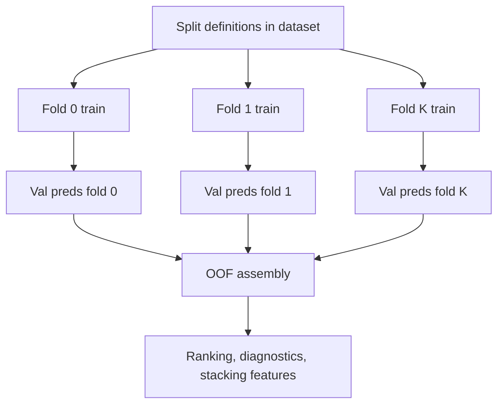

The OOF contract includes: each row linked to sample identity, fold identity persisted for auditability, partition and branch context retained, and model/preprocessing signatures retained. This allows fair variant comparison, leak-safe meta-model features, and fold-specific instability diagnosis.

For repeated measurements, OOF exists at scan-level and aggregated entity-level. For stacking, base model predictions for meta-model training must be OOF-generated to avoid target leakage.

### 3.14 CV-to-Refit Lifecycle Pattern

A robust production pattern: train across folds first, then retrain the winner on full training data.

1. **Phase A:** Run candidate pipelines with fold-based evaluation. Persist fold metrics, artifacts, and OOF outputs.
2. **Phase B:** Rank candidates using a predefined metric. Select the winner with deterministic tie-break rules.
3. **Phase C:** Refit only the winning configuration on the full training partition (excluding holdout/test).
4. **Phase D:** Persist refit artifacts as the deployment-default chain. Keep CV artifacts for audit.

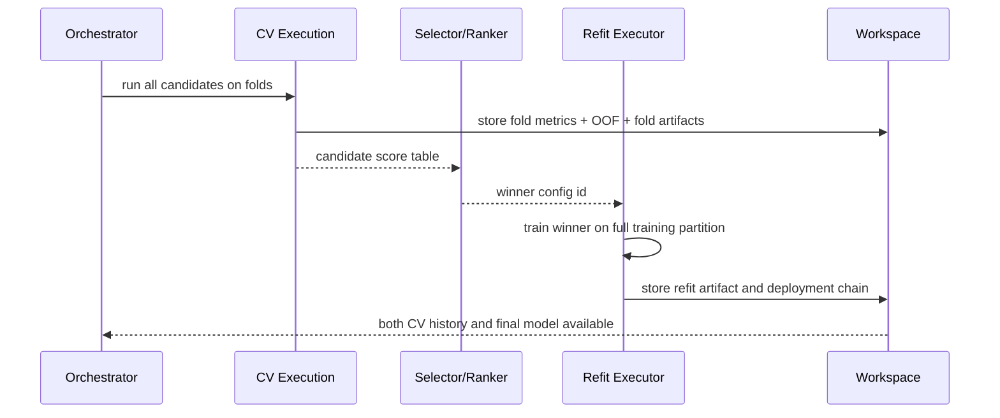

**Why this matters:** CV answers model-selection quality. Refit answers deployment-readiness. Conflating them creates either under-trained deployment artifacts or biased selection.

### 3.15 Retrain and Transfer Workflow

Retrain uses a source model/chain plus new data. Modes include full retrain, transfer-style reuse, and fine-tune patterns. Per-step mode control determines whether to train or reuse artifacts.

### 3.16 Branching Workflow

Branching enables parallel subflows in two families:

- **Duplication branches** — all samples go to each branch (parallel preprocessing/modeling)
- **Separation branches** — samples are partitioned across branches (by metadata, tag, or source)

Branch context is tracked in the execution context and becomes important for artifact and prediction resolution.

### 3.17 Merge Workflow

Merge operations reconcile branch outputs. Strategies include:

- `predictions` — use OOF predictions as stacking features (for duplication branches)
- `features` — use transformed features from branches
- `concat` — reassemble samples in original order (for separation branches)

Merge logic must handle asymmetry (shape differences, model availability differences). Merging is one of the highest-complexity areas.

### 3.18 Feature Augmentation Workflow

Feature augmentation orchestrates repeated preprocessing operations in `extend`, `add`, or `replace` modes. This changes processing growth patterns and directly influences memory footprint.

### 3.19 Sample Augmentation Workflow

Sample augmentation generates synthetic variants in standard count mode or balancing-aware mode (based on labels or metadata). This is especially useful for imbalanced classification.

### 3.20 Trace and Chain Lifecycle

Execution trace captures step outcomes and artifacts. The chain builder converts trace data into replayable chains containing ordered steps, model step index, fold artifact references, shared preprocessing references, and branch/source metadata. Chains are first-class deployment and replay units.

### 3.21 Prediction Persistence Workflow

Prediction rows are persisted with rich metadata. Array payloads (y_true, y_pred, y_proba) are stored in a dedicated array table. This split keeps scalar query paths efficient while preserving detailed replay capability.

### 3.22 Workflow State Transitions

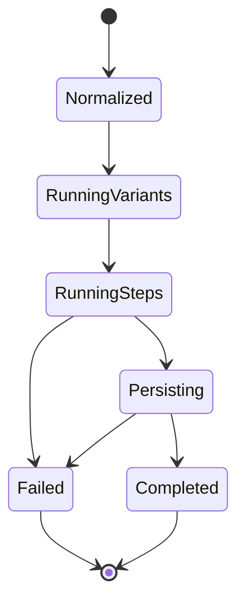

### 3.23 Workflow Contracts

1. Step controllers must return context updates consistently.
2. Prediction mode must never assume training-time fitting.
3. Artifact naming and indexing must remain deterministic enough for replay.
4. Branch and fold semantics must be preserved through persistence.
5. Run metadata must reflect actual execution conditions.

---

## Section 4: Project, Workspace, and File Management

### 4.1 Why Workspace Management Is Central

The workspace is the durable memory of experiments. Without it, results remain process-local and fragile. It enables run tracking, artifact reuse, chain replay, export workflows, and lifecycle cleanup.

### 4.2 Active Workspace Resolution

Active workspace path resolution follows a priority order: explicitly set path, environment variable, or default local workspace path.

### 4.3 Workspace Layout

A workspace is initialized with:

```
workspace/
├── store.duckdb          # DuckDB database (runs, chains, predictions, artifacts metadata)
├── artifacts/            # Content-addressed binary files (hash-sharded)
│   ├── ab/abc123...joblib
│   └── ...
├── exports/              # User-triggered exports (.n4a bundles, etc.)
└── library/              # Reusable pipeline templates
```

Note: `figures/`, `outputs/`, and `logs/` directories may also be created during execution for chart outputs, step outputs, and log files respectively.

### 4.4 Store-First Architecture

Structured runtime data lives in DuckDB (file: `store.duckdb`). The DB is the source of truth for runs and predictions, avoiding scattered manifest files and simplifying query/ranking workflows.

### 4.5 Core Store Tables

| Table | Purpose |
| --- | --- |
| `runs` | High-level experiment sessions |
| `pipelines` | Per-variant execution metadata |
| `chains` | Replayable step-to-artifact mappings |
| `predictions` | Scalar metrics and identifiers |
| `prediction_arrays` | Dense arrays (y_true, y_pred, y_proba) |
| `artifacts` | Binary metadata and content hash references |
| `logs` | Structured step events |

Together these capture full runtime provenance and power analysis and replay.

### 4.6 Artifact Storage Model

Artifacts are content-addressed by hash, with git-style sharding: `artifacts/{hash[:2]}/{hash}.{ext}`. This provides natural deduplication for identical binaries, stable lookup by artifact id, and predictable cleanup based on reference counting.

### 4.7 Chain as Deployment Unit

A chain represents an ordered preprocessing and model sequence plus all needed artifact references. This makes it the key replay unit and the key export unit.

### 4.8 Export Paths

The primary export formats are:

- **`.n4a`** — full bundle (ZIP archive with artifacts and metadata)
- **`.n4a.py`** — portable Python script with embedded artifacts

Exports are explicit operations triggered via `result.export("model.n4a")`. Training does not eagerly create export files.

### 4.9 Replay Paths

Replay uses chain metadata and artifact lookup to apply transforms in stored sequence, then model prediction logic. Replay supports both refit and fold-based variants.

### 4.10 Library Templates

The workspace library stores reusable pipeline templates with config plus metadata. Categories and tags support organization, enabling knowledge reuse across projects and team-level pattern sharing.

### 4.11 Query and Ranking

Top predictions can be queried by metric, filtered by dataset and model class. Runs and pipelines can be listed and inspected. This enables operational reporting without custom SQL.

### 4.12 Cleanup Workflows

Cleanup includes deleting run trees, deleting pipeline records, garbage collecting orphaned artifacts, and database vacuum. Essential for long-running experimentation programs.

### 4.13 Workspace Lifecycle Diagram

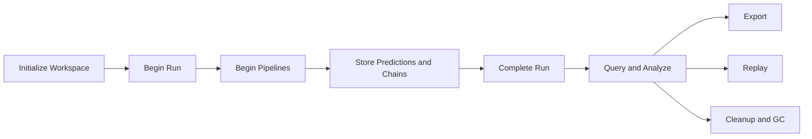

---

## Section 5: Controllers

### 5.1 Controller Philosophy

Controllers are behavior adapters between abstract steps and concrete execution. A step definition alone is not enough — execution requires context-aware behavior. Controllers provide that behavior and are the core extension seam of the engine.

### 5.2 Controller Registration Model

Controllers are registered in a global registry using the `@register_controller` decorator. Matching and routing are dynamic: a controller is selected when its `matches()` classmethod returns `True`, with `priority` deciding conflicts. This avoids hardcoded if-else execution trees.

### 5.3 Controller Base Contract

All controllers inherit from `OperatorController` (abstract base class in `controllers/controller.py`). The required interface includes:

| Method | Type | Purpose |
| --- | --- | --- |
| `matches(step, operator, keyword)` | classmethod | Determine if this controller handles the step |
| `use_multi_source()` | classmethod | Whether to iterate over sources |
| `supports_prediction_mode()` | classmethod | Whether to run during prediction |
| `execute(step_info, dataset, context, runtime_context)` | instance | Perform the step's logic |

Each controller also declares a numeric `priority` (lower = higher precedence).

### 5.4 Controller Families

The library includes the following controller families:

**Transform controllers:**
- `TransformerMixinController` (priority 10) — general feature-space transforms
- `YTransformerMixinController` (priority 5) — target-side transforms

**Model controllers** (all inherit from `BaseModelController`):
- `SklearnModelController` (priority 6) — sklearn-like estimators
- `TensorFlowModelController` (priority 4) — TensorFlow models
- `PyTorchModelController` (priority 4) — PyTorch models
- `JaxModelController` (priority 4) — JAX models
- `AutoGluonModelController` (priority 5) — AutoGluon configs
- `MetaModelController` (priority 5) — stacking/meta-model behavior

**Data-flow controllers:**
- `BranchController` (priority 5) — branch orchestration
- `MergeController` (priority 5) — branch output reconciliation
- `FeatureAugmentationController` (priority 10) — repeated preprocessing orchestration
- `SampleAugmentationController` (priority 10) — synthetic sample generation
- `TagController` (priority 5) — sample annotation
- `ExcludeController` (priority 5) — sample exclusion
- `FeatureSelectionController` (priority 5) — feature selection
- `ResamplerController` (priority 5) — spectral resampling
- `ConcatAugmentationController` (priority 10) — concatenation transforms
- `AutoTransferPreprocessingController` (priority 9) — auto transfer preprocessing
- `RepToSourcesController` / `RepToPPController` (priority 3) — repetition handling

**Splitter controllers:**
- `CrossValidatorController` (priority 10) — fold generation from CV splitters
- `FoldFileLoaderController` (priority 9) — load folds from files

**Chart controllers:**
- `SpectraChartController`, `YChartController`, `FoldChartController`, `ExclusionChartController`, `AugmentationChartController`, `SpectralDistributionController` (all priority 10)

**Fallback:**
- `DummyController` (priority 1000) — catch-all for unhandled operators

### 5.5 Controller Interaction Patterns

Controllers interact with three main surfaces:

- **Dataset** — read/mutate feature processings, folds, exclusions, target processings, tags
- **ExecutionContext** — update selector state, pipeline state, metadata flags, custom state
- **Artifacts** — emit artifacts in train mode, consume artifacts in predict mode

### 5.6 Controller Extension Pattern

To add custom behavior:

1. Define a class inheriting from `OperatorController`
2. Implement the base contract methods (`matches`, `execute`, etc.)
3. Decorate with `@register_controller`
4. Set an appropriate `priority` to avoid accidental shadowing
5. Ensure the module is imported at runtime

### 5.7 Controller Priority Strategy

Lower priority values win earlier. Use low priority for specific behaviors and higher priority for generic ones. This keeps specific handlers from being shadowed by generic ones. Example: `TensorFlowModelController` (priority 4) wins over `SklearnModelController` (priority 6) for TensorFlow objects.

### 5.8 Controller Family Map

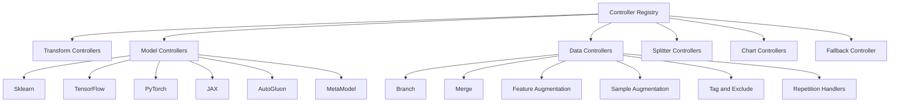

---

## Section 6: Operators Diversity (Short)

This section provides a quick map of operator breadth, not a full API reference.

### 6.1 Operator Categories

| Category | Examples |
| --- | --- |
| Spectral transforms | Scatter correction (SNV, MSC), Savitzky-Golay derivatives, baseline correction, wavelet transforms, signal conversion |
| Feature engineering | Feature selection, resampling, detrend |
| Target transforms | MinMaxScaler, StandardScaler on y |
| Filters | Y-outlier (IQR, z-score), X-outlier (Mahalanobis, leverage), metadata-driven |
| Augmentation | Random perturbation, spline-based perturbation, environmental/scattering effects, edge artifact simulation |
| Splitters | Standard sklearn splitters, spectroscopy-specific (Kennard-Stone, SPXY), grouped wrappers |
| Models | Full sklearn ecosystem, specialized PLS family, TensorFlow/PyTorch/JAX operators, AutoGluon, meta-model selectors |

### 6.2 Practical Diversity View

Diversity means two things: many interchangeable components **and** consistent pipeline syntax and execution control. Without consistent execution semantics, diversity becomes chaos.

### 6.3 Operator Diversity Diagram

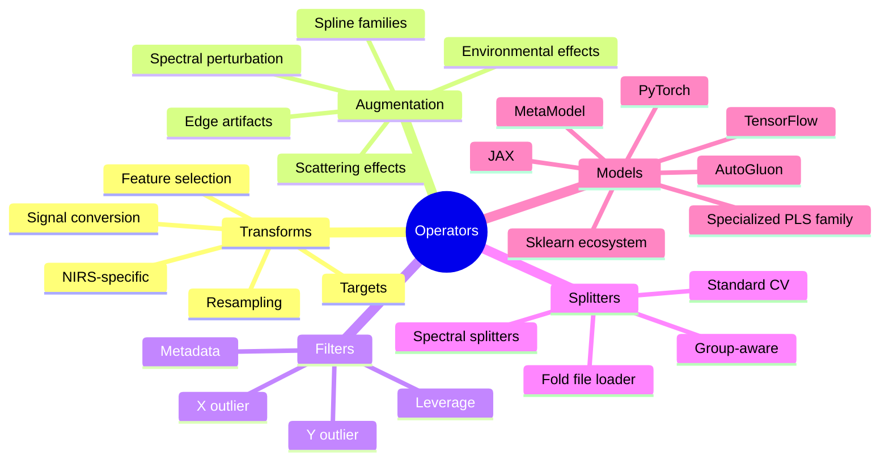

---

## Section 7: Public API and Usage Surfaces

### 7.1 API Design Goal

The public API is designed for fast adoption. Most users need only module-level functions. Advanced users can access `PipelineRunner` directly.

### 7.2 Primary Module-Level Entry Points

| Function | Purpose |
| --- | --- |
| `nirs4all.run(pipeline, dataset, ...)` | Train and evaluate pipelines |
| `nirs4all.predict(model, data, ...)` | Make predictions on new data |
| `nirs4all.explain(model, data, ...)` | Generate SHAP explanations |
| `nirs4all.retrain(source, data, ...)` | Retrain on new data |
| `nirs4all.session(...)` | Create a reusable session |
| `nirs4all.load_session(...)` | Load a saved session |
| `nirs4all.generate(...)` | Generate synthetic data |

### 7.3 `run` Workflow Surface

`run` is the main training and evaluation entry. It supports single or multiple pipelines, single or multiple datasets, Cartesian execution, cache configuration, and refit behavior. It returns a `RunResult`.

### 7.4 `predict` Workflow Surface

`predict` supports two paths:

- **Chain-id replay** — fast in-workspace prediction using DuckDB store: `nirs4all.predict(chain_id="abc123", data=X_new)`
- **Model-source path** — portable prediction from exported bundles: `nirs4all.predict(model="model.n4a", data=X_new)`

### 7.5 `explain` Workflow Surface

`explain` wraps SHAP-oriented explainability. It integrates with model replay semantics and returns an `ExplainResult` with explanation artifacts and charts.

### 7.6 `retrain` Workflow Surface

`retrain` adapts existing trained pipelines to new data. Modes include full retrain, transfer-style reuse, and fine-tuning.

### 7.7 Result Objects

| Class | Key properties and methods |
| --- | --- |
| `RunResult` | `best_score`, `best_rmse`, `best_r2`, `best_accuracy`, `top(n)`, `filter(...)`, `export(...)`, `final`, `cv_best` |
| `PredictResult` | `values` (alias for y_pred), `shape`, `to_numpy()`, `to_list()`, `to_dataframe()` |
| `ExplainResult` | `values`, `shape`, `mean_abs_shap`, `top_features`, `get_feature_importance()`, `to_dataframe()` |

### 7.8 Session Surface

Session supports context-managed shared runner style and stateful pipeline lifecycle style. Useful when many runs share the same operational settings.

### 7.9 Advanced Surface: PipelineRunner

`PipelineRunner` allows precise runtime control: workspace path, logging verbosity, artifact save policy, chart behaviors, and continue-on-error behavior.

---

## Section 8: CLI and Operational Flows

### 8.1 CLI Mission

CLI provides operational access to key workflows. It complements the Python API and is especially useful for automation and diagnostics.

### 8.2 CLI Command Groups

| Group | Key commands |
| --- | --- |
| `workspace` | `init`, `list-runs`, `query-best`, `filter-predictions`, `stats`, `list-templates` |
| `artifacts` | `list-orphaned`, `cleanup`, `stats`, `purge` |
| `config` | `validate` (pipeline or dataset config files) |
| `dataset` | `validate`, `inspect`, `export-config`, `diff` |

Additional top-level flags: `--test-install`, `--test-integration`, `--version`.

### 8.3 CLI Workflow Pattern

A common operational pattern:

1. Validate configs (`nirs4all config validate ...`)
2. Initialize workspace (`nirs4all workspace init ...`)
3. Run experiments from API/script
4. Inspect outcomes (`nirs4all workspace list-runs ...`)
5. Export and clean up (`nirs4all artifacts cleanup ...`)

---

## Section 9: Reproducibility, Caching, and Performance

### 9.1 Reproducibility Pillars

Core reproducibility pillars:

- Controlled random seeding (NumPy, Python random, DL backends)
- Explicit dataset and pipeline identities via content hashing
- Deterministic split semantics with grouped splits
- Persisted execution traces and chains
- Explicit artifact references

Perfect determinism still depends on backend and hardware behavior.

### 9.2 Caching Philosophy

Caching is runtime-oriented and pragmatic. Cache must preserve semantic equivalence — it is not a replacement for correct execution semantics.

Cache behavior is controlled through `CacheConfig` with knobs for step-cache flags, memory limits, and observability settings. Step cache targets repeated preprocessing reuse and is most valuable in generator-heavy variant sweeps.

### 9.3 Memory Pressure Sources

Common pressure sources include feature processing expansion, branch-state copying, high-dimensional multi-source datasets, large variant grids, and fold-multiplied model artifacts. Performance planning must account for these multipliers.

### 9.4 Runtime Observability

Structured logs and step-level metrics help locate bottlenecks. Memory warnings and cache statistics identify pressure points. Observability should be treated as part of the optimization workflow.

### 9.5 Cleanup as Performance Strategy

Large stale workspaces can slow tooling. Periodic cleanup includes deleting obsolete runs, garbage collecting artifacts, and vacuuming the database.

---

## Section 10: Modeling Patterns in Real Work

### 10.1 Pattern: Baseline First

Start with a narrow baseline pipeline — one preprocessing path and one model family. Establish a stable reference before branching out.

### 10.2 Pattern: Controlled Variant Expansion

Use generator features (`_or_`, `_range_`) to vary one axis at a time. Avoid exploding all axes simultaneously in early exploration.

### 10.3 Pattern: Repetition-Aware Validation

When repeated measurements exist, set repetition-aware grouping early to avoid optimistic leakage-biased metrics.

### 10.4 Pattern: Branch for Competing Preprocessing

Use duplication branches to compare preprocessing chains, then merge downstream for ranking and analysis.

### 10.5 Pattern: Separation Branches for Subpopulations

Use separation branches for subgroup-specific models. Subgroups can be metadata-defined or tag-defined to capture heterogeneity explicitly.

### 10.6 Pattern: Stacking with Meta-Model

Use branch + merge with `"predictions"` strategy to build stacking features. Validate anti-leakage assumptions (OOF discipline) for the stacking pipeline design.

### 10.7 Pattern: Export and Replay as Validation Gate

After identifying a winner, perform export and replay checks before deployment. Validate operational portability, not only CV score.

### 10.8 Pattern: Retrain for New Batches

Choose retrain mode by change profile: full retrain for distribution shifts, transfer-style reuse for moderate drift, fine-tuning for compatible model families.

### 10.9 Pattern Risks

Common misuse examples:
- Over-branching too early
- Unconstrained generator explosion
- Stacking without leakage checks
- Non-grouped splits on repeated entities

Patterns are guides, not automatic guarantees.

---

## Section 11: Extension Model and Customization

### 11.1 Extension Philosophy

The system is designed to be extended without rewriting the engine. The primary extension seam is the controller registry. Secondary seams include custom operators and pipeline templates.

### 11.2 Custom Controller Extension

1. Implement the `OperatorController` base contract
2. Define precise `matches()` logic
3. Choose a safe routing priority
4. Register with `@register_controller` and ensure the module is imported

This enables domain-specific workflow keywords.

### 11.3 Custom Operator Extension

Operators can be introduced in transform or model families. As long as controller matching supports them, they participate in normal pipelines. Consistency with sklearn-like conventions (fit/transform/predict interface) helps integration.

### 11.4 Custom Split and Group Logic

Projects with special validation constraints can provide custom splitters. Grouped wrappers and context-aware split behavior provide compatibility pathways.

### 11.5 Template-Based Reuse

Pipeline library templates support reusable workflow assets. Teams can standardize trusted pipeline templates with metadata for discoverability.

### 11.6 Extension Quality Guidelines

1. Define explicit failure behavior
2. Avoid silent fallback logic
3. Log enough metadata for debugging
4. Test train and predict mode separately
5. Validate branch and multi-source compatibility where relevant

---

## Section 12: Observability and Artifacts Lifecycle

### 12.1 Observability Layers

Observability exists at three layers:

- **Runtime logs** — step start/end events, warnings, errors, durations
- **Prediction records** — scalar metrics, identifiers, row-level outcomes
- **Artifact and chain metadata** — logical workflow to physical artifact mappings

These layers should be interpreted together.

### 12.2 Lifecycle from Training to Deployment

1. Step execution emits artifacts
2. Trace captures artifact references
3. Chain is saved from trace
4. Predictions link to chain and pipeline
5. Export builds a portable deployment unit (`.n4a` bundle)

This sequence is central to reproducibility.

### 12.3 Observability Risks

- Semantic drift between labels and persisted records
- Ambiguous chain matching in complex branch contexts
- Inconsistent fold naming conventions across flows

---

## Section 13: Risks, Tradeoffs, and Current Technical Debt Themes

### 13.1 Why Include Debt Themes

An onboarding overview should not hide active debt areas. Understanding risk boundaries is part of understanding the system.

### 13.2 Debt Themes by Layer

**Data layer:**
- Memory growth under processing expansion
- Hash and metadata consistency sensitivity
- Cache key correctness and boundedness

**Pipeline layer:**
- Complexity in branch and merge execution paths
- Cache integration maturity
- Refit/persistence consistency in edge scenarios

**Workspace/artifact layer:**
- Fold-id and chain contract normalization
- Resolver determinism across branch contexts

### 13.3 Core Tradeoffs

More workflow flexibility means more routing complexity. More backend support means more controller surface. More persistence detail means more schema burden. These tradeoffs are deliberate and require governance and testing investment.

### 13.4 Operational Mitigations

- Enforce reproducibility profiles in production runs
- Use strict config validation and review
- Keep branch usage intentional and documented
- Audit replay and export as part of release checks
- Maintain cleanup schedules for workspace health

---

## Section 14: Onboarding Paths by Persona

### 14.1 Research User Path

1. Read sections 1, 2, and 3
2. Start with one dataset and one baseline pipeline (see `examples/user/`)
3. Add controlled preprocessing alternatives via `_or_`
4. Use prediction ranking (`result.top()`) and export checks

### 14.2 Pipeline Engineer Path

1. Read sections 3, 5, 6, and 9
2. Implement one custom operator or controller
3. Validate train/predict behavior symmetry
4. Profile branch and variant performance

### 14.3 Platform/MLOps Path

1. Read sections 4, 8, 9, and 12
2. Define workspace lifecycle policies
3. Automate validation and cleanup workflows
4. Define bundle export and replay verification gates

### 14.4 Maintainer Path

1. Read sections 3, 4, 5, 9, 12, and 13
2. Map current complexity hotspots to test coverage
3. Harden contract boundaries before adding features
4. Reduce ambiguous behavior through explicit invariants

### 14.5 New Contributor First Week Plan

| Day | Activity |
| --- | --- |
| 1 | Run a small training example from `examples/` |
| 2 | Trace execution through runner, orchestrator, and executor |
| 3 | Study one controller family in detail |
| 4 | Inspect workspace tables and artifacts from your run |
| 5 | Implement a small non-critical extension or fix |

---

## Section 15: Practical Glossary

| Term | Definition |
| --- | --- |
| `artifact` | Serialized binary state for a fitted model or transformer |
| `artifact registry` | Runtime component tracking artifacts before durable registration |
| `augmentation` | Transformation increasing variation in samples or features |
| `base sample` | Sample with `sample_id == origin_id` |
| `branch` | Parallel subflow in pipeline execution |
| `branch path` | Ordered index path identifying nested branch lineage |
| `cache config` | Typed runtime options for cache behavior and observability |
| `chain` | Replayable sequence of steps plus artifact references |
| `config normalization` | Converting flexible input syntax to canonical execution form |
| `context` | Execution-time state container used by controllers |
| `controller` | Behavior adapter that executes parsed steps against dataset/context |
| `controller router` | Component choosing which controller handles a step |
| `cross-validation` | Evaluation using multiple train/test folds |
| `data selector` | Dataclass describing partition and retrieval semantics |
| `dataset configs` | Configuration abstraction for loading/preparing datasets |
| `execution context` | Composite: DataSelector + PipelineState + StepMetadata + custom dict |
| `execution mode` | Runtime mode: train, predict, or explain |
| `execution trace` | Structured record of executed steps and artifact emissions |
| `export` | Explicit operation producing shareable bundles (`.n4a`, `.n4a.py`) |
| `feature augmentation` | Generating preprocessing-derived feature channels |
| `feature source` | One source channel in a multi-source dataset (`FeatureSource`) |
| `fold` | One split partition pair for CV evaluation |
| `generator expansion` | Producing pipeline variants from `_or_` and `_range_` specs |
| `grouped split` | Split keeping grouped samples (e.g., repetitions) together |
| `hash identity` | Content hash for reproducibility and provenance |
| `indexer` | Data structure handling sample-level filtering and alignment |
| `layout` | Requested array shape: `2d`, `2d_interleaved`, `3d`, `3d_transpose` |
| `merge` | Operation combining branch or source outputs |
| `meta-model` | Model trained on predictions from other models |
| `multi-source` | Dataset with more than one aligned feature source |
| `NA policy` | Rule for handling missing values during loading |
| `operator` | Transform, model, splitter, filter, or utility step unit |
| `orchestrator` | Component coordinating dataset x pipeline variant execution |
| `origin_id` | Base-sample identity for augmented sample lineage |
| `out-of-fold (OOF)` | Predictions on held-out validation data not seen in training |
| `partition` | Dataset subset: train, val, or test |
| `predictions` | Accumulated prediction records with arrays and metrics |
| `priority` | Numeric controller ordering (lower wins) |
| `processing chain` | Ordered list of preprocessing identifiers applied to features |
| `refit` | Retraining the winning variant on full training data |
| `repetition` | Multiple measurements of one physical entity |
| `runtime context` | Infrastructure container with store, artifacts, trace services |
| `sample_id` | Primary index identity for a row entry |
| `session` | Reusable runtime container for multiple operations |
| `signal type` | Physical interpretation of spectral values (absorbance, reflectance, etc.) |
| `step cache` | Cache for reusing preprocessing results across generator variants |
| `store` | DuckDB-backed workspace persistence (`store.duckdb`) |
| `tag` | Computed sample annotation stored in index space |
| `task type` | `regression`, `binary_classification`, or `multiclass_classification` |
| `template library` | Workspace-managed reusable pipeline configuration repository |
| `workspace` | Persistent experiment environment: database + artifacts + exports |
| `y_processing` | Target-space transformation chain management |

---

## Section 16: Appendix A - Concept Maps

### 16.1 Full-System Concept Map

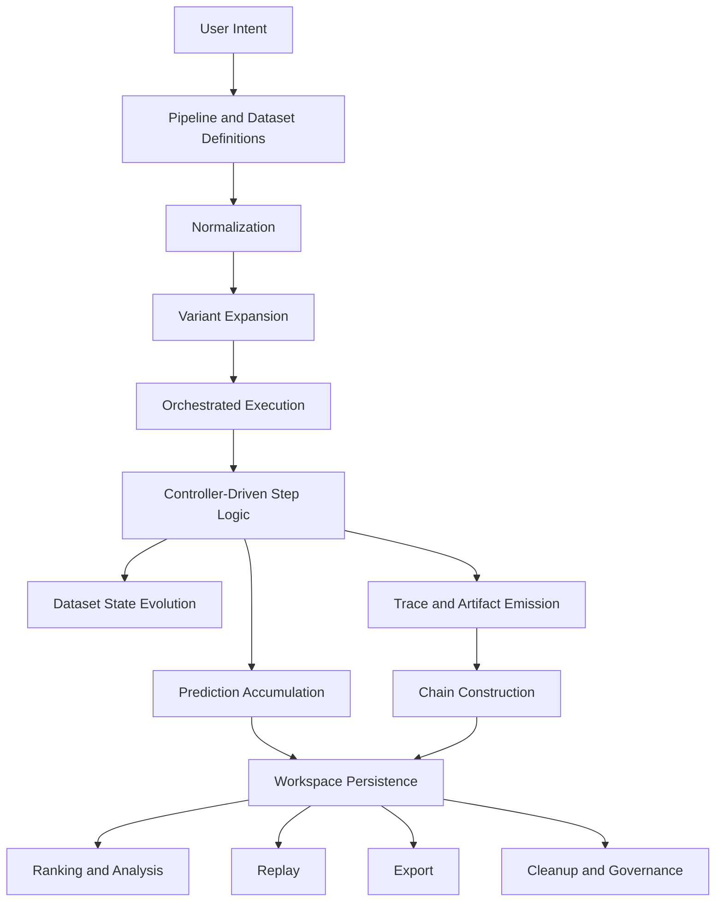

### 16.2 Data and Workflow Coupling Map

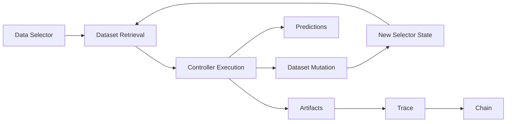

### 16.3 Workspace Governance Map

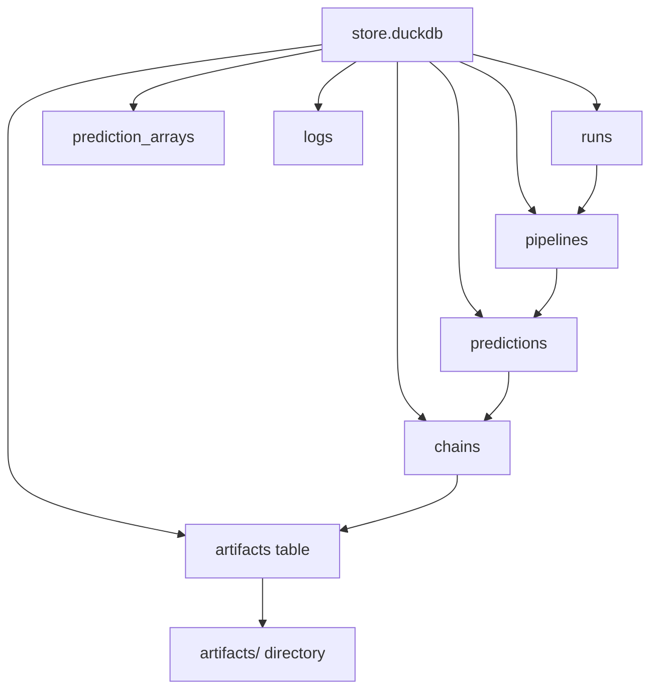
