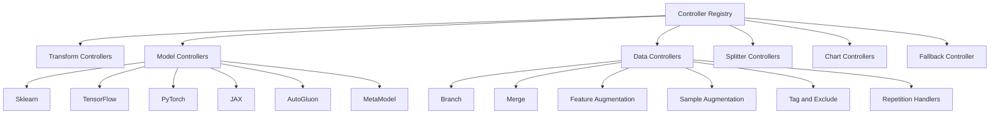

# Controllers Introduction

Controllers are the **behavior adapters** between abstract pipeline steps and concrete execution. They're the core extension seam of the NIRS4ALL engine, making it flexible and framework-agnostic.

## Controller Philosophy

A step definition alone is not enough — execution requires **context-aware behavior**.

Consider this pipeline step:

```python
PLSRegression(n_components=10)
```

To execute this, you need to know:
- Are we in train mode or predict mode?
- Which fold are we on?
- Which partition (train/val/test)?
- Which processing chains are active?
- Which branch context are we in?
- Where should artifacts be stored?

Controllers provide this **context-aware behavior**, interpreting operator intent based on current execution state.

## Why Not Just Execute Directly?

Many libraries directly execute step objects (`step.fit(X, y)`). NIRS4ALL routes steps through controllers because:

1. **Framework diversity** — sklearn, TensorFlow, PyTorch, JAX all have different training interfaces
2. **Keyword semantics** — `model`, `y_processing`, `branch`, `merge` need specialized handling
3. **Mode awareness** — train vs predict vs explain have different behaviors
4. **Branching orchestration** — parallel subflows need coordination
5. **Artifact management** — saving and loading fitted objects requires coordination

::::{admonition} Key Insight
:class: tip

Controllers turn a **declarative pipeline** (what you want) into an **imperative execution** (how to do it), while keeping your pipeline definitions simple and framework-agnostic.
::::

## Controller Registration Model

Controllers are registered in a **global registry** using the `@register_controller` decorator:

```python
from nirs4all.controllers import register_controller, OperatorController

@register_controller
class MyCustomController(OperatorController):
    priority = 50  # Lower = higher priority

    @classmethod
    def matches(cls, step, operator, keyword) -> bool:
        return isinstance(operator, MyOperatorType)

    def execute(self, step_info, dataset, context, runtime_context, **kwargs):
        # Execute the step
        pass
```

**Matching and routing are dynamic**: a controller is selected when its `matches()` classmethod returns `True`, with `priority` deciding conflicts.

This avoids hardcoded if-else execution trees and makes extension easy.

## Controller Base Contract

All controllers inherit from `OperatorController` (abstract base class). The required interface:

| Method | Type | Purpose |
| --- | --- | --- |
| `matches(step, operator, keyword)` | classmethod | Determine if this controller handles the step |
| `use_multi_source()` | classmethod | Whether to iterate over sources |
| `supports_prediction_mode()` | classmethod | Whether to run during prediction |
| `execute(step_info, dataset, context, runtime_context)` | instance | Perform the step's logic |

Each controller also declares a numeric `priority` (lower = higher precedence).

::::{admonment} Execution Contract
:class: note

The `execute()` method:
- **Receives**: `step_info`, `dataset`, `context`, `runtime_context`
- **Returns**: `(context, StepOutput)` tuple
- **Can mutate**: `dataset`, `context` (but must return updated context)
- **Can emit**: artifacts via `runtime_context.artifact_registry`
::::

## Controller Families

NIRS4ALL includes several controller families:

### Transform Controllers

Handle feature and target transformations:

- **`TransformerMixinController`** (priority 10) — general feature-space transforms (SNV, MSC, StandardScaler, etc.)
- **`YTransformerMixinController`** (priority 5) — target-side transforms (`y_processing`)

### Model Controllers

All inherit from `BaseModelController`:

- **`SklearnModelController`** (priority 6) — sklearn-like estimators (PLSRegression, RandomForest, etc.)
- **`TensorFlowModelController`** (priority 4) — TensorFlow models
- **`PyTorchModelController`** (priority 4) — PyTorch models
- **`JaxModelController`** (priority 4) — JAX models
- **`AutoGluonModelController`** (priority 5) — AutoGluon configs
- **`MetaModelController`** (priority 5) — stacking/meta-model behavior

### Data-Flow Controllers

Handle complex data transformations and routing:

- **`BranchController`** (priority 5) — branch orchestration (duplication and separation branches)
- **`MergeController`** (priority 5) — branch output reconciliation
- **`FeatureAugmentationController`** (priority 10) — repeated preprocessing orchestration
- **`SampleAugmentationController`** (priority 10) — synthetic sample generation
- **`TagController`** (priority 5) — sample annotation
- **`ExcludeController`** (priority 5) — sample exclusion
- **`FeatureSelectionController`** (priority 5) — feature selection
- **`ResamplerController`** (priority 5) — spectral resampling

### Splitter Controllers

Handle cross-validation fold generation:

- **`CrossValidatorController`** (priority 10) — fold generation from CV splitters
- **`FoldFileLoaderController`** (priority 9) — load folds from files

### Chart Controllers

Generate diagnostic charts:

- **`SpectraChartController`** — spectra visualization
- **`YChartController`** — target distribution
- **`FoldChartController`** — fold composition
- **`ExclusionChartController`** — exclusion diagnostics
- **`AugmentationChartController`** — augmentation diagnostics
- **`SpectralDistributionController`** — spectral distribution analysis

All chart controllers have priority 10.

### Fallback Controller

- **`DummyController`** (priority 1000) — catch-all for unhandled operators (logs a warning)

## Controller Family Map



## Controller Interaction Patterns

Controllers interact with three main surfaces:

### Dataset Interaction

- **Read/mutate feature processings** — add new processing chains
- **Read/mutate folds** — set fold assignments
- **Read/mutate exclusions** — mark samples as excluded
- **Read/mutate target processings** — transform targets
- **Read/mutate tags** — annotate samples

### ExecutionContext Interaction

- **Update selector state** — change partition, processing, layout, etc.
- **Update pipeline state** — advance step number, change execution mode
- **Update metadata flags** — track controller coordination data
- **Update custom state** — store controller-specific data (e.g., branch paths)

### Artifacts Interaction

- **Emit artifacts in train mode** — save fitted models/transformers
- **Consume artifacts in predict mode** — load fitted artifacts

## Controller Priority Strategy

Lower priority values win earlier. Use low priority for **specific behaviors** and higher priority for **generic ones**.

This keeps specific handlers from being shadowed by generic ones.

::::{admonition} Priority Examples
:class: note

**Specific wins over generic:**
- `TensorFlowModelController` (priority 4) beats `SklearnModelController` (priority 6) for TensorFlow objects
- `YTransformerMixinController` (priority 5) beats `TransformerMixinController` (priority 10) for `y_processing` keyword

**Generic catches all:**
- `DummyController` (priority 1000) catches anything unmatched
::::

## Controller Extension Pattern

To add custom behavior, follow this pattern:

### Step 1: Define Controller Class

```python
from nirs4all.controllers import register_controller, OperatorController

@register_controller
class MyCustomController(OperatorController):
    priority = 50  # Choose appropriate priority

    @classmethod
    def matches(cls, step, operator, keyword) -> bool:
        # Return True if this controller handles the step
        return isinstance(operator, MyOperatorClass)

    @classmethod
    def use_multi_source(cls) -> bool:
        # Return True if this operator should iterate over sources
        return False

    @classmethod
    def supports_prediction_mode(cls) -> bool:
        # Return True if this operator runs during prediction
        return True
```

### Step 2: Implement Execute Logic

```python
    def execute(self, step_info, dataset, context, runtime_context, **kwargs):
        # Get operator from step_info
        operator = step_info.operator

        # Get current partition and processing chains
        selector = context.selector
        partition = selector.partition

        # Get features and targets
        X, y = dataset.get_X_y(selector)

        # Execute operator logic
        if context.state.execution_mode == "train":
            # Fit operator
            operator.fit(X, y)

            # Save artifact
            artifact_id = runtime_context.artifact_registry.register(
                operator,
                step_index=step_info.step_index,
                artifact_type="transform",
            )
        else:
            # Load artifact
            operator = runtime_context.artifact_loader.load_artifact(
                step_index=step_info.step_index,
            )

        # Transform data
        X_transformed = operator.transform(X)

        # Update dataset with new processing
        dataset.add_processing(X_transformed, processing_name=f"step_{step_info.step_index}")

        # Update context selector to use new processing
        new_selector = selector.with_processing(processing=f"step_{step_info.step_index}")
        context = context.with_selector(new_selector)

        # Return updated context and step output
        return context, StepOutput(success=True)
```

### Step 3: Register and Import

The `@register_controller` decorator automatically registers the controller. Just ensure the module is imported at runtime:

```python
# In your __init__.py or main script
from mypackage.controllers import MyCustomController
```

## Controller Extension Examples

### Example 1: Custom Transform Controller

```python
from nirs4all.controllers import register_controller, OperatorController
from nirs4all.operators.transforms import MyCustomTransform

@register_controller
class MyCustomTransformController(OperatorController):
    priority = 15  # Higher than TransformerMixinController (10)

    @classmethod
    def matches(cls, step, operator, keyword) -> bool:
        return isinstance(operator, MyCustomTransform)

    @classmethod
    def supports_prediction_mode(cls) -> bool:
        return True

    def execute(self, step_info, dataset, context, runtime_context, **kwargs):
        # Custom execution logic
        pass
```

### Example 2: Custom Keyword Controller

```python
@register_controller
class MyKeywordController(OperatorController):
    priority = 10

    @classmethod
    def matches(cls, step, operator, keyword) -> bool:
        return keyword == "my_custom_keyword"

    def execute(self, step_info, dataset, context, runtime_context, **kwargs):
        # Custom keyword behavior
        pass
```

Now you can use:

```python
pipeline = [
    {"my_custom_keyword": SomeOperator()},
]
```

## Extension Quality Guidelines

When extending with custom controllers:

1. **Define explicit failure behavior** — don't silently fall back to generic behavior
2. **Avoid silent fallback logic** — log warnings when behavior is ambiguous
3. **Log enough metadata for debugging** — include step_index, operator type, keyword
4. **Test train and predict mode separately** — ensure symmetry
5. **Validate branch and multi-source compatibility** — if relevant to your operator

## Advanced Topics

<details>
<summary><strong>Multi-Source Controllers</strong></summary>

If your operator needs to iterate over sources:

```python
@classmethod
def use_multi_source(cls) -> bool:
    return True
```

The execution engine will call `execute()` once per source, updating `context.selector.source_index` each time.

</details>

<details>
<summary><strong>Branch-Aware Controllers</strong></summary>

Access branch context via:

```python
branch_id = context.custom.get("branch_id")
branch_name = context.custom.get("branch_name")
```

Emit branch-specific artifacts:

```python
artifact_id = runtime_context.artifact_registry.register(
    operator,
    branch_id=branch_id,
)
```

</details>

<details>
<summary><strong>Fold-Aware Controllers</strong></summary>

Model controllers automatically get fold context:

```python
fold_id = context.selector.fold_id
```

Emit fold-specific artifacts:

```python
artifact_id = runtime_context.artifact_registry.register(
    model,
    fold_id=fold_id,
)
```

</details>

## Next Steps

Now that you understand controllers, explore:

- **[Pipeline Workflow](pipeline_workflow.md)** — See how controllers fit into execution
- **[Data Workflow](data_workflow.md)** — Learn how controllers interact with datasets
- **[Persona Paths](persona_paths.md)** — Find your tailored learning path

Or dive into the [Developer Guide](../developer/index.md) for controller implementation details.

```{seealso}
**Related Examples:**
- [D02: Custom Controllers](../../examples/developer/06_internals/D02_custom_controllers.py) - Complete guide to creating custom controllers
- [U01: Multi-Model](../../examples/user/04_models/U01_multi_model.py) - See how model controller handles multiple models
- [D01: Branching Basics](../../examples/developer/01_advanced_pipelines/D01_branching_basics.py) - Branch controller in action
```
