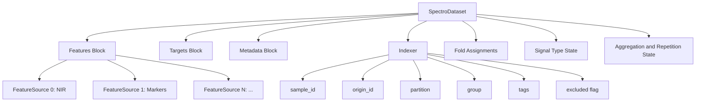
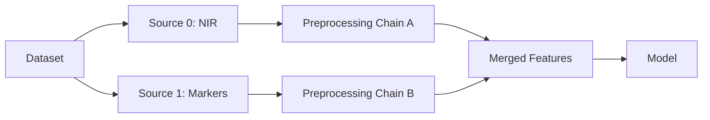
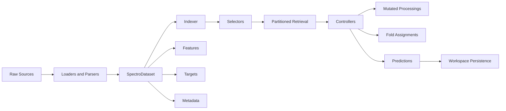

# Data Workflow

Understanding how NIRS4ALL manages data is crucial. The data layer is designed to make modeling **safe** and **flexible**.

## Data Layer Mission

**Safe** means:
- No silent sample misalignment
- No silent leakage across folds
- Traceable transformations
- Predictable selection semantics

**Flexible** means:
- Multi-source support (spectra + metadata markers)
- Multiple processing branches (try many preprocessing variants)
- Dynamic metadata filtering
- Augmentation-aware retrieval

## The Central Data Object: SpectroDataset

Everything revolves around `SpectroDataset` — the core data container. It's not just a wrapper around NumPy arrays. It's a carefully designed facade over several internal components.

### Internal Composition



This decomposition separates **value arrays** from **index semantics**, keeping retrieval logic explicit and mutation logic controlled.

## Sample Identity Model

The index tracks two critical identifiers:

- **`sample_id`** — unique row identifier
- **`origin_id`** — identifier of the base sample (for augmented samples)

::::{admonition} Key Insight
:class: tip

- Base samples have `sample_id == origin_id`
- Augmented samples have `sample_id != origin_id`

This enables a crucial behavior: augmented samples can have different `X` values, but `y` maps back to the origin. This preserves label consistency.
::::

**Example scenario:**

```python
# You have 100 base samples
# You apply spectral augmentation (add noise, shift, etc.)
# Now you have 500 samples (100 base + 400 augmented)

# During training:
# - All 500 samples are used
# - Augmented samples have different X values
# - But y values map back to their origin_id

# During splitting:
# - Only 100 base samples determine train/test
# - This prevents augmented variants from leaking across folds
```

## Multi-Source Data Model

A dataset can carry **one or many sources**. Each source can have:
- Distinct feature dimensionality (1000 wavelengths vs 20 chemical markers)
- Different headers (wavelength units vs marker names)
- Independent processing chains

At retrieval time, you can:
- Keep sources separate (for multi-input models)
- Concatenate them (for unified feature vectors)

**Use cases:**
- Combine NIR spectra with chemical markers
- Merge data from multiple instruments
- Apply source-specific preprocessing then merge



## Processing Dimension Model

Features are not simply 2D arrays (samples × features). Internally, each `FeatureSource` stores a **3D array**:

**Shape**: `samples × processings × features`

::::{admonition} Why 3D?
:class: note

This allows multiple preprocessing variants to coexist without overwriting earlier processings.

**Example:**
- Processing 0: Raw spectra
- Processing 1: SNV-corrected
- Processing 2: SNV + Savitzky-Golay derivative

When a merge operation needs a flattened representation, it can collapse the processing/source structure.
::::

This supports:
- Branch workflows (compare multiple preprocessing paths)
- Feature augmentation (add derived features)
- Stacking (use processed features from multiple branches)

## Retrieval Semantics

When you retrieve data from a `SpectroDataset`, you have fine-grained control:

| Control | Purpose |
| --- | --- |
| `partition` | Select train, val, or test subsets |
| `processing` | Select specific processing chains |
| `layout` | Control output tensor shape (2d, 3d, etc.) |
| `include_augmented` | Include/exclude augmented samples |
| `include_excluded` | Include/exclude flagged-out samples |
| `source_index` | Select a specific source |

**Why so many controls?**

Because a wrong default can leak information or break alignment. Controllers use these switches intentionally for each execution mode.

::::{admonition} Example: Split Controller
:class: note

When splitting data into train/test:
- `include_augmented=False` (only base samples determine folds)
- `include_excluded=False` (don't include flagged outliers)
- `partition=None` (no partition filter yet)

When training a model:
- `include_augmented=True` (use augmented samples for training)
- `include_excluded=False` (exclude flagged outliers)
- `partition="train"` (only training partition)
::::

## Layout Semantics

**Layout** is a contract between data retrieval and operator expectations. It changes tensor organization without changing scientific meaning.

| Layout | Enum value | Conceptual shape | Typical consumer |
| --- | --- | --- | --- |
| `2d` | `FLAT_2D` | samples × (processings * features) | Classical ML, sklearn estimators |
| `2d_interleaved` | `FLAT_2D_INTERLEAVED` | samples × (features * processings) | Models expecting ordered channel alternation |
| `3d` | `VOLUME_3D` | samples × processings × features | Deep learning, custom tensor operators |
| `3d_transpose` | `VOLUME_3D_TRANSPOSE` | samples × features × processings | DL variants needing feature-major memory order |

**Why layout exists:**

NIRS workflows mix classical regression models, deep models, multi-source inputs, and feature-augmented channels. One fixed layout would force repeated ad hoc reshaping. Explicit layout keeps train/predict symmetry easier to maintain.

::::{admonition} Practical Rules
:class: tip

1. Choose layout based on consumer contract, not one-step convenience
2. Keep layout stable across train and predict for a given chain
3. Treat layout as part of the reproducibility fingerprint — different layout can produce different fitted artifacts
::::

<details>
<summary><strong>Advanced: Failure Modes to Avoid</strong></summary>

- Training with `3d` and predicting with `2d` → shape mismatch
- Silent transpose mismatches → incorrect feature ordering
- Merging branches with incompatible tensor orientation → crash or wrong results

</details>

## Augmented Sample Handling

Augmented samples are **inclusion-optional** at selection time:

- **For split operations**: Only base samples should drive fold assignment
- **For training**: Augmented samples are typically included
- **For targets**: Augmented samples map to origin `y` values

This keeps augmentation powerful without breaking target consistency.

## Excluded Sample Handling

Samples can be marked as **excluded**. Exclusion is an index flag, not immediate deletion:

- Arrays remain structurally stable
- Selection can omit excluded samples by default
- Diagnostics can re-include excluded samples when needed

**Why not delete immediately?**

Some stages need full-shape updates (e.g., computing outlier scores for all samples), while others need filtered training subsets (e.g., model fitting without outliers).

## Tags as Data-State Annotations

**Tags** are first-class computed columns in index space. They annotate samples without removing them.

**Use cases:**
- Mark outliers for analysis (without excluding them)
- Label samples for conditional branching
- Track diagnostic flags
- Enable metadata-based filtering

::::{admonition} Tag vs Exclude
:class: note

- **Tag**: Annotate samples (non-destructive)
- **Exclude**: Mark samples to be filtered out during training

Tags and exclusion are distinct behaviors. You can tag samples as outliers for diagnostics while still training on them, or you can exclude them.
::::

## Repetition Semantics

**Repetition** means multiple spectra for one physical sample — a frequent NIRS reality.

The dataset can define a **repetition column** that drives:
- **Group-aware split behavior** — keep all repetitions of a sample in the same fold
- **Aggregation in scoring** — average predictions across repetitions

Without grouping by repetition, train/test can share the same biological entity, causing **data leakage**.

::::{admonition} Example
:class: warning

You have 50 soil samples, each measured 3 times (150 spectra total).

**Wrong approach**: Random split on 150 spectra
- Repetitions of the same sample can end up in both train and test
- Model learns to recognize the specific sample, not general patterns
- Test scores are optimistically biased

**Right approach**: Group-aware split on 50 samples
- All repetitions of a sample stay in the same fold
- Model generalizes across samples
- Test scores are honest
::::

## Aggregation Semantics

**Aggregation** groups predictions by metadata column, repetition semantics, or task-specific policies.

Available methods:
- **mean** — average predictions
- **median** — median predictions
- **vote** — majority vote (classification)

Outlier-aware aggregation can be enabled to handle noisy replicates.

## Fold Storage in Dataset

Split controllers write **fold assignments** into the dataset. Model controllers then consume these fold definitions without recomputing split logic.

This creates a clear separation:
- **Split controller** decides folds
- **Model controller** trains on folds

**Benefits:**
- Consistent fold definitions across pipeline variants
- Reproducible splits across runs
- Audit trail for fold assignments

## DataSelector and Context Coupling

Selection logic is carried through `DataSelector`, a dataclass inside `ExecutionContext`. Key fields:

| Field | Purpose |
| --- | --- |
| `partition` | train, val, test |
| `processing` | active processing chains |
| `layout` | requested array shape |
| `include_augmented` | augmented sample inclusion flag |
| `include_excluded` | excluded sample inclusion flag |
| `fold_id` | current fold identifier |
| `branch_id` / `branch_name` | branch context |
| `source_index` | specific feature source |

This keeps step behavior deterministic and reduces hidden global assumptions.

## Targets and Y-Processing

Targets are handled **separately** from features. `y_processing` can transform targets, and these transformations are tracked as named processing states in context.

**Use case**: Scaling targets for neural network training, then inverse-transforming predictions back to original scale.

**Benefits:**
- Scaled target training
- Inverse-consistent prediction logic
- Chain persistence of target transforms

## Metadata Handling

Metadata is **index-aligned** and **queryable**. It participates in:
- Grouping (e.g., by site or batch)
- Splitting (e.g., stratified by class)
- Branching rules (e.g., separate models per site)
- Sample selection (e.g., filter by date range)
- Reporting (e.g., per-site metrics)

The data layer treats metadata as **operational context**, not just display context.

## Signal Type and Header Semantics

Spectral data comes in different physical representations. The `SignalType` enum tracks:

| Category | Values |
| --- | --- |
| Core types | `absorbance`, `reflectance`, `reflectance%`, `transmittance`, `transmittance%` |
| Special types | `kubelka_munk`, `log_1_r`, `log_1_t` |
| Detection states | `auto`, `unknown`, `preprocessed` |

Header units (`HeaderUnit` enum):
- `cm-1` (wavenumber)
- `nm` (wavelength)
- `none`, `text`, `index`

**Why this matters:**

Some operators need to know signal type (e.g., signal conversion, Kubelka-Munk transform). Wavelength-aware transforms (e.g., resampling, smoothing) need correct units.

## Task Type Semantics

The `TaskType` enum defines three task types:

- `REGRESSION` — continuous target prediction
- `BINARY_CLASSIFICATION` — two-class classification
- `MULTICLASS_CLASSIFICATION` — multi-class classification

Task type influences:
- Scorer behavior (RMSE vs accuracy)
- Aggregation method defaults (mean vs vote)
- Model interpretation logic
- Probability handling

## Leakage Prevention Patterns

Leakage prevention is **layered**, not a single control:

1. **Split-first logic** — define folds before any model fitting
2. **Explicit base-sample selection** — only base samples determine folds
3. **Repetition-aware grouping** — keep repetitions together
4. **Separate train vs test partition selectors** — controllers explicitly request partitions
5. **Exclusion and tag-based filtering** — exclude outliers without deleting them

## Data Retrieval Modes Matrix

| Retrieval intent | Include augmented | Include excluded | Typical user |
| --- | --- | --- | --- |
| Split calculation | No | No | Splitter controller |
| Transform all data | Usually Yes | Often Yes | Transform controller |
| Train model | Often Yes | No | Model controller |
| Diagnostics | Optional | Yes | Analysis/reporting |
| Predict new data | Context-dependent | Usually No | Prediction flow |

## Data Logic Concept Map



## Next Steps

Now that you understand how data flows, learn about:

- **[Pipeline Workflow](pipeline_workflow.md)** — How execution orchestrates steps
- **[Controllers Intro](controllers_intro.md)** — How controllers interact with datasets
- **[Workspace Intro](workspace_intro.md)** — How data and results are persisted

```{seealso}
**Related Examples:**
- [U01: Flexible Inputs](../../examples/user/02_data_handling/U01_flexible_inputs.py) - All data input formats and SpectroDataset usage
- [U03: Multi-Source](../../examples/user/02_data_handling/U03_multi_source.py) - Working with multi-source datasets
- [U04: Repetition Aggregation](../../examples/user/05_cross_validation/U04_aggregation.py) - Handling repeated measurements
- [U04: Signal Conversion](../../examples/user/03_preprocessing/U04_signal_conversion.py) - Signal type detection and conversion
```
