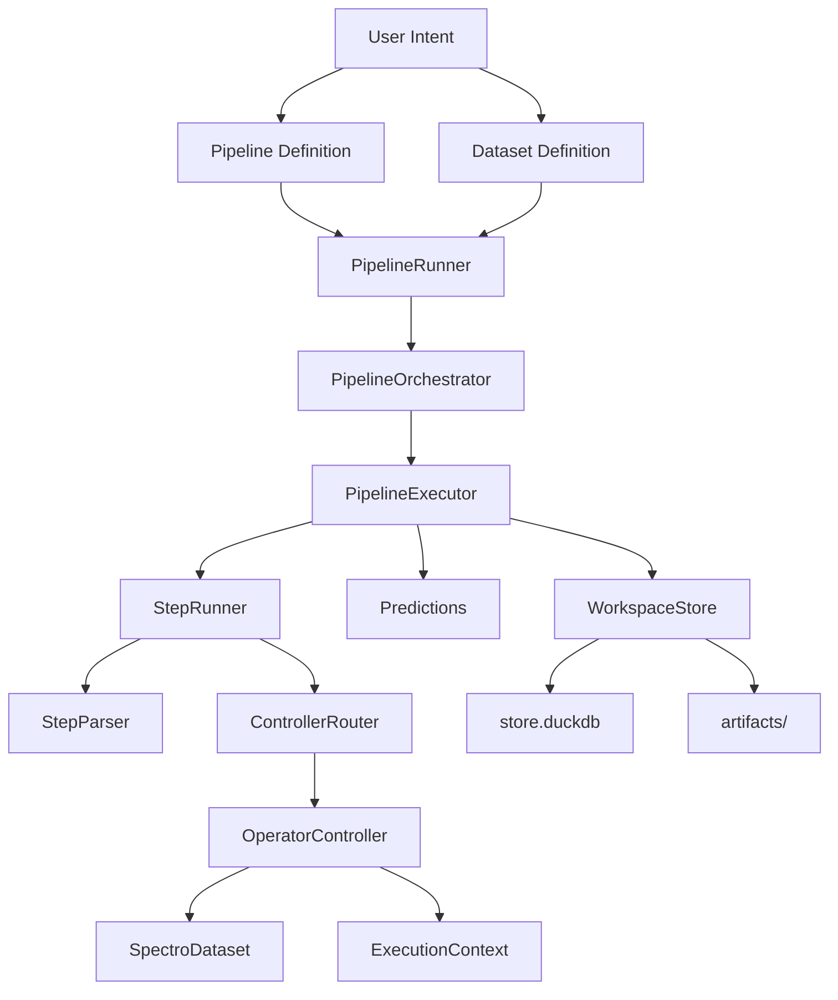
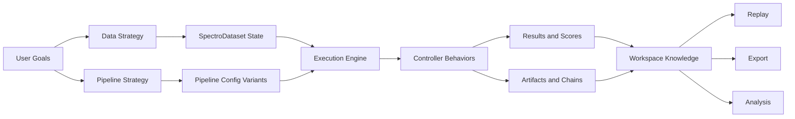

# Mental Models

Building the right mental model of NIRS4ALL will help you understand not just *how* to use it, but *why* it works the way it does.

## The Problem Space

NIRS workflows are rarely linear. Real projects require:
- Comparing many preprocessing choices
- Evaluating multiple model families
- Ensuring repeatable evaluation
- Producing traceable outputs
- Handling complex data scenarios (multi-source, repeated measurements, heterogeneous metadata)

Traditional ML pipelines fall short because they assume simple tabular data and linear workflows. NIRS4ALL was built to handle the complexity of spectroscopy from the ground up.

## The Three-Layer Mental Model

Think of NIRS4ALL in three conceptual layers:

```{figure} ../_static/images/three_layer_model.png
:alt: Three-layer architecture
:align: center
:width: 80%

The three-layer mental model: Data, Workflow, and Runtime
```

### Layer 1: Data

**Mission**: Make modeling safe and flexible.

- **Safe** means no silent sample misalignment, no leakage across folds, traceable transformations
- **Flexible** means multi-source support, branching, dynamic filtering, augmentation-aware retrieval

**Key object**: `SpectroDataset` — the core data container holding features, targets, metadata, folds, and index semantics.

### Layer 2: Workflow

**Mission**: Turn intent into controlled execution.

Takes your pipeline definition, expands variants from generators, executes steps with context-aware logic, and records outputs in a reproducible way.

**Key objects**: `PipelineConfigs`, `ExecutionContext`, `RuntimeContext`

### Layer 3: Runtime

**Mission**: Provide durable experiment memory.

Persists run metadata, chains, predictions, and artifacts. Enables replay, export, and analysis long after the Python process exits.

**Key object**: `WorkspaceStore` — DuckDB-backed persistence layer

::::{admonition} In Short
:class: tip

**Data is the state. Pipeline is the plan. Controllers are the behavior. Workspace is the memory.**
::::

## Architecture at a Glance

Here's how data flows through the system:



**What's happening here?**

1. You define a pipeline and dataset
2. The runner normalizes and expands generator variants
3. The orchestrator coordinates execution across datasets × pipeline configs
4. For each step, the step runner parses and routes to the appropriate controller
5. Controllers mutate the dataset/context and emit artifacts
6. Predictions and chains are accumulated and persisted to the workspace

## Key Conceptual Objects

| Object | Role |
| --- | --- |
| `SpectroDataset` | Core data container (features, targets, metadata, folds, index) |
| `PipelineConfigs` | Normalized pipeline definitions with generator expansion |
| `ExecutionContext` | Composite of DataSelector, PipelineState, and StepMetadata |
| `RuntimeContext` | Infrastructure wiring (store, artifact registry, trace, cache) |
| `OperatorController` | Behavior adapter between abstract steps and execution |
| `Predictions` | Accumulated prediction records with arrays and metrics |
| `WorkspaceStore` | DuckDB-backed persistence facade |

Each object owns a distinct concern. Execution frequently crosses object boundaries, but the separation keeps the system modular and testable.

## Why Controllers Matter

Most libraries directly execute step objects. NIRS4ALL routes steps through **controllers**, which provides:

- **Framework-specific handling** — sklearn, TensorFlow, PyTorch, JAX all have different training interfaces
- **Keyword-specific handling** — `model`, `y_processing`, `branch`, `merge` keywords trigger specialized behavior
- **Branching and merge orchestration** — complex multi-path workflows need coordination
- **Consistent prediction-mode behavior** — controllers know when to skip training-only steps

Controller routing is priority-based: lower numeric priority wins. If multiple controllers match a step, the highest-priority one is selected.

::::{admonition} Example
:class: note

When you add `PLSRegression(10)` to your pipeline:
1. StepParser normalizes it to a `ParsedStep`
2. ControllerRouter checks all registered controllers
3. `SklearnModelController` matches (priority 6)
4. Controller executes fit/predict with proper fold and partition handling
::::

## Why the Dataset Abstraction Matters

Traditional ML libraries assume simple 2D arrays: `X` (samples × features) and `y` (targets).

NIRS4ALL supports much more:
- **Multi-source data** — combine NIR spectra with chemical markers or metadata
- **Processing chains** — track multiple preprocessing variants without overwriting
- **Sample identity** — distinguish base samples from augmented variants
- **Metadata-driven logic** — enable grouping, splitting, and branching by metadata
- **Fold assignments** — store cross-validation splits in the dataset for consistency

This abstraction enables spectroscopy workflows where:
- One sample can have multiple spectral measurements (repetitions)
- One project can combine heterogeneous sources
- Preprocessing branches need consistent sample alignment

## Why the Workspace Matters

A pipeline result isn't just a final score — it's also **traceability** and **deployability**.

The workspace stores:
- **Run metadata** — what you ran, when, with what config
- **Chains** — replayable step sequences with artifact references
- **Predictions** — row-level outputs with fold/partition context
- **Artifacts** — fitted models and transformers as content-addressed binaries

This gives you a durable experiment memory that supports:
- Comparing dozens of variants across runs
- Exporting winning models for production
- Replaying predictions on new data
- Auditing what happened months later

## High-Level Execution Story

Here's what happens when you call `nirs4all.run()`:

1. User defines a pipeline and a dataset
2. Runner normalizes both (handles path strings, dicts, objects)
3. Orchestrator expands generator combinations (`_or_`, `_range_`)
4. Executor runs each pipeline variant on each dataset
5. Step runner parses and routes each step to a controller
6. Controllers mutate dataset/context and emit artifacts
7. Predictions are accumulated and persisted
8. Chains are built from execution traces
9. Workspace stores the full run record

At the end, you get a `RunResult` with:
- Best scores across all variants
- Top-N ranking
- Export capabilities
- Query and filter methods

## Data-First and Operator-Driven

The pipeline engine is **operator-driven** (controllers execute step objects), but the runtime is **data-state aware** (controllers interpret operator intent in context).

A controller doesn't blindly run an operator — it considers:
- Which partition (train/val/test)?
- Which fold (for cross-validation)?
- Which processing chains are active?
- Are we in train, predict, or explain mode?
- Which branch context are we in?

This allows train vs predict behavior differences, fold-aware behaviors, branch-aware behaviors, and artifact-aware behaviors.

## Relationship Between API and Internals

The module-level API (`run`, `predict`, `explain`, `retrain`) is **simple by design**. Internally, these entry points call the same execution infrastructure, keeping behavior coherent across workflows.

Public simplicity is achieved by internal modularity.

```python
# Simple public API
result = nirs4all.run(
    pipeline=[MinMaxScaler(), PLSRegression(10)],
    dataset="sample_data/regression",
)

# Internally, this calls:
# - PipelineRunner.run()
# - PipelineOrchestrator.execute()
# - PipelineExecutor.execute()
# - StepRunner.execute() for each step
# - Controllers for each operator
# - WorkspaceStore for persistence
```

## Main Concept Diagram

Here's how the layers interact:



## Strengths and Complexities

### Strong Areas

- **Spectroscopy-aware preprocessing and data handling** — signal types, wavelength units, multi-source, repetitions
- **Flexible controller dispatch** — supports many ML frameworks without hardcoding
- **Workspace-backed persistence** — full experiment traceability
- **Chain export and replay** — production deployment made easy

### Complex Areas

- **Branching and merge semantics** — powerful but requires careful understanding
- **Fold and prediction lifecycle alignment** — ensuring OOF predictions are correct
- **Cache and memory management** — large sweeps can consume significant memory

::::{admonition} Design Tradeoff
:class: warning

More workflow flexibility means more routing complexity. More backend support means more controller surface. More persistence detail means more schema burden.

These tradeoffs are deliberate. NIRS4ALL prioritizes **correctness and flexibility** over simplicity, while providing a simple top-level API.
::::

## Next Steps

Now that you have the big picture, you can dive deeper:

- **[Data Workflow](data_workflow.md)** — Learn how `SpectroDataset` works
- **[Pipeline Workflow](pipeline_workflow.md)** — Understand execution flow
- **[Controllers Intro](controllers_intro.md)** — See how to extend the system
- **[Workspace Intro](workspace_intro.md)** — Explore persistence and replay

Or jump to [Persona Paths](persona_paths.md) for a tailored learning path based on your role.

```{seealso}
**Related Examples:**
- [U01: Hello World](../../examples/user/01_getting_started/U01_hello_world.py) - Your first pipeline to see the basic workflow
- [U02: Basic Regression](../../examples/user/01_getting_started/U02_basic_regression.py) - Complete example with preprocessing and visualization
- [D01: Session Workflow](../../examples/developer/06_internals/D01_session_workflow.py) - Stateful workflows with workspace persistence
```
