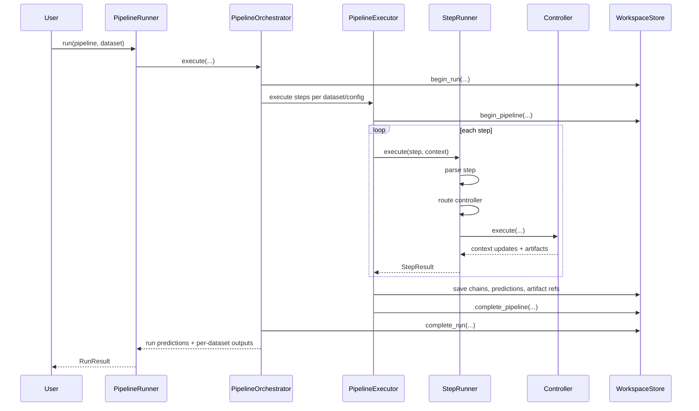
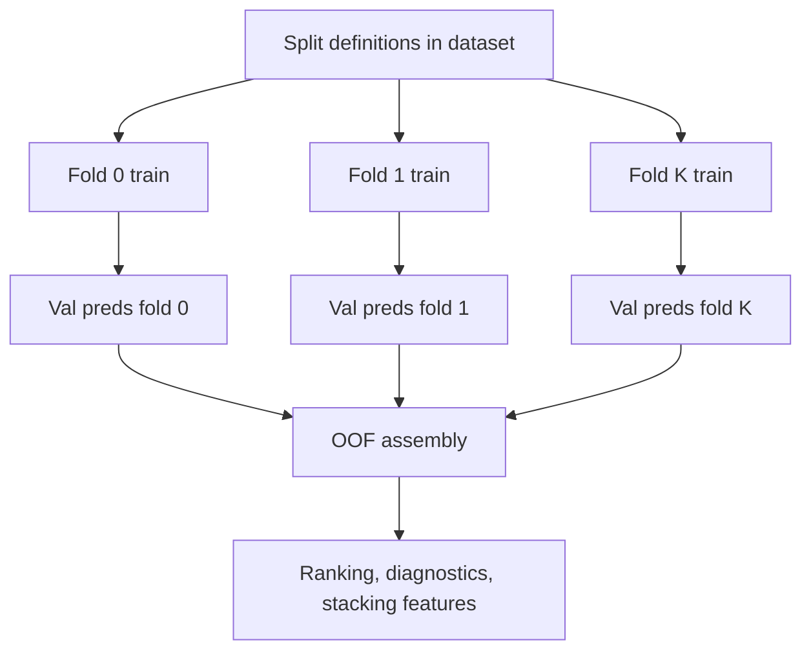
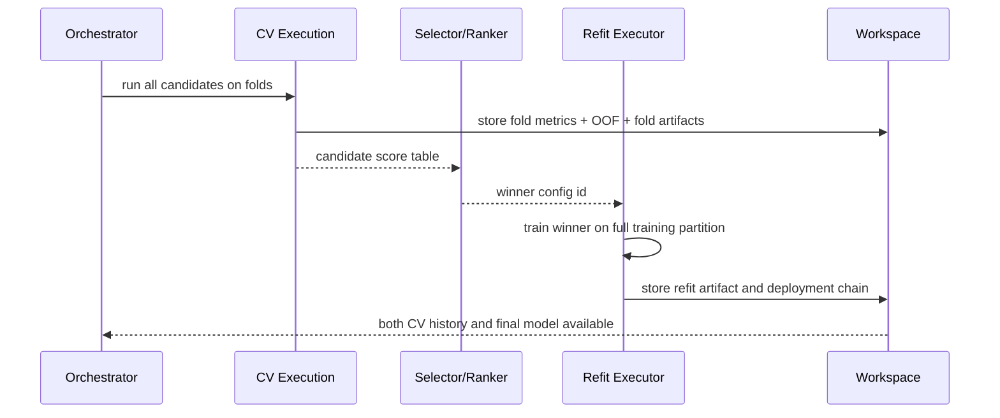
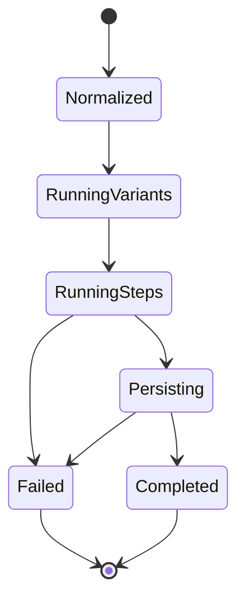

# Pipeline Workflow

The workflow layer turns **intent** into **controlled execution**. It takes your pipeline definition and datasets, expands variants from generators, executes steps with context-aware controller logic, and records outputs in a reproducible store.

## Workflow Mission

Transform a high-level pipeline definition into:
1. **Expanded variants** from generators (`_or_`, `_range_`)
2. **Controlled execution** with context-aware step logic
3. **Traceable outputs** with fold/partition/branch context
4. **Durable persistence** in workspace store

## Primary Execution Stack

The execution engine is layered for modularity:

| Component | Role |
| --- | --- |
| `PipelineRunner` | Top-level facade for run/predict/explain/retrain |
| `PipelineOrchestrator` | Coordinates Cartesian product of datasets × pipeline configs |
| `PipelineExecutor` | Executes a single pipeline on a single dataset |
| `StepRunner` | Parses, routes, and executes individual steps |
| `StepParser` | Normalizes raw step syntax into `ParsedStep` |
| `ControllerRouter` | Selects the matching controller by priority |
| `OperatorController` | Behavior adapter that executes the step |

## End-to-End Training Flow

Here's what happens when you call `nirs4all.run()`:



## Pipeline Normalization Phase

Before execution, `PipelineConfigs` normalizes your pipeline definition. It accepts:
- Lists of step objects
- Dicts with pipeline keys
- JSON/YAML file paths

**Generator expansion** happens here:
- `_or_` (variant alternatives) → multiple pipeline configs
- `_range_` (parameter sweeps) → grid of parameter values

Each expanded variant receives a generated identity.

::::{admonition} Example
:class: note

```python
pipeline = [
    {"_or_": [SNV(), MSC(), Detrend()]},
    PLSRegression(n_components={"_range_": [5, 10, 15]}),
]

# Expands to 9 variants:
# SNV + PLS(5), SNV + PLS(10), SNV + PLS(15)
# MSC + PLS(5), MSC + PLS(10), MSC + PLS(15)
# Detrend + PLS(5), Detrend + PLS(10), Detrend + PLS(15)
```
::::

## Dataset Normalization Phase

Dataset inputs are normalized via `DatasetConfigs`, which handles:
- Path-based loading (`"sample_data/regression"`)
- Config parsing (dicts with loader settings)
- Direct `SpectroDataset` instances

Once normalized, the orchestrator operates on consistent dataset objects.

## Orchestration Topology

The orchestrator executes a **Cartesian product** of each dataset with each expanded pipeline config.

This allows sweep-style experiments naturally:
- 3 datasets × 20 pipeline variants = 60 executions

During this phase, the orchestrator:
- Starts run-level persistence
- Initializes shared runtime components
- Manages post-run summaries

## Context Initialization

The executor initializes an `ExecutionContext` containing:

| Component | Purpose |
| --- | --- |
| **DataSelector** | Immutable data selection parameters (partition, processing, layout, etc.) |
| **PipelineState** | Mutable state (current step number, y_processing name, execution mode) |
| **StepMetadata** | Controller coordination data (keyword, operator type) |
| **Custom dict** | Controller-specific state (e.g., branch paths) |
| **Aggregate column** | For prediction aggregation policy |

## RuntimeContext Role

`RuntimeContext` is the **infrastructure context**. It carries runtime services rather than data state:

| Service | Purpose |
| --- | --- |
| `store` | WorkspaceStore for DuckDB-backed persistence |
| `artifact_registry` | Artifact management during training |
| `artifact_loader` / `artifact_provider` | For predict/explain modes |
| `step_runner` | For executing sub-steps (e.g., inside branches) |
| `run_id`, `pipeline_id`, `pipeline_uid`, `pipeline_name` | Identifiers |
| `trace_recorder` | Recording execution traces |
| `cache_config` / `step_cache` | Step-level caching |
| `retrain_config` | Retrain mode control |
| `phase` | Current execution phase (`CV` or `REFIT`) |

This separates **data semantics** from **infrastructure wiring**.

## Step Processing Pipeline

Each step goes through three mini-phases:

1. **Parse** — convert syntax into `ParsedStep`
2. **Route** — select the best matching controller by priority
3. **Execute** — apply controller logic with context and dataset

::::{admonition} Example: Transform Step
:class: note

```python
# Pipeline definition
pipeline = [MinMaxScaler()]

# Step processing:
# 1. Parse: MinMaxScaler() → ParsedStep(operator=MinMaxScaler(), keyword=None)
# 2. Route: Check all controllers → TransformerMixinController matches (priority 10)
# 3. Execute: Controller calls fit_transform on training data, stores artifact
```
::::

## Keyword Semantics

Pipeline **keywords** influence controller matching. Key keywords:

| Keyword | Purpose |
| --- | --- |
| `model` | Define model step |
| `y_processing` | Target scaling |
| `tag` | Mark samples (non-removal) |
| `exclude` | Exclude samples from training |
| `branch` | Parallel/separation branches |
| `merge` | Combine branch outputs |
| `_or_` | Generator for variant alternatives |
| `_range_` | Parameter sweep generator |

Additional internal keywords: `feature_augmentation`, `sample_augmentation`, `auto_transfer_preprocessing`, `concat_transform`.

## Controller Routing Logic

Routing is simple and deterministic:

1. Evaluate all registered controllers
2. Keep those whose `matches()` returns `True`
3. Sort by numeric `priority` (lower wins)
4. Instantiate the first match

::::{admonition} Priority Strategy
:class: tip

Lower priority values win earlier. Use low priority for specific behaviors and higher priority for generic ones.

**Example**: `TensorFlowModelController` (priority 4) wins over `SklearnModelController` (priority 6) for TensorFlow objects.
::::

## Execution Modes

NIRS4ALL supports four execution modes:

### Train Mode

The richest lifecycle:
- Split controllers define folds
- Transform controllers fit and transform
- Model controllers train and score
- Predictions are stored with fold/partition context
- Traces capture step-level artifact references

### Predict Mode

Replays persisted artifacts:
- Training-only steps are skipped
- Controllers load stored artifacts
- Transformations replay in pipeline order
- Model artifacts generate final predictions

### Explain Mode

Resembles predict mode but:
- Collects explanation artifacts (SHAP values)
- Generates SHAP charts
- Returns feature importance

### Refit Mode

Retrains the winning configuration:
- Runs after CV evaluation
- Trains on full training partition (excluding holdout/test)
- Produces deployment-ready final model

## Out-of-Fold (OOF) Training and Prediction Lifecycle

**OOF** is the core mechanism behind honest validation and stacking-safe features. Each prediction is produced by a model that **did not train on that row**.



**The OOF contract:**
- Each row linked to sample identity
- Fold identity persisted for auditability
- Partition and branch context retained
- Model/preprocessing signatures retained

This allows:
- Fair variant comparison (no leakage)
- Leak-safe meta-model features (for stacking)
- Fold-specific instability diagnosis

::::{admonition} Stacking Example
:class: note

When building a meta-model (stacking), base model predictions for meta-model training **must be OOF-generated** to avoid target leakage.

**Wrong**: Use in-sample predictions from base models
- Meta-model sees predictions from models trained on the same data
- Optimistically biased

**Right**: Use OOF predictions from base models
- Meta-model sees predictions from models that never saw those samples
- Honest generalization
::::

## CV-to-Refit Lifecycle Pattern

A robust production pattern: **train across folds first, then retrain the winner on full training data**.



**Lifecycle steps:**

1. **Phase A**: Run candidate pipelines with fold-based evaluation. Persist fold metrics, artifacts, and OOF outputs.
2. **Phase B**: Rank candidates using a predefined metric. Select the winner with deterministic tie-break rules.
3. **Phase C**: Refit only the winning configuration on the full training partition (excluding holdout/test).
4. **Phase D**: Persist refit artifacts as the deployment-default chain. Keep CV artifacts for audit.

**Why this matters:**

- **CV** answers model-selection quality
- **Refit** answers deployment-readiness

Conflating them creates either under-trained deployment artifacts or biased selection.

## Retrain and Transfer Workflow

Retrain uses a **source model/chain** plus **new data**. Modes include:

- **Full retrain** — retrain all steps from scratch
- **Transfer-style reuse** — freeze preprocessing, retrain model
- **Fine-tune** — load model weights and continue training

Per-step mode control determines whether to train or reuse artifacts.

## Branching Workflow

Branching enables **parallel subflows** in two families:

### Duplication Branches

All samples go to each branch (parallel preprocessing/modeling):

```python
{"branch": [
    [SNV(), PLSRegression(10)],
    [MSC(), RandomForestRegressor()],
]}
```

**Use case**: Compare preprocessing chains, then merge for ranking.

### Separation Branches

Samples are partitioned across branches (by metadata, tag, or source):

```python
{"branch": {"by_metadata": "site"}}
{"branch": {"by_tag": "outlier_flag", "values": {"clean": False, "outliers": True}}}
```

**Use case**: Subgroup-specific models (e.g., one model per site).

Branch context is tracked in the execution context and becomes important for artifact and prediction resolution.

## Merge Workflow

Merge operations reconcile **branch outputs**. Strategies:

| Strategy | Use case | Branch type |
| --- | --- | --- |
| `predictions` | Use OOF predictions as stacking features | Duplication branches |
| `features` | Use transformed features from branches | Duplication branches |
| `concat` | Reassemble samples in original order | Separation branches |

Merge logic must handle asymmetry (shape differences, model availability differences). Merging is one of the highest-complexity areas.

## Feature Augmentation Workflow

Feature augmentation orchestrates **repeated preprocessing operations** in `extend`, `add`, or `replace` modes.

- **Extend**: Add new processing chains (grow 3D array)
- **Add**: Add derived features to existing processing
- **Replace**: Overwrite existing processing

This changes processing growth patterns and directly influences memory footprint.

## Sample Augmentation Workflow

Sample augmentation generates **synthetic variants** in:

- **Standard count mode**: Fixed number of augmented samples per base sample
- **Balancing-aware mode**: Based on labels or metadata (e.g., oversample minority class)

Especially useful for imbalanced classification.

## Trace and Chain Lifecycle

**Execution trace** captures step outcomes and artifacts. The **chain builder** converts trace data into replayable chains containing:

- Ordered steps
- Model step index
- Fold artifact references
- Shared preprocessing references
- Branch/source metadata

Chains are **first-class deployment and replay units**.

## Prediction Persistence Workflow

Prediction rows are persisted with rich metadata:

- `dataset_name`, `pipeline_id`, `pipeline_uid`, `pipeline_name`
- `fold_id`, `partition`
- `branch_id`, `branch_name`
- `model_class`, `preprocessing_signature`
- Scalar metrics (`rmse`, `r2`, `accuracy`, etc.)

Array payloads (`y_true`, `y_pred`, `y_proba`) are stored in a dedicated array table.

This split keeps scalar query paths efficient while preserving detailed replay capability.

## Workflow State Transitions



## Workflow Contracts

Key contracts that controllers and the execution engine must uphold:

1. **Step controllers** must return context updates consistently
2. **Prediction mode** must never assume training-time fitting
3. **Artifact naming and indexing** must remain deterministic for replay
4. **Branch and fold semantics** must be preserved through persistence
5. **Run metadata** must reflect actual execution conditions

## Next Steps

Now that you understand how pipelines execute, explore:

- **[Controllers Intro](controllers_intro.md)** — Learn how to extend execution behavior
- **[Workspace Intro](workspace_intro.md)** — See how results are persisted
- **[Data Workflow](data_workflow.md)** — Review how data flows through execution

```{seealso}
**Related Examples:**
- [U01: Multi-Model](../../examples/user/04_models/U01_multi_model.py) - Generator syntax with `_or_` for model comparison
- [D01: Generator Syntax](../../examples/developer/02_generators/D01_generator_syntax.py) - Complete generator syntax reference
- [D02: Generator Advanced](../../examples/developer/02_generators/D02_generator_advanced.py) - Advanced generators with constraints
- [D01: Branching Basics](../../examples/developer/01_advanced_pipelines/D01_branching_basics.py) - Pipeline branching and merging
```
