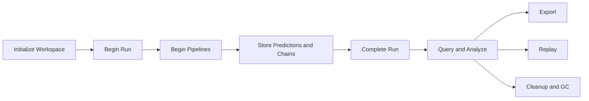

# Workspace Introduction

The workspace is the **durable memory** of your experiments. Without it, results remain process-local and fragile. With it, you get run tracking, artifact reuse, chain replay, export workflows, and lifecycle cleanup.

## Why Workspace Management Is Central

Imagine running 50 pipeline variants, finding the best one, and then losing all the metadata when your Python process exits. Or trying to remember which preprocessing steps were used for a model you trained last month.

The workspace solves this by:
- **Tracking all runs** with metadata and timestamps
- **Storing predictions** with fold/partition/branch context
- **Persisting artifacts** as content-addressed binaries
- **Building chains** for replay and export
- **Enabling queries** like "show me the top 10 models by RMSE"

## Active Workspace Resolution

Workspace path resolution follows a priority order:

1. **Explicitly set path** — via `workspace=` parameter
2. **Environment variable** — `NIRS4ALL_WORKSPACE`
3. **Default local workspace** — `./workspace` in current directory

::::{admonition} Tip
:class: tip

Set `NIRS4ALL_WORKSPACE` in your environment to use a shared workspace across projects:

```bash
export NIRS4ALL_WORKSPACE="/path/to/shared/workspace"
```
::::

## Workspace Layout

A workspace is initialized with this structure:

```
workspace/
├── store.duckdb          # DuckDB database (runs, chains, predictions, artifacts metadata)
├── artifacts/            # Content-addressed binary files (hash-sharded)
│   ├── ab/
│   │   └── abc123...joblib
│   ├── cd/
│   │   └── cde456...joblib
│   └── ...
├── exports/              # User-triggered exports (.n4a bundles, etc.)
├── library/              # Reusable pipeline templates
├── figures/              # Chart outputs (optional)
├── outputs/              # Step outputs (optional)
└── logs/                 # Log files (optional)
```

**Key principle**: Structured data lives in DuckDB, binary artifacts live in content-addressed files.

## Store-First Architecture

The workspace uses a **store-first architecture**: structured runtime data lives in DuckDB (`store.duckdb`).

**Why DuckDB?**

- Fast analytical queries
- Embedded (no server setup)
- SQL access for custom queries
- ACID transactions
- Efficient storage with compression

The DB is the **source of truth** for runs and predictions, avoiding scattered manifest files and simplifying query/ranking workflows.

## Core Store Tables

The workspace database contains these core tables:

| Table | Purpose |
| --- | --- |
| `runs` | High-level experiment sessions (run_id, timestamp, config) |
| `pipelines` | Per-variant execution metadata (pipeline_id, run_id, dataset_name) |
| `chains` | Replayable step-to-artifact mappings (chain_id, steps, artifact refs) |
| `predictions` | Scalar metrics and identifiers (rmse, r2, accuracy, fold_id, partition) |
| `prediction_arrays` | Dense arrays (y_true, y_pred, y_proba) linked to predictions |
| `artifacts` | Binary metadata and content hash references (artifact_id, hash, type) |
| `logs` | Structured step events (timestamp, level, message) |

Together, these capture **full runtime provenance** and power analysis and replay.

## Artifact Storage Model

Artifacts (fitted models, transformers) are **content-addressed by hash**, with git-style sharding:

```
artifacts/{hash[:2]}/{hash}.{ext}
```

**Example:**
```
artifacts/ab/abc123def456...789.joblib
artifacts/cd/cde456fgh789...012.joblib
```

**Benefits:**

- **Natural deduplication** — identical binaries share the same hash
- **Stable lookup** — artifact_id → hash → file path
- **Predictable cleanup** — reference counting determines orphaned artifacts

::::{admonition} Content Addressing
:class: note

If two models have identical fitted parameters (rare but possible with small datasets or deterministic seeds), they share the same artifact file. This saves disk space and simplifies caching.
::::

## Chain as Deployment Unit

A **chain** represents:
- Ordered preprocessing and model sequence
- All needed artifact references (hash + metadata)
- Branch/source context
- Fold context (for CV chains) or refit context (for deployment chains)

This makes it the **key replay unit** and the **key export unit**.

**Chain structure:**

```python
{
    "chain_id": "abc123",
    "pipeline_id": "def456",
    "fold_id": "fold_0",  # or "refit" for deployment chains
    "steps": [
        {"step_index": 0, "operator": "MinMaxScaler", "artifact_id": "art_001"},
        {"step_index": 1, "operator": "PLSRegression", "artifact_id": "art_002"},
    ],
    "branch_path": None,
    "source_index": 0,
}
```

## Export Paths

NIRS4ALL supports two primary export formats:

### .n4a Bundle (ZIP Archive)

Full bundle with artifacts and metadata:

```python
result.export("model.n4a")
```

**Contains:**
- `manifest.json` (metadata, pipeline config, dataset info)
- `artifacts/` (all fitted models and transformers)
- `chain.json` (step sequence with artifact references)

**Use case**: Production deployment, sharing models with collaborators.

### .n4a.py (Portable Python Script)

Self-contained Python script with embedded artifacts:

```python
result.export("model.n4a.py")
```

**Contains:**
- Python script with `predict()` function
- Base64-encoded artifacts embedded in the script

**Use case**: Quick sharing, minimal dependencies, executable without NIRS4ALL installation.

::::{admonition} Export Philosophy
:class: tip

Training does **not** eagerly create export files. Export is an explicit operation triggered via `result.export()`. This keeps workspace clean and avoids wasting disk space on unwanted exports.
::::

## Replay Paths

Replay uses **chain metadata and artifact lookup** to:
1. Apply transforms in stored sequence
2. Load fitted artifacts
3. Execute model prediction logic

Replay supports both **refit** and **fold-based** variants:

```python
# Replay from chain in workspace
result = nirs4all.predict(chain_id="abc123", data=X_new)

# Replay from exported bundle
result = nirs4all.predict(model="model.n4a", data=X_new)
```

## Library Templates

The workspace **library** stores reusable pipeline templates:

```
workspace/library/
├── templates/
│   ├── baseline_pls.json
│   ├── advanced_cnn.json
│   └── custom_preprocessing.json
└── metadata/
    └── templates.db
```

Templates include:
- **Config** — full pipeline definition
- **Metadata** — name, description, author, tags, categories
- **Provenance** — source run_id (optional)

**Benefits:**
- Knowledge reuse across projects
- Team-level pattern sharing
- Standardized workflows

::::{admonition} Example
:class: note

```python
# Save a pipeline as a template
result.save_template(
    name="Baseline PLS",
    description="SNV + SG derivative + PLS regression",
    tags=["baseline", "regression"],
    category="preprocessing",
)

# Load a template
pipeline = nirs4all.load_template("Baseline PLS")
```
::::

## Query and Ranking

The workspace supports operational queries:

```python
# Query top predictions
top_preds = workspace.query_best(metric="rmse", limit=10)

# List runs
runs = workspace.list_runs(dataset="my_dataset")

# List pipelines in a run
pipelines = workspace.list_pipelines(run_id="run_001")

# Filter predictions
preds = workspace.filter_predictions(
    dataset="my_dataset",
    model_class="PLSRegression",
    metric="rmse",
    threshold=0.5,
)
```

This enables operational reporting without custom SQL.

## Cleanup Workflows

Workspace cleanup is essential for long-running experimentation programs:

### Deleting Runs

```bash
nirs4all workspace delete-run --run-id run_001
```

Deletes run metadata, pipelines, chains, and predictions. Artifacts are **not** deleted immediately (reference counting).

### Garbage Collecting Artifacts

```bash
nirs4all artifacts cleanup
```

Deletes orphaned artifacts (no longer referenced by any chain).

### Database Vacuum

```bash
nirs4all workspace vacuum
```

Reclaims disk space from deleted records.

::::{admonition} Cleanup Strategy
:class: tip

**Recommended cleanup schedule:**
- Delete obsolete runs monthly
- Garbage collect artifacts weekly
- Vacuum database quarterly

This keeps workspace performant and disk usage manageable.
::::

## Workspace Lifecycle Diagram

Here's the full lifecycle from run to cleanup:



## Workspace Governance

As workspace usage grows, governance becomes important:

### Versioning

- **Dataset versions** — track dataset hash and version history
- **Pipeline versions** — track pipeline config changes
- **Chain versions** — link chains to specific artifact versions

### Provenance

- **Run metadata** — timestamp, user, config, git commit (if available)
- **Chain provenance** — link chains to source runs
- **Artifact provenance** — track which steps generated which artifacts

### Access Control

- **Workspace isolation** — separate workspaces for different projects
- **Read-only access** — for auditing and analysis
- **Write access** — for running experiments and cleanup

## Advanced Topics

<details>
<summary><strong>Workspace Merging</strong></summary>

Merge multiple workspaces into one:

```bash
nirs4all workspace merge --source workspace_a/ --target workspace_b/
```

Useful for consolidating experiments from different environments.

</details>

<details>
<summary><strong>Workspace Backup</strong></summary>

Backup workspace database and artifacts:

```bash
# Database only (fast)
cp workspace/store.duckdb workspace_backup/store.duckdb

# Full backup (slow)
tar -czf workspace_backup.tar.gz workspace/
```

For production, use incremental artifact backups (copy only new artifacts by modification time).

</details>

<details>
<summary><strong>Custom Queries</strong></summary>

Access workspace database directly with DuckDB:

```python
import duckdb

conn = duckdb.connect("workspace/store.duckdb", read_only=True)
result = conn.execute("""
    SELECT pipeline_name, AVG(rmse) as avg_rmse
    FROM predictions
    WHERE dataset_name = 'my_dataset'
    GROUP BY pipeline_name
    ORDER BY avg_rmse
    LIMIT 10
""").fetchall()
```

Useful for custom analytics and reporting.

</details>

## Next Steps

Now that you understand workspace persistence, explore:

- **[Pipeline Workflow](pipeline_workflow.md)** — See how execution generates workspace data
- **[Controllers Intro](controllers_intro.md)** — Learn how controllers emit artifacts
- **[Persona Paths](persona_paths.md)** — Find your learning path based on your role

```{seealso}
**Related Examples:**
- [U03: Workspace Management](../../examples/user/06_deployment/U03_workspace_management.py) - Session context and workspace structure
- [D01: Session Workflow](../../examples/developer/06_internals/D01_session_workflow.py) - Advanced session workflows with persistence
- [U02: Export Bundle](../../examples/user/06_deployment/U02_export_bundle.py) - Export models from workspace
```
