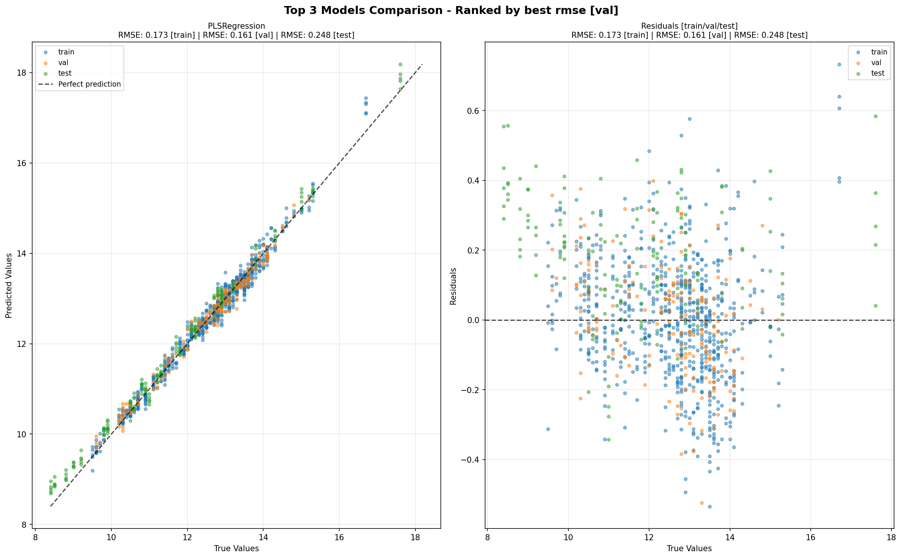
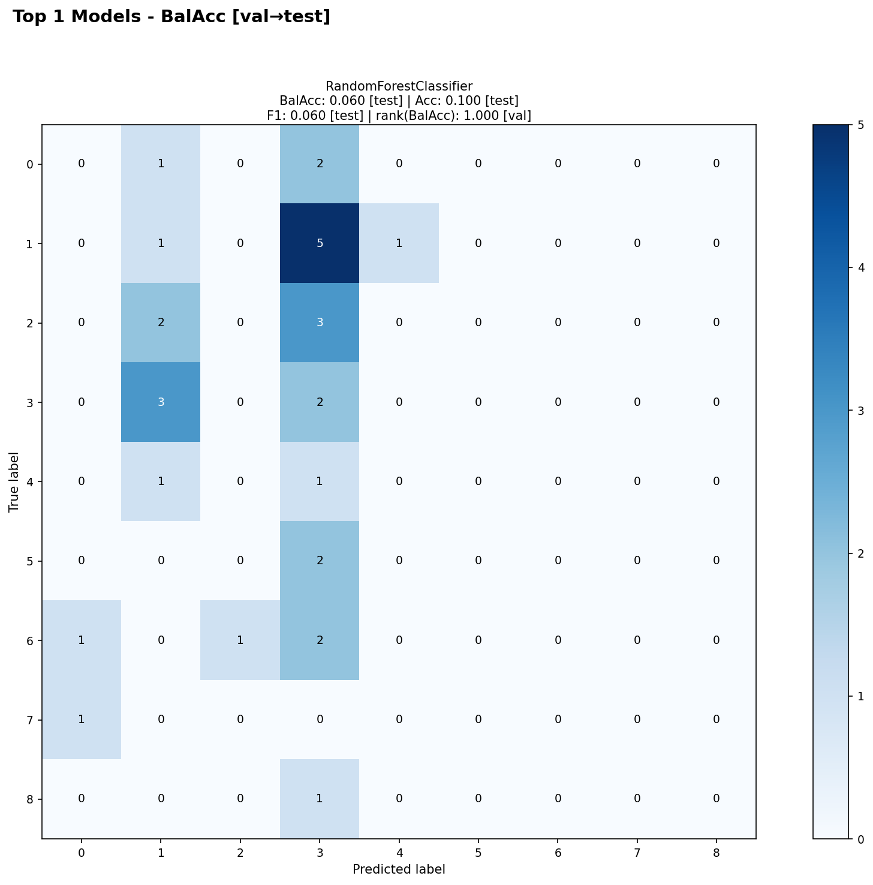
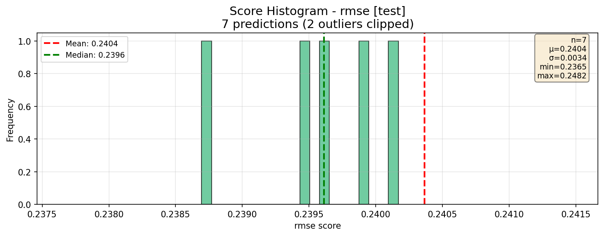
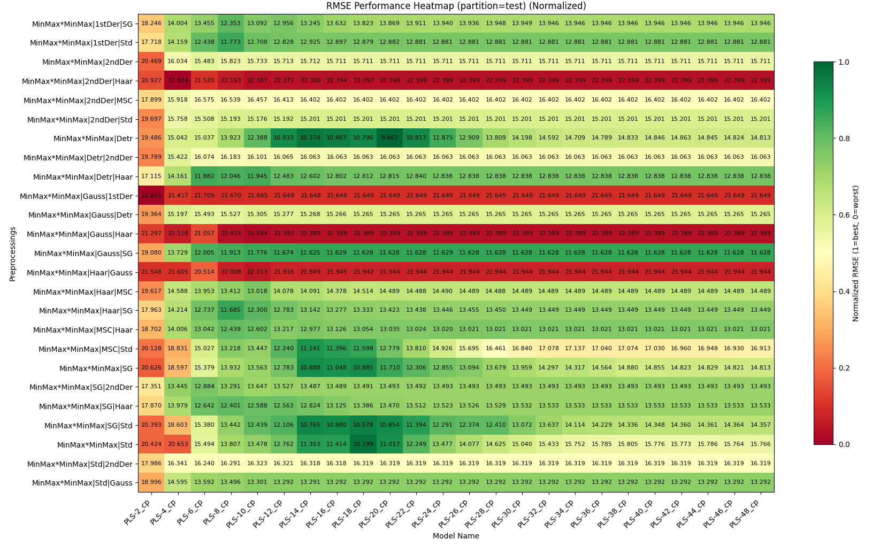

# Analyzer Charts Reference

## Overview

The PredictionAnalyzer provides five chart types for visualizing model predictions and performance. All charts support flexible parameter configurations with automatic task-type detection.

## Core Concepts

### Metric Auto-Detection

When `rank_metric` or `display_metric` is not specified, charts automatically select:
- **Classification tasks**: `balanced_accuracy`
- **Regression tasks**: `rmse`

The task type is determined from existing prediction data (not recomputed).

### Parameter Naming Convention

Charts with ranking functionality use consistent parameter names:

- **`rank_metric`**: Metric used to rank/select models
- **`rank_partition`**: Partition used for ranking ('train', 'val', 'test')
- **`display_metric`**: Metric shown in visualizations (defaults to `rank_metric`)
- **`display_partition`**: Partition displayed in charts (defaults to 'test')

Charts without ranking (Histogram, Candlestick) use only:
- **`display_metric`**: Metric to visualize
- **`display_partition`**: Partition to display

---

## Chart Types

### 1. TopKComparisonChart (`plot_top_k`)

**Purpose**: Scatter plots showing predicted vs true values for top K models.

**Signature**:
```python
plot_top_k(
    k: int = 5,
    rank_metric: str = None,          # Auto-detected
    rank_partition: str = 'val',
    display_metric: str = '',         # Defaults to rank_metric
    display_partition: str = 'all',   # 'all' or specific partition
    show_scores: bool = True,
    **kwargs
)
```

**Key Features**:
- Shows predicted vs true scatter plots
- Includes residual plots
- Supports multiple partitions ('all' shows train/val/test)
- `show_scores` controls score display in titles

**Example**:
```python
# Basic usage (auto-detects metric)
fig = analyzer.plot_top_k(k=5)

# Explicit configuration
fig = analyzer.plot_top_k(
    k=3,
    rank_metric='rmse',
    rank_partition='val',
    display_partition='test'
)
```

**Title Format**:
- Figure: `"Top {k} Models Comparison - Ranked by best {rank_metric} ({rank_partition})"`
- Chart: Model name + ranking/display scores (controlled by `show_scores`)



---

### 2. ConfusionMatrixChart (`plot_confusion_matrix`)

**Purpose**: Confusion matrices for top K classification models.

**Signature**:
```python
plot_confusion_matrix(
    k: int = 5,
    rank_metric: str = None,          # Auto-detected
    rank_partition: str = 'val',
    display_metric: str = '',         # Defaults to rank_metric
    display_partition: str = 'test',
    show_scores: bool = True,
    **kwargs
)
```

**Key Features**:
- Ranks models by classification metric
- Shows confusion matrix from display_partition
- Returns one figure per dataset
- `show_scores` controls score display in titles

**Example**:
```python
# Basic usage
fig = analyzer.plot_confusion_matrix(k=4)

# Explicit configuration
fig = analyzer.plot_confusion_matrix(
    k=3,
    rank_metric='accuracy',
    rank_partition='val',
    display_partition='test'
)
```

**Title Format**:
- Figure: `"Dataset: {ds} - Top {k} Confusion Matrices\nRanked by best {rank_metric} ({rank_partition}), Displayed: {display_partition}"`
- Chart: Model name + scores (controlled by `show_scores`)



---

### 3. ScoreHistogramChart (`plot_histogram`)

**Purpose**: Distribution histogram of metric scores across predictions.

**Signature**:
```python
plot_histogram(
    display_metric: str = None,       # Auto-detected
    display_partition: str = 'test',
    bins: int = 20,
    **kwargs
)
```

**Key Features**:
- No ranking (displays all predictions)
- Shows mean and median lines
- Includes statistics box
- Creates one figure per dataset when multiple datasets present

**Example**:
```python
# Basic usage
fig = analyzer.plot_histogram()

# Explicit configuration
fig = analyzer.plot_histogram(
    display_metric='r2',
    display_partition='val',
    bins=30
)
```

**Title Format**:
- `"Score Histogram - {display_metric} ({display_partition})\n{n} predictions"`



---

### 4. CandlestickChart (`plot_candlestick`)

**Purpose**: Box plots showing metric distribution grouped by a variable.

**Signature**:
```python
plot_candlestick(
    variable: str,                    # Required: grouping variable
    display_metric: str = None,       # Auto-detected
    display_partition: str = 'test',
    **kwargs
)
```

**Key Features**:
- Groups predictions by variable (e.g., 'model_name', 'preprocessings')
- Shows min, Q25, mean, median, Q75, max
- No ranking (displays all predictions)

**Example**:
```python
# Basic usage
fig = analyzer.plot_candlestick(variable='model_name')

# Explicit configuration
fig = analyzer.plot_candlestick(
    variable='preprocessings',
    display_metric='rmse',
    display_partition='test'
)
```

**Title Format**:
- `"Candlestick - {display_metric} by {variable}\nDisplayed: {display_partition}"`


---

### 5. HeatmapChart (`plot_heatmap`)

**Purpose**: Performance heatmap across two categorical variables.

**Signature**:
```python
plot_heatmap(
    x_var: str,                       # Required: x-axis variable
    y_var: str,                       # Required: y-axis variable
    rank_metric: str = None,          # Auto-detected
    rank_partition: str = 'val',
    display_metric: str = '',         # Defaults to rank_metric
    display_partition: str = 'test',
    normalize: bool = False,
    rank_agg: str = 'best',
    display_agg: str = 'mean',
    show_counts: bool = True,
    **kwargs
)
```

**Key Features**:
- Ranks predictions using `rank_metric` + `rank_partition` + `rank_agg`
- Displays `display_metric` from `display_partition` using `display_agg`
- Supports multiple aggregation strategies ('best', 'worst', 'mean', 'median')
- Colors based on normalized scores (always)
- Can show raw or normalized scores in cells

**Example**:
```python
# Basic usage
fig = analyzer.plot_heatmap('model_name', 'dataset_name')

# Advanced configuration
fig = analyzer.plot_heatmap(
    x_var='model_name',
    y_var='dataset_name',
    rank_metric='rmse',
    rank_partition='val',
    rank_agg='best',          # Select best model per cell
```


    display_metric='r2',
    display_partition='test',
    display_agg='mean',       # Show mean R2 in cell
    normalize=False,
    show_counts=True
)
```

**Title Format**:
- `"{display_agg} {display_metric} in {display_partition} (rank on {rank_agg} {rank_metric} in {rank_partition})"`

---

## Advanced Features

### show_scores Parameter (TopK & ConfusionMatrix only)

Controls score display in chart titles:

```python
# Default: show display_metric on display_partition
fig = analyzer.plot_top_k(k=5, show_scores=True)

# Show only ranking info
fig = analyzer.plot_top_k(k=5, show_scores='rank_only')

# No scores
fig = analyzer.plot_top_k(k=5, show_scores=False)

# Show display_metric on all partitions
fig = analyzer.plot_top_k(k=5, show_scores='all')

# Show multiple metrics on display_partition
fig = analyzer.plot_top_k(k=5, show_scores=['rmse', 'r2', 'mae'])

# Full control
fig = analyzer.plot_top_k(
    k=5,
    show_scores={
        'partitions': ['train', 'val', 'test'],
        'metrics': ['rmse', 'r2']
    }
)
```

### Common Filters

All charts accept additional filters:

```python
fig = analyzer.plot_top_k(
    k=5,
    dataset_name='wheat',      # Filter by dataset
    model_name='RandomForest', # Filter by model
    config_name='config1'      # Filter by config
)
```

---

## Migration Guide

### From Old to New Parameter Names

| Old Parameter | New Parameter | Chart |
|---------------|---------------|-------|
| `metric` | `rank_metric` | ConfusionMatrix |
| `metric` | `display_metric` | Histogram, Candlestick |
| `partition` | `display_partition` | Histogram, Candlestick |

### Backward Compatibility

Old parameter names still work but will be deprecated:

```python
# Old style (still works)
fig = analyzer.plot_confusion_matrix(k=5, metric='accuracy')

# New style (recommended)
fig = analyzer.plot_confusion_matrix(k=5, rank_metric='accuracy')
```

---

## Best Practices

1. **Let auto-detection work**: Omit `rank_metric`/`display_metric` for automatic task-type selection
2. **Use rank_partition='val'**: Reserve test set for final evaluation
3. **Show multiple datasets separately**: When working with multiple datasets, the analyzer automatically creates one figure per dataset
4. **Use show_scores wisely**: Default (`True`) is good for most cases; use `'all'` or dict for detailed analysis
5. **Normalize heatmaps per dataset**: When comparing across datasets, use `normalize=False` but colors still show relative performance

---

## Common Patterns

### Classification Analysis

```python
analyzer = PredictionAnalyzer(predictions)

# Top models (auto-detects balanced_accuracy)
fig1 = analyzer.plot_top_k(k=5)

# Confusion matrices
fig2 = analyzer.plot_confusion_matrix(k=3)

# Performance across models
fig3 = analyzer.plot_heatmap('model_name', 'dataset_name')
```

### Regression Analysis

```python
analyzer = PredictionAnalyzer(predictions)

# Top models (auto-detects rmse)
fig1 = analyzer.plot_top_k(k=5, show_scores='all')

# Score distribution
fig2 = analyzer.plot_histogram()

# Model comparison
fig3 = analyzer.plot_candlestick(variable='model_name')

# Performance heatmap
fig4 = analyzer.plot_heatmap(
    'model_name',
    'dataset_name',
    display_metric='r2'
)
```

### Multi-Metric Analysis

```python
# Show RMSE for ranking, R2 for display
fig = analyzer.plot_top_k(
    k=5,
    rank_metric='rmse',
    display_metric='r2',
    show_scores=['rmse', 'r2', 'mae']
)
```
